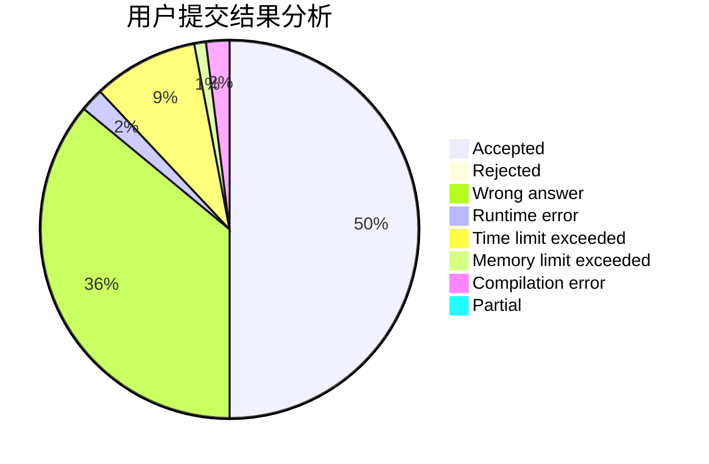
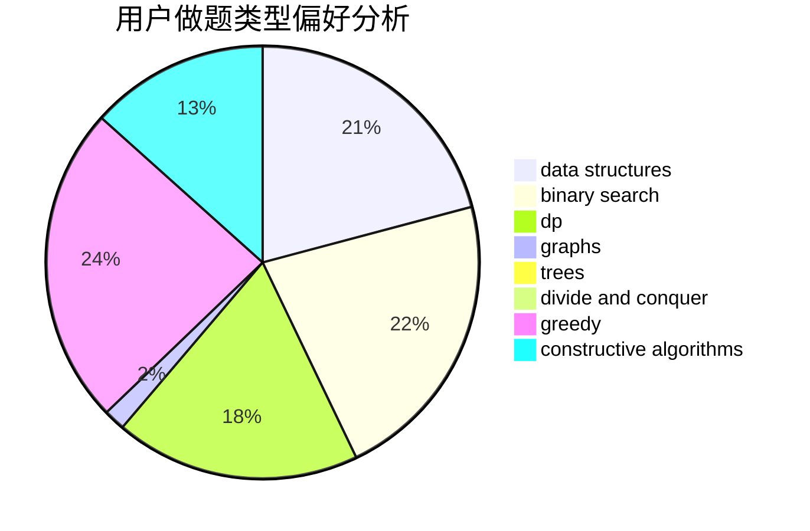
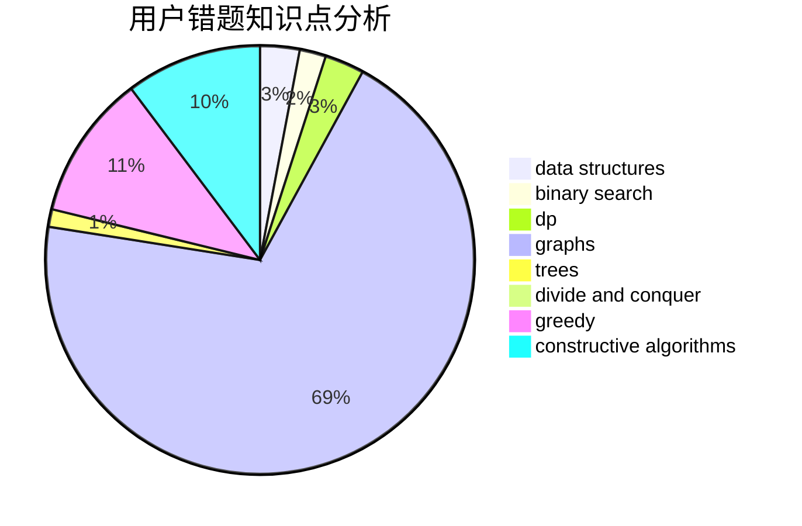

# ChuTian
<!-- tabs:start -->
#### **用户提交结果分析**

#### **用户做题类型偏好分析**

#### **用户错题知识点分析**

<!-- tabs:end -->
# 推荐题目
[Mishka and Interesting sum](http://codeforces.com/problemset/problem/703/D)		data structures		  
[Chris and Road](http://codeforces.com/problemset/problem/703/C)		geometry,
                        implementation		  
[Olympic Medal](http://codeforces.com/problemset/problem/215/B)		greedy,
                        math		  
[Mishka and Divisors](http://codeforces.com/problemset/problem/703/E)		dp,
                        number theory		  
[Closest Equals](http://codeforces.com/problemset/problem/522/D)		*special problem,
                        data structures		  
[k-Amazing Numbers](https://codeforces.com/contest/1417/problem/C)		binary search,
                        data structures,
                        implementation,
                        two pointers		  
[Whose sentence is it?](http://codeforces.com/problemset/problem/312/A)		implementation,
                        strings		  
[Iahub and Xors](http://codeforces.com/problemset/problem/341/D)		data structures		  
[Cells Not Under Attack](http://codeforces.com/problemset/problem/701/B)		data structures,
                        math		  
[Vova and Trophies](http://codeforces.com/problemset/problem/1082/B)		greedy		  
<!-- tabs:start -->
#### **data structures**
[Mishka and Interesting sum](http://codeforces.com/problemset/problem/703/D)		data structures		  
[Chris and Road](http://codeforces.com/problemset/problem/522/D)		*special problem,
                        data structures		  
[Olympic Medal](https://codeforces.com/contest/1417/problem/C)		binary search,
                        data structures,
                        implementation,
                        two pointers		  
[Mishka and Divisors](http://codeforces.com/problemset/problem/341/D)		data structures		  
[Closest Equals](http://codeforces.com/problemset/problem/701/B)		data structures,
                        math		  
[k-Amazing Numbers](http://codeforces.com/problemset/problem/220/C)		data structures		  
[Whose sentence is it?](http://codeforces.com/problemset/problem/487/B)		binary search,
                        data structures,
                        dp,
                        two pointers		  
[Iahub and Xors](http://codeforces.com/problemset/problem/1353/D)		constructive algorithms,
                        data structures,
                        sortings		  
[Cells Not Under Attack](http://codeforces.com/problemset/problem/1120/F)		data structures,
                        dp,
                        greedy		  
[Vova and Trophies](http://codeforces.com/problemset/problem/702/F)		data structures		  
#### **binary search**
[Mishka and Interesting sum](https://codeforces.com/contest/1417/problem/C)		binary search,
                        data structures,
                        implementation,
                        two pointers		  
[Chris and Road](http://codeforces.com/problemset/problem/487/B)		binary search,
                        data structures,
                        dp,
                        two pointers		  
[Olympic Medal](http://codeforces.com/problemset/problem/363/D)		binary search,
                        greedy		  
[Mishka and Divisors](https://codeforces.com/contest/1434/problem/A)		binary search,
                        brute force,
                        dp,
                        implementation,
                        sortings,
                        two pointers		  
[Closest Equals](http://codeforces.com/problemset/problem/1470/E)		binary search,
                        combinatorics,
                        data structures,
                        dp,
                        graphs,
                        implementation,
                        two pointers		  
[k-Amazing Numbers](https://codeforces.com/contest/1240/problem/A)		binary search,
                        greedy		  
[Whose sentence is it?](http://codeforces.com/problemset/problem/1492/C)		binary search,
                        data structures,
                        dp,
                        greedy,
                        two pointers		  
[Iahub and Xors](http://codeforces.com/problemset/problem/1463/D)		binary search,
                        constructive algorithms,
                        greedy,
                        two pointers		  
[Cells Not Under Attack](http://codeforces.com/problemset/problem/1490/G)		binary search,
                        data structures,
                        math		  
[Vova and Trophies](http://codeforces.com/problemset/problem/1479/D)		binary search,
                        bitmasks,
                        brute force,
                        data structures,
                        probabilities,
                        trees		  
#### **dp**
[Mishka and Interesting sum](http://codeforces.com/problemset/problem/703/E)		dp,
                        number theory		  
[Chris and Road](http://codeforces.com/problemset/problem/1310/E)		dp		  
[Olympic Medal](http://codeforces.com/problemset/problem/1065/D)		dfs and similar,
                        dp,
                        shortest paths		  
[Mishka and Divisors](http://codeforces.com/problemset/problem/487/B)		binary search,
                        data structures,
                        dp,
                        two pointers		  
[Closest Equals](http://codeforces.com/problemset/problem/1172/C2)		dp,
                        probabilities		  
[k-Amazing Numbers](http://codeforces.com/problemset/problem/1396/C)		dp,
                        greedy,
                        implementation		  
[Whose sentence is it?](http://codeforces.com/problemset/problem/316/D2)		dp		  
[Iahub and Xors](http://codeforces.com/problemset/problem/704/B)		dp,
                        graphs,
                        greedy		  
[Cells Not Under Attack](http://codeforces.com/problemset/problem/1120/F)		data structures,
                        dp,
                        greedy		  
[Vova and Trophies](https://codeforces.com/contest/1434/problem/A)		binary search,
                        brute force,
                        dp,
                        implementation,
                        sortings,
                        two pointers		  
#### **graph**
[Mishka and Interesting sum](http://codeforces.com/problemset/problem/369/C)		dfs and similar,
                        graphs,
                        trees		  
[Chris and Road](http://codeforces.com/problemset/problem/704/B)		dp,
                        graphs,
                        greedy		  
[Olympic Medal](http://codeforces.com/problemset/problem/542/E)		graphs,
                        shortest paths		  
[Mishka and Divisors](http://codeforces.com/problemset/problem/704/C)		dp,
                        graphs,
                        implementation,
                        math		  
[Closest Equals](http://codeforces.com/problemset/problem/1470/E)		binary search,
                        combinatorics,
                        data structures,
                        dp,
                        graphs,
                        implementation,
                        two pointers		  
[k-Amazing Numbers](http://codeforces.com/problemset/problem/370/A)		graphs,
                        math,
                        shortest paths		  
[Whose sentence is it?](http://codeforces.com/problemset/problem/1487/C)		brute force,
                        constructive algorithms,
                        dfs and similar,
                        graphs,
                        greedy,
                        implementation,
                        math		  
[Iahub and Xors](http://codeforces.com/problemset/problem/1437/C)		dp,
                        flows,
                        graph matchings,
                        greedy,
                        math,
                        sortings		  
[Cells Not Under Attack](http://codeforces.com/problemset/problem/1470/D)		constructive algorithms,
                        dfs and similar,
                        graph matchings,
                        graphs,
                        greedy		  
[Vova and Trophies](http://codeforces.com/problemset/problem/1476/C)		dp,
                        graphs,
                        greedy		  
#### **trees**
[Mishka and Interesting sum](http://codeforces.com/problemset/problem/369/C)		dfs and similar,
                        graphs,
                        trees		  
[Chris and Road](http://codeforces.com/problemset/problem/696/B)		dfs and similar,
                        math,
                        probabilities,
                        trees		  
[Olympic Medal](http://codeforces.com/problemset/problem/1152/D)		dp,
                        greedy,
                        trees		  
[Mishka and Divisors](http://codeforces.com/problemset/problem/704/E)		data structures,
                        geometry,
                        trees		  
[Closest Equals](http://codeforces.com/problemset/problem/1479/D)		binary search,
                        bitmasks,
                        brute force,
                        data structures,
                        probabilities,
                        trees		  
[k-Amazing Numbers](http://codeforces.com/problemset/problem/1511/C)		brute force,
                        data structures,
                        implementation,
                        trees		  
[Whose sentence is it?](http://codeforces.com/problemset/problem/1499/F)		combinatorics,
                        dfs and similar,
                        dp,
                        trees		  
[Iahub and Xors](http://codeforces.com/problemset/problem/1491/E)		brute force,
                        dfs and similar,
                        divide and conquer,
                        number theory,
                        trees		  
[Cells Not Under Attack](http://codeforces.com/problemset/problem/1466/D)		data structures,
                        greedy,
                        sortings,
                        trees		  
[Vova and Trophies](http://codeforces.com/problemset/problem/1495/D)		combinatorics,
                        dfs and similar,
                        graphs,
                        math,
                        shortest paths,
                        trees		  
#### **divide and conquer**
[Mishka and Interesting sum](http://codeforces.com/problemset/problem/1461/D)		binary search,
                        brute force,
                        data structures,
                        divide and conquer,
                        implementation,
                        sortings		  
[Chris and Road](http://codeforces.com/problemset/problem/1466/G)		combinatorics,
                        divide and conquer,
                        hashing,
                        math,
                        string suffix structures,
                        strings		  
[Olympic Medal](http://codeforces.com/problemset/problem/1490/D)		dfs and similar,
                        divide and conquer,
                        implementation		  
[Mishka and Divisors](https://codeforces.com/contest/1483/problem/C)		data structures,
                        divide and conquer,
                        dp		  
[Closest Equals](http://codeforces.com/problemset/problem/1491/E)		brute force,
                        dfs and similar,
                        divide and conquer,
                        number theory,
                        trees		  
[k-Amazing Numbers](http://codeforces.com/problemset/problem/1303/G)		data structures,
                        divide and conquer,
                        geometry,
                        trees		  
[Whose sentence is it?](http://codeforces.com/problemset/problem/1494/D)		constructive algorithms,
                        data structures,
                        dfs and similar,
                        divide and conquer,
                        dsu,
                        greedy,
                        sortings,
                        trees		  
[Iahub and Xors](http://codeforces.com/problemset/problem/1482/E)		data structures,
                        divide and conquer,
                        dp		  
[Cells Not Under Attack](http://codeforces.com/problemset/problem/566/C)		dfs and similar,
                        divide and conquer,
                        trees		  
[Vova and Trophies](http://codeforces.com/problemset/problem/1428/F)		binary search,
                        data structures,
                        divide and conquer,
                        dp,
                        two pointers		  
#### **greedy**
[Mishka and Interesting sum](http://codeforces.com/problemset/problem/215/B)		greedy,
                        math		  
[Chris and Road](http://codeforces.com/problemset/problem/1082/B)		greedy		  
[Olympic Medal](http://codeforces.com/problemset/problem/369/A)		greedy,
                        implementation		  
[Mishka and Divisors](http://codeforces.com/problemset/problem/1396/C)		dp,
                        greedy,
                        implementation		  
[Closest Equals](http://codeforces.com/problemset/problem/704/D)		flows,
                        greedy		  
[k-Amazing Numbers](http://codeforces.com/problemset/problem/363/D)		binary search,
                        greedy		  
[Whose sentence is it?](http://codeforces.com/problemset/problem/704/B)		dp,
                        graphs,
                        greedy		  
[Iahub and Xors](http://codeforces.com/problemset/problem/1120/F)		data structures,
                        dp,
                        greedy		  
[Cells Not Under Attack](http://codeforces.com/problemset/problem/1346/B)		*special problem,
                        greedy		  
[Vova and Trophies](http://codeforces.com/problemset/problem/1076/A)		greedy,
                        strings		  
#### **constructive algorithms**
[Mishka and Interesting sum](http://codeforces.com/problemset/problem/1282/D)		constructive algorithms,
                        interactive,
                        strings		  
[Chris and Road](http://codeforces.com/problemset/problem/1353/D)		constructive algorithms,
                        data structures,
                        sortings		  
[Olympic Medal](http://codeforces.com/problemset/problem/1416/B)		constructive algorithms,
                        greedy,
                        math		  
[Mishka and Divisors](http://codeforces.com/problemset/problem/1208/C)		constructive algorithms		  
[Closest Equals](http://codeforces.com/problemset/problem/1276/C)		brute force,
                        combinatorics,
                        constructive algorithms,
                        data structures,
                        greedy,
                        math		  
[k-Amazing Numbers](http://codeforces.com/problemset/problem/1493/A)		constructive algorithms,
                        greedy		  
[Whose sentence is it?](http://codeforces.com/problemset/problem/1463/D)		binary search,
                        constructive algorithms,
                        greedy,
                        two pointers		  
[Iahub and Xors](https://codeforces.com/contest/1456/problem/B)		bitmasks,
                        brute force,
                        constructive algorithms		  
[Cells Not Under Attack](http://codeforces.com/problemset/problem/1492/D)		bitmasks,
                        constructive algorithms,
                        greedy,
                        math		  
[Vova and Trophies](https://codeforces.com/contest/1504/problem/D)		constructive algorithms,
                        games,
                        interactive		  
#### **sortings**
[Mishka and Interesting sum](http://codeforces.com/problemset/problem/1353/D)		constructive algorithms,
                        data structures,
                        sortings		  
[Chris and Road](https://codeforces.com/contest/1434/problem/A)		binary search,
                        brute force,
                        dp,
                        implementation,
                        sortings,
                        two pointers		  
[Olympic Medal](https://codeforces.com/contest/1345/problem/C)		math,
                        number theory,
                        sortings		  
[Mishka and Divisors](https://codeforces.com/contest/1496/problem/C)		geometry,
                        greedy,
                        math,
                        sortings		  
[Closest Equals](http://codeforces.com/problemset/problem/1495/A)		geometry,
                        greedy,
                        math,
                        sortings		  
[k-Amazing Numbers](http://codeforces.com/problemset/problem/1497/A)		brute force,
                        data structures,
                        greedy,
                        sortings		  
[Whose sentence is it?](http://codeforces.com/problemset/problem/1427/A)		math,
                        sortings		  
[Iahub and Xors](http://codeforces.com/problemset/problem/1461/D)		binary search,
                        brute force,
                        data structures,
                        divide and conquer,
                        implementation,
                        sortings		  
[Cells Not Under Attack](http://codeforces.com/problemset/problem/1437/C)		dp,
                        flows,
                        graph matchings,
                        greedy,
                        math,
                        sortings		  
[Vova and Trophies](http://codeforces.com/problemset/problem/1473/A)		greedy,
                        implementation,
                        math,
                        sortings		  
<!-- tabs:end -->
