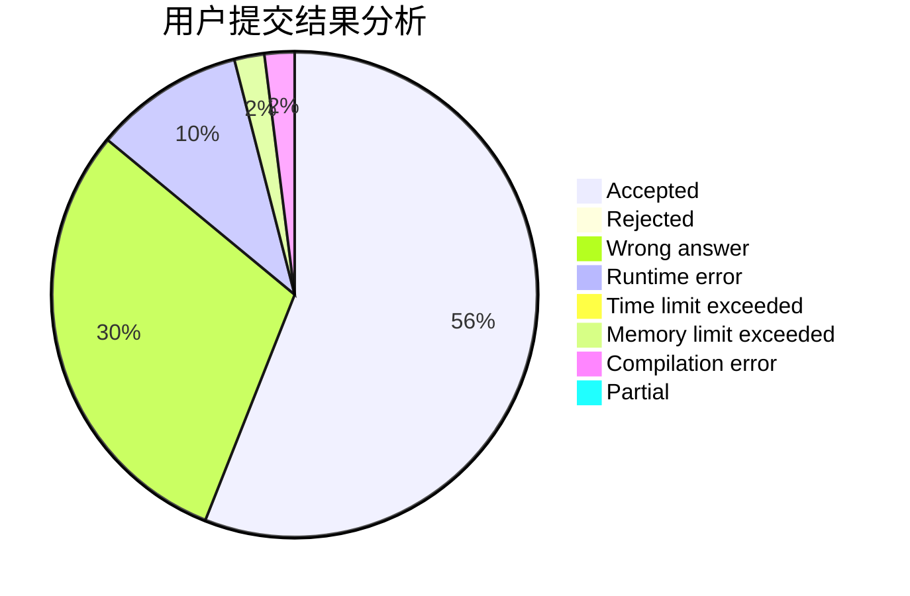
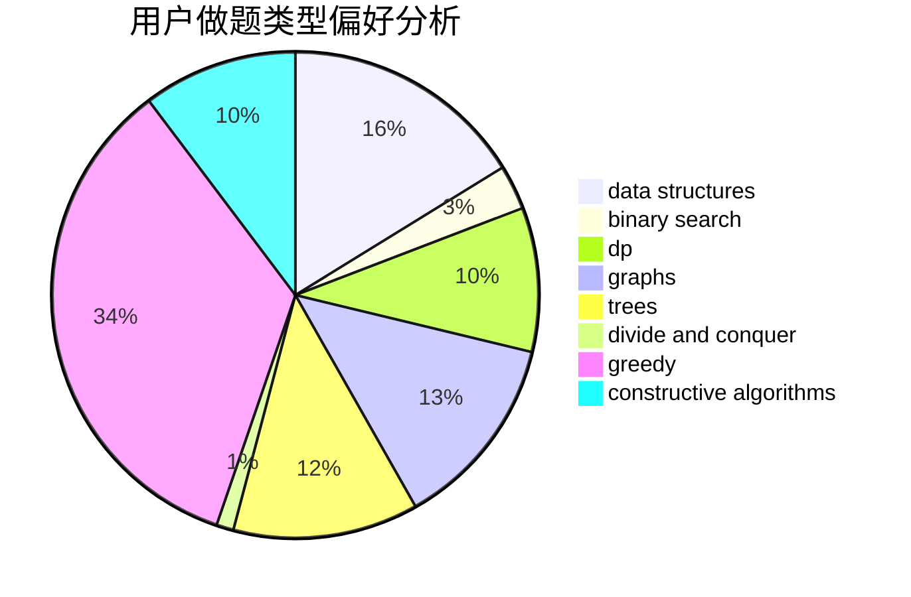
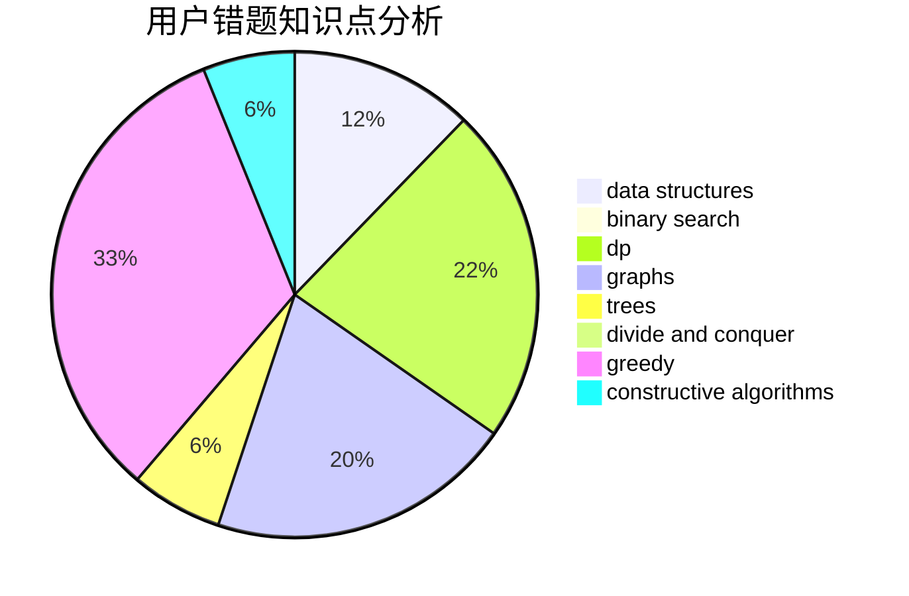

# Circle_of_Arthas

<!-- tabs:start -->

#### **用户提交结果分析**

#### **用户做题类型偏好分析**

#### **用户错题知识点分析**

<!-- tabs:end -->
# 推荐题目
[1141D](https://codeforces.com/contest/1141/problem/D)		greedy,
                        implementation		  
[724G](https://codeforces.com/contest/724/problem/G)		bitmasks,
                        graphs,
                        math,
                        number theory,
                        trees		  
[295B](https://codeforces.com/contest/295/problem/B)		dp,
                        graphs,
                        shortest paths		  
[725C](https://codeforces.com/contest/725/problem/C)		brute force,
                        constructive algorithms,
                        implementation,
                        strings		  
[559D](https://codeforces.com/contest/559/problem/D)		combinatorics,
                        geometry,
                        probabilities		  
[725B](https://codeforces.com/contest/725/problem/B)		implementation,
                        math		  
[1057B](https://codeforces.com/contest/1057/problem/B)		*special problem,
                        brute force		  
[520C](https://codeforces.com/contest/520/problem/C)		math,
                        strings		  
[496E](https://codeforces.com/contest/496/problem/E)		greedy,
                        sortings		  
[1080B](https://codeforces.com/contest/1080/problem/B)		math		  
