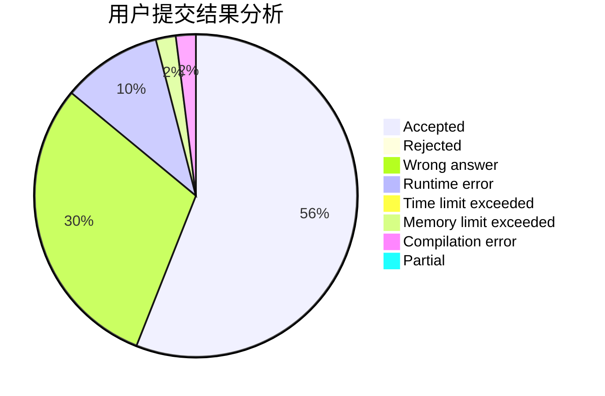
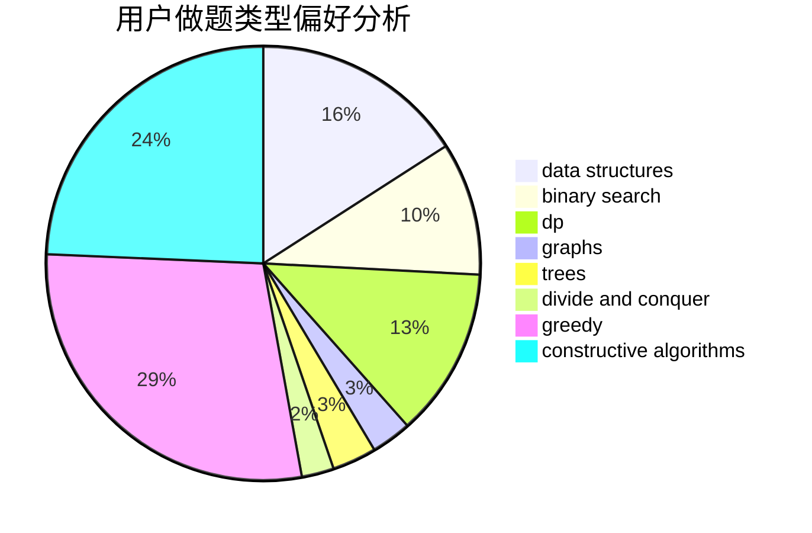
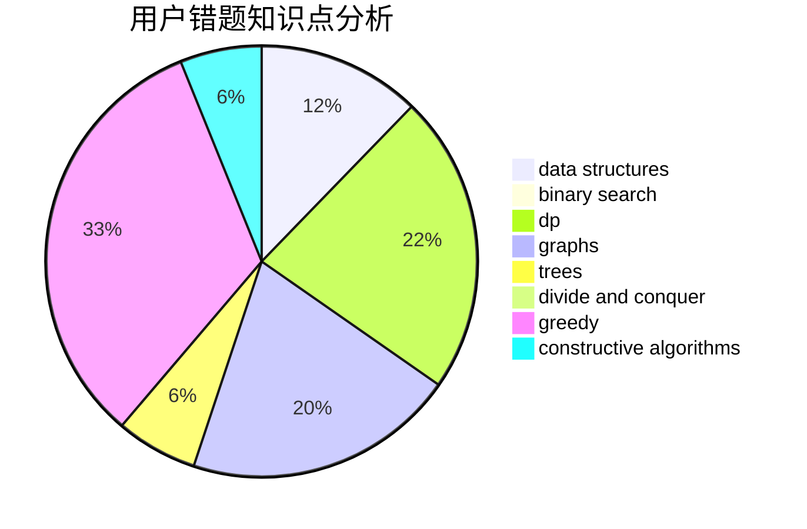

# Circle_of_Arthas

<!-- tabs:start -->

#### **用户提交结果分析**

#### **用户做题类型偏好分析**

#### **用户错题知识点分析**

<!-- tabs:end -->
# 推荐题目
[113D](https://codeforces.com/contest/113/problem/D)		math,
                        matrices,
                        probabilities		  
[706C](https://codeforces.com/contest/706/problem/C)		dp,
                        strings		  
[27C](https://codeforces.com/contest/27/problem/C)		constructive algorithms,
                        greedy		  
[707A](https://codeforces.com/contest/707/problem/A)		implementation		  
[538C](https://codeforces.com/contest/538/problem/C)		binary search,
                        brute force,
                        greedy,
                        implementation,
                        math		  
[706E](https://codeforces.com/contest/706/problem/E)		data structures,
                        implementation		  
[1056F](https://codeforces.com/contest/1056/problem/F)		binary search,
                        dp,
                        math		  
[4C](https://codeforces.com/contest/4/problem/C)		data structures,
                        hashing,
                        implementation		  
[476E](https://codeforces.com/contest/476/problem/E)		dp,
                        strings		  
[107C](https://codeforces.com/contest/107/problem/C)		bitmasks,
                        dp		  
