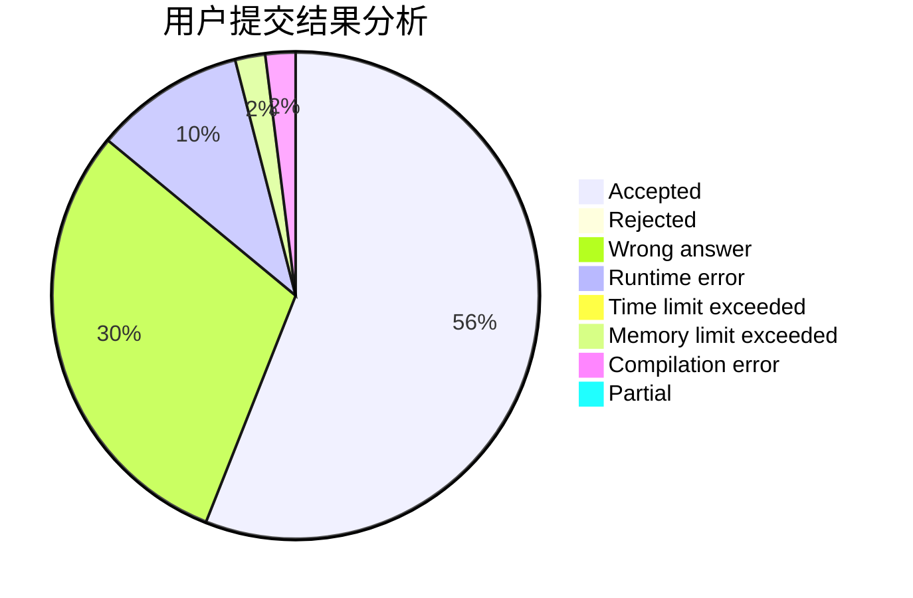
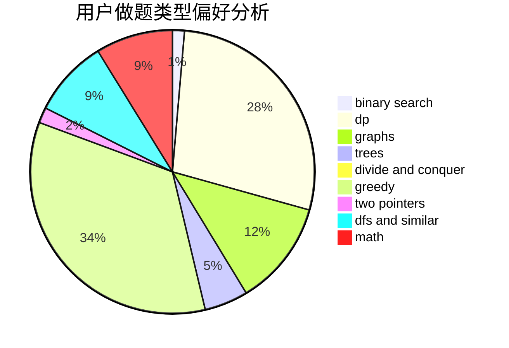

# Circle_of_Arthas

<!-- tabs:start -->

#### **用户提交结果分析**

#### **用户做题类型偏好分析**

<!-- tabs:end -->
# 推荐题目
[1141D](https://codeforces.com/contest/1141/problem/D)
[724G](https://codeforces.com/contest/724/problem/G)
[295B](https://codeforces.com/contest/295/problem/B)
[725C](https://codeforces.com/contest/725/problem/C)
[559D](https://codeforces.com/contest/559/problem/D)
[725B](https://codeforces.com/contest/725/problem/B)
[1057B](https://codeforces.com/contest/1057/problem/B)
[520C](https://codeforces.com/contest/520/problem/C)
[496E](https://codeforces.com/contest/496/problem/E)
[1080B](https://codeforces.com/contest/1080/problem/B)
