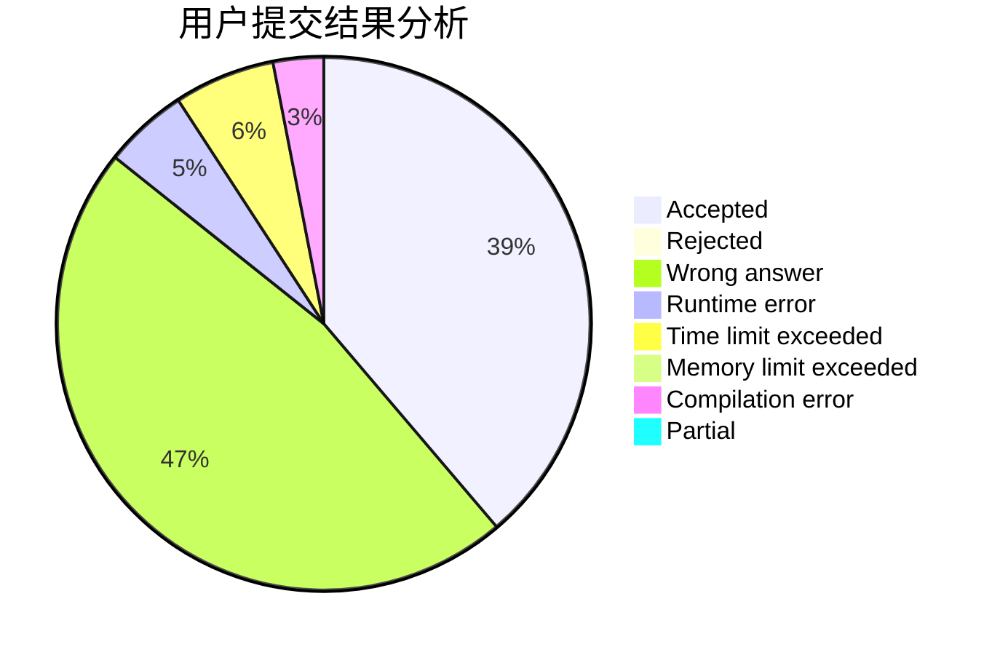
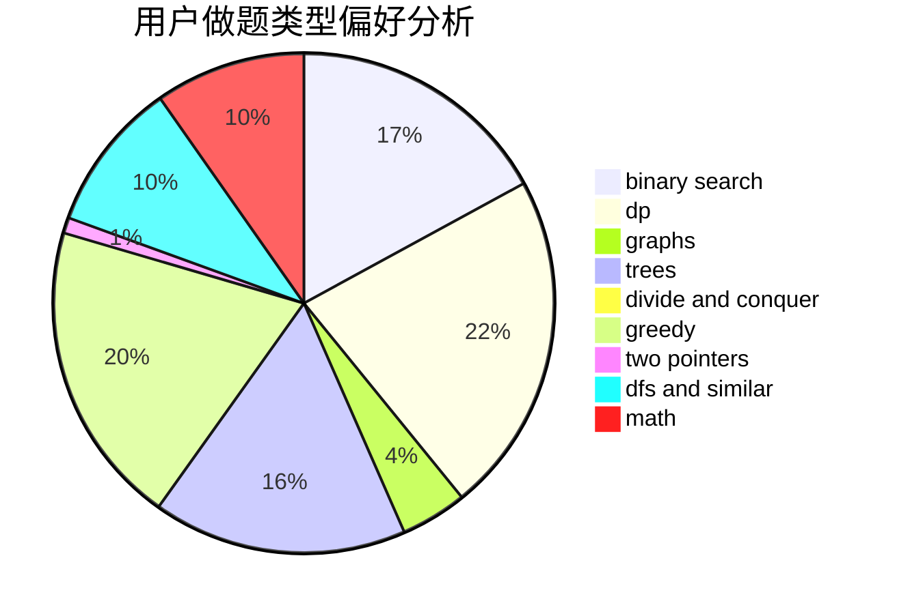

# Cirno

<!-- tabs:start -->

#### **用户提交结果分析**

#### **用户做题类型偏好分析**

<!-- tabs:end -->
# 推荐题目
[727C](https://codeforces.com/contest/727/problem/C)
[727F](https://codeforces.com/contest/727/problem/F)
[729D](https://codeforces.com/contest/729/problem/D)
[729E](https://codeforces.com/contest/729/problem/E)
[727A](https://codeforces.com/contest/727/problem/A)
[1166B](https://codeforces.com/contest/1166/problem/B)
[1078C](https://codeforces.com/contest/1078/problem/C)
[524E](https://codeforces.com/contest/524/problem/E)
[484B](https://codeforces.com/contest/484/problem/B)
[727E](https://codeforces.com/contest/727/problem/E)
