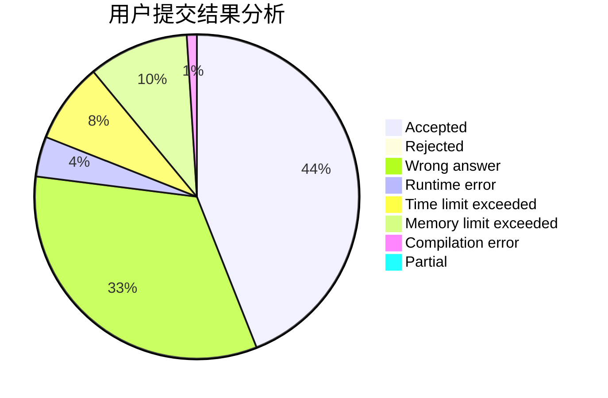
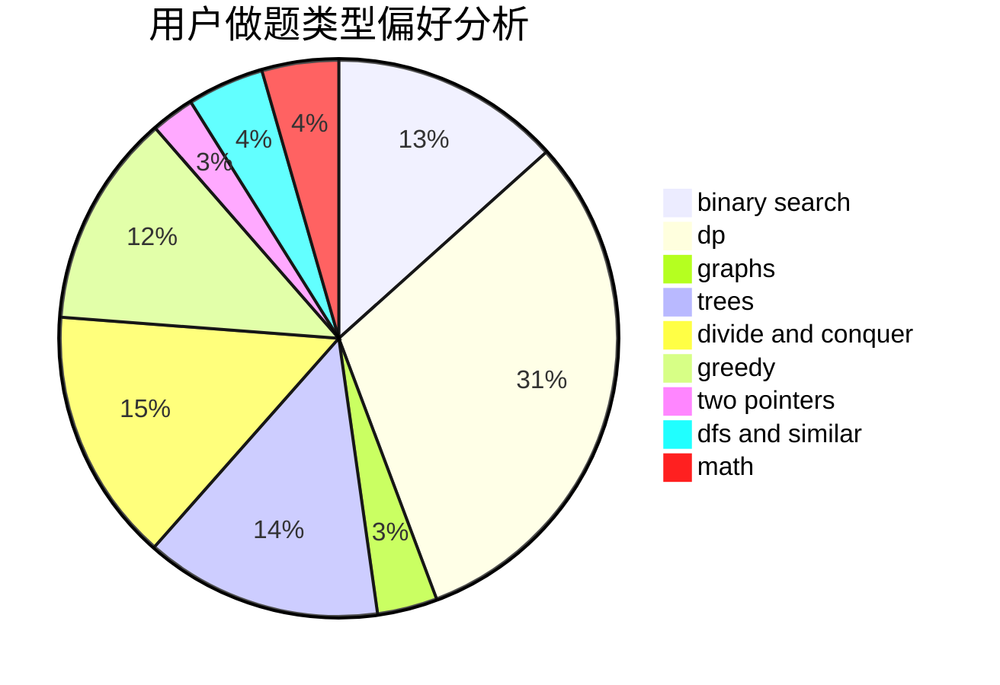

# 18Michael

<!-- tabs:start -->

#### **用户提交结果分析**

#### **用户做题类型偏好分析**

<!-- tabs:end -->
# 推荐题目
[1194F](https://codeforces.com/contest/1194/problem/F)
[1191C](https://codeforces.com/contest/1191/problem/C)
[1190D](https://codeforces.com/contest/1190/problem/D)
[1005D](https://codeforces.com/contest/1005/problem/D)
[118E](https://codeforces.com/contest/118/problem/E)
[1191E](https://codeforces.com/contest/1191/problem/E)
[1190E](https://codeforces.com/contest/1190/problem/E)
[1190A](https://codeforces.com/contest/1190/problem/A)
[11951](https://codeforces.com/contest/1195/problem/1)
[118B](https://codeforces.com/contest/118/problem/B)
