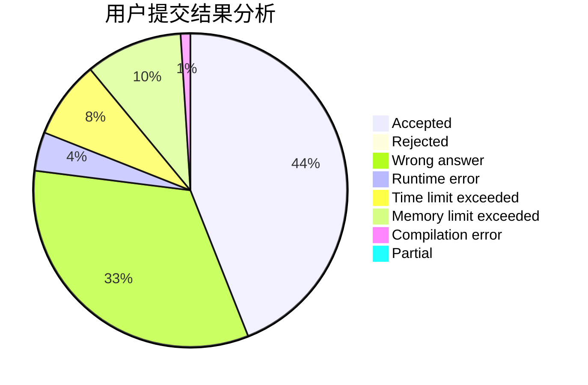
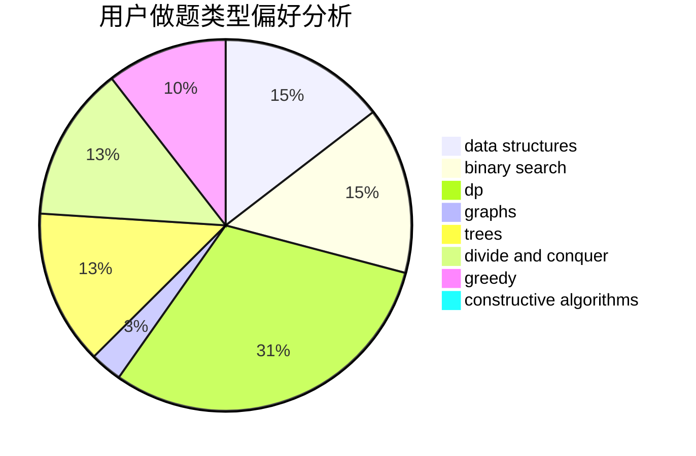
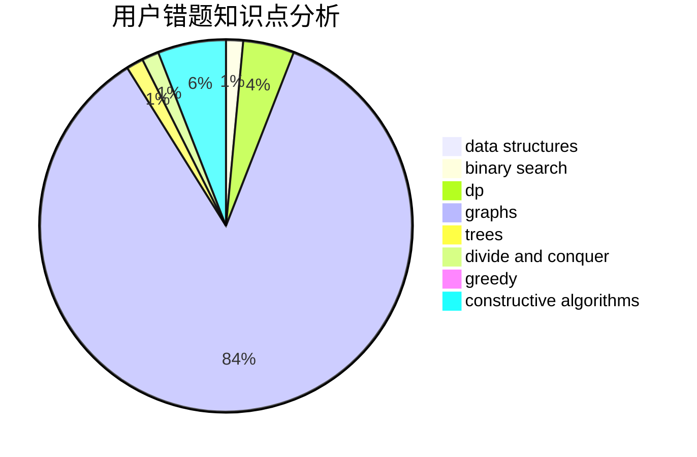

# 18Michael

<!-- tabs:start -->

#### **用户提交结果分析**

#### **用户做题类型偏好分析**

#### **用户错题知识点分析**

<!-- tabs:end -->
# 推荐题目
[1194F](https://codeforces.com/contest/1194/problem/F)		combinatorics,
                        dp,
                        number theory,
                        probabilities,
                        two pointers		  
[1191C](https://codeforces.com/contest/1191/problem/C)		dsu,graphs,sortings,trees		  
[1190D](https://codeforces.com/contest/1190/problem/D)		data structures,
                        divide and conquer,
                        sortings,
                        two pointers		  
[1005D](https://codeforces.com/contest/1005/problem/D)		dp,
                        greedy,
                        number theory		  
[118E](https://codeforces.com/contest/118/problem/E)		dfs and similar,
                        graphs		  
[1191E](https://codeforces.com/contest/1191/problem/E)		dsu,graphs,sortings,trees		  
[1190E](https://codeforces.com/contest/1190/problem/E)		binary search,
                        greedy		  
[1190A](https://codeforces.com/contest/1190/problem/A)		implementation,
                        two pointers		  
[11951](https://codeforces.com/contest/1195/problem/1)		dsu,graphs,sortings,trees		  
[118B](https://codeforces.com/contest/118/problem/B)		constructive algorithms,
                        implementation		  
