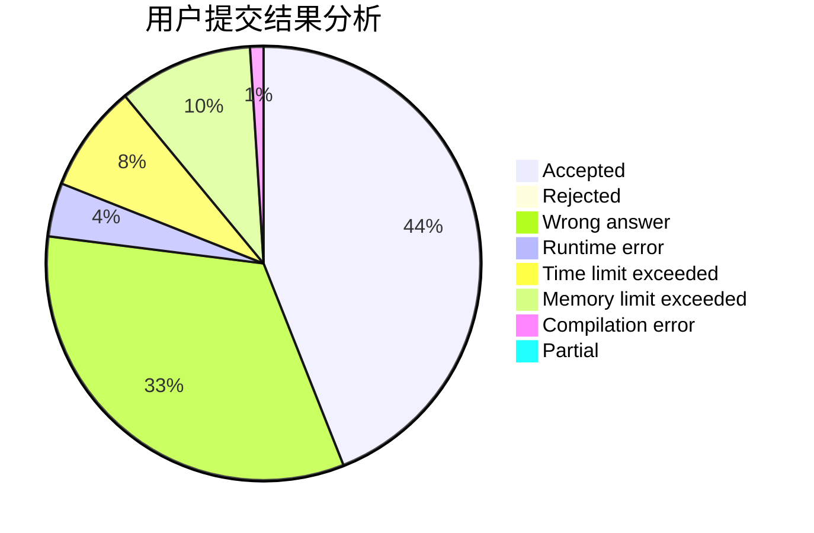
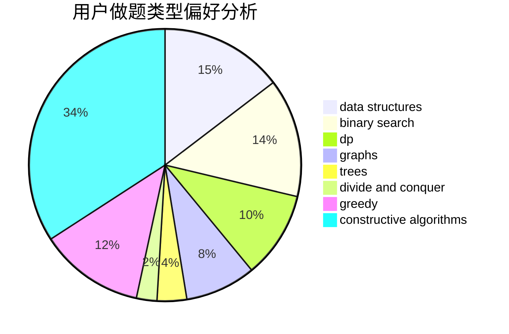
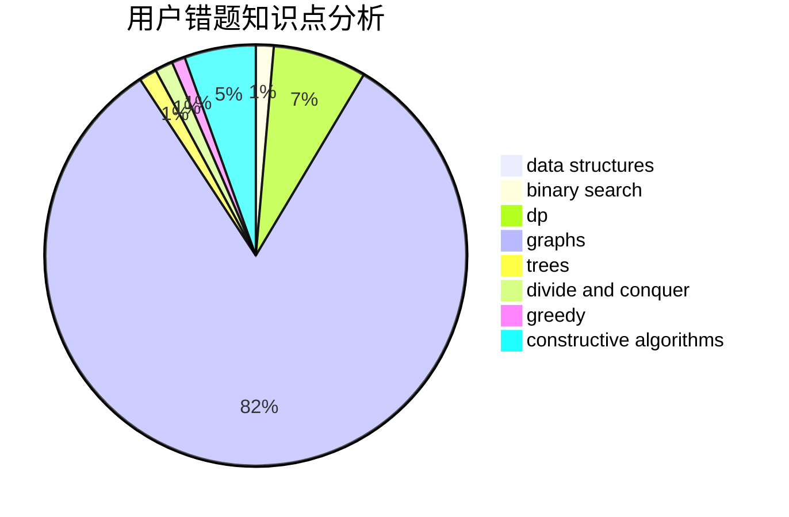

# 18Michael

<!-- tabs:start -->

#### **用户提交结果分析**

#### **用户做题类型偏好分析**

#### **用户错题知识点分析**

<!-- tabs:end -->
# 推荐题目
[1189D1](https://codeforces.com/contest/1189D/problem/1)		dsu,graphs,sortings,trees		  
[1187F](https://codeforces.com/contest/1187/problem/F)		dp,
                        math,
                        probabilities		  
[1187B](https://codeforces.com/contest/1187/problem/B)		binary search,
                        implementation,
                        strings		  
[1005C](https://codeforces.com/contest/1005/problem/C)		brute force,
                        greedy,
                        implementation		  
[1186C](https://codeforces.com/contest/1186/problem/C)		implementation,
                        math		  
[1188A1](https://codeforces.com/contest/1188A/problem/1)		trees		  
[1187C](https://codeforces.com/contest/1187/problem/C)		constructive algorithms,
                        greedy,
                        implementation		  
[1186D](https://codeforces.com/contest/1186/problem/D)		constructive algorithms,
                        greedy,
                        math		  
[1189D2](https://codeforces.com/contest/1189D/problem/2)		dsu,graphs,sortings,trees		  
[1185G1](https://codeforces.com/contest/1185G/problem/1)		bitmasks,
                        combinatorics,
                        dp		  
