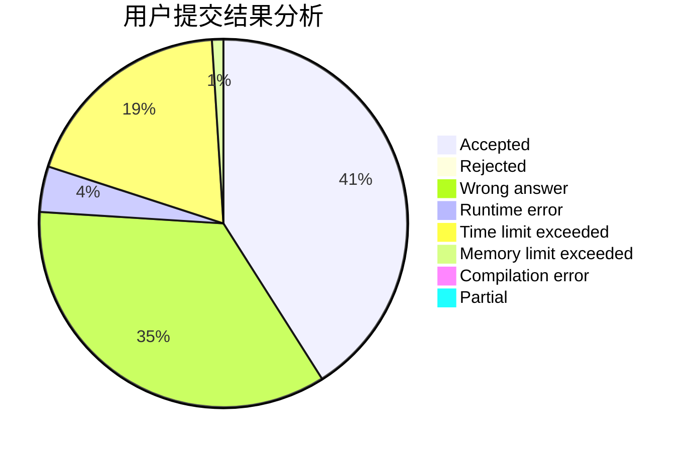
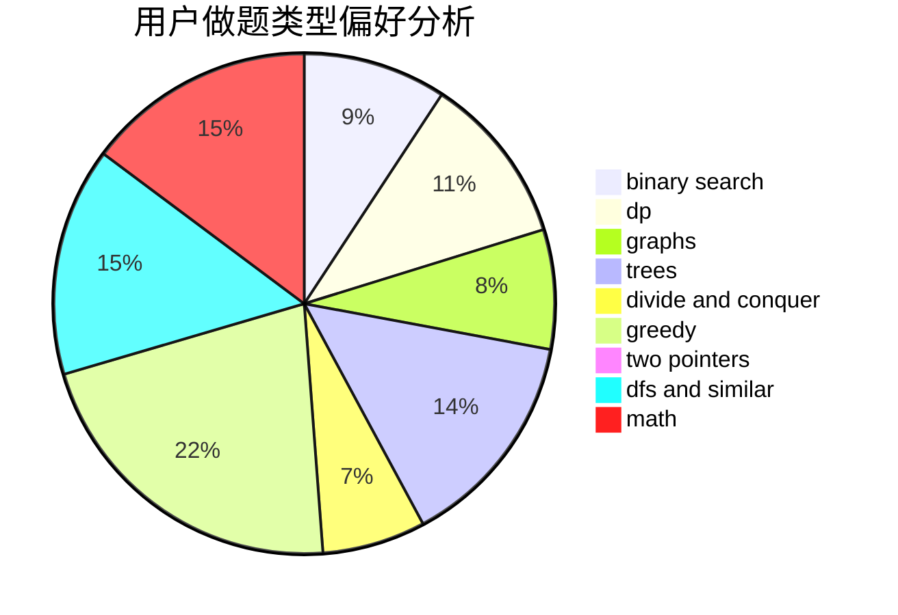

# CitricAcid

<!-- tabs:start -->

#### **用户提交结果分析**

#### **用户做题类型偏好分析**

<!-- tabs:end -->
# 推荐题目
[543E](https://codeforces.com/contest/543/problem/E)
[246D](https://codeforces.com/contest/246/problem/D)
[1276F](https://codeforces.com/contest/1276/problem/F)
[630J](https://codeforces.com/contest/630/problem/J)
[681A](https://codeforces.com/contest/681/problem/A)
[628C](https://codeforces.com/contest/628/problem/C)
[730C](https://codeforces.com/contest/730/problem/C)
[730B](https://codeforces.com/contest/730/problem/B)
[482E](https://codeforces.com/contest/482/problem/E)
[1070K](https://codeforces.com/contest/1070/problem/K)
