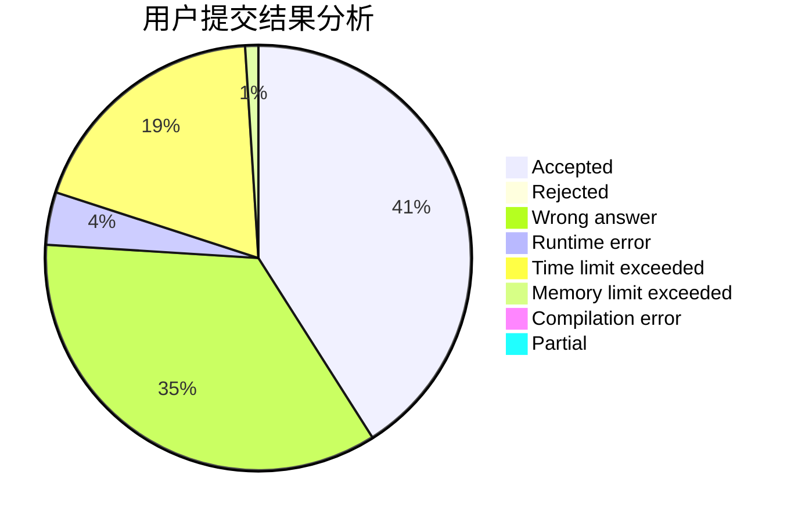
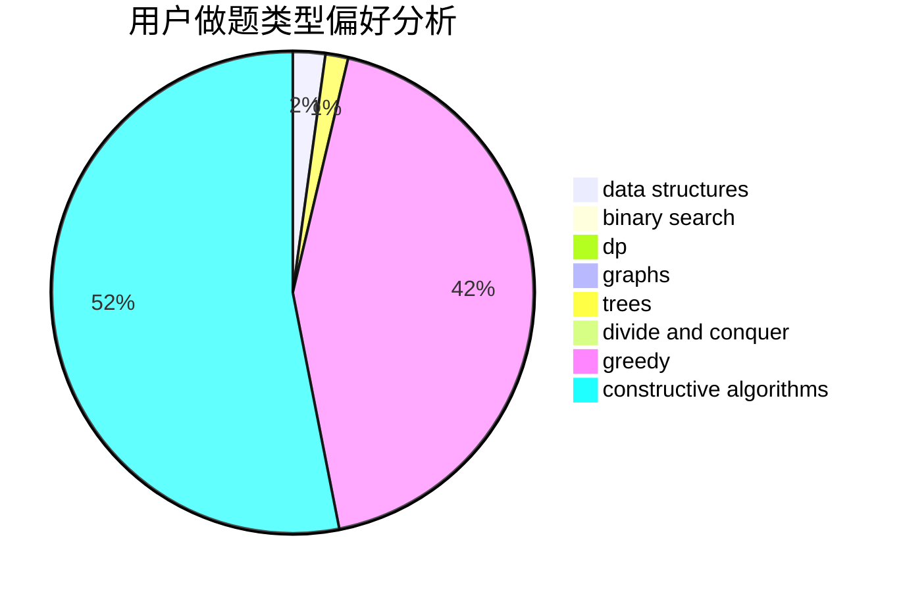

# CitricAcid

<!-- tabs:start -->

#### **用户提交结果分析**

#### **用户做题类型偏好分析**

#### **用户错题知识点分析**

<!-- tabs:end -->
# 推荐题目
[516E](https://codeforces.com/contest/516/problem/E)		math,
                        number theory		  
[228D](https://codeforces.com/contest/228/problem/D)		data structures		  
[1267K](https://codeforces.com/contest/1267/problem/K)		combinatorics,
                        math		  
[611F](https://codeforces.com/contest/611/problem/F)		binary search,
                        implementation		  
[660C](https://codeforces.com/contest/660/problem/C)		binary search,
                        dp,
                        two pointers		  
[609C](https://codeforces.com/contest/609/problem/C)		implementation,
                        math		  
[70E](https://codeforces.com/contest/70/problem/E)		dp,
                        implementation,
                        trees		  
[70D](https://codeforces.com/contest/70/problem/D)		data structures,
                        geometry		  
[463A](https://codeforces.com/contest/463/problem/A)		brute force,
                        implementation		  
[1070H](https://codeforces.com/contest/1070/problem/H)		brute force,
                        implementation		  
