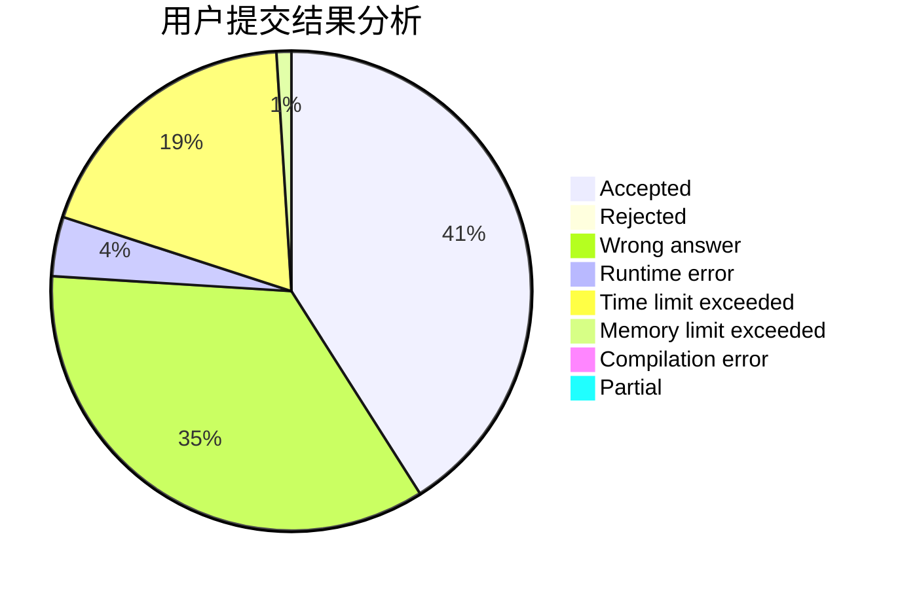
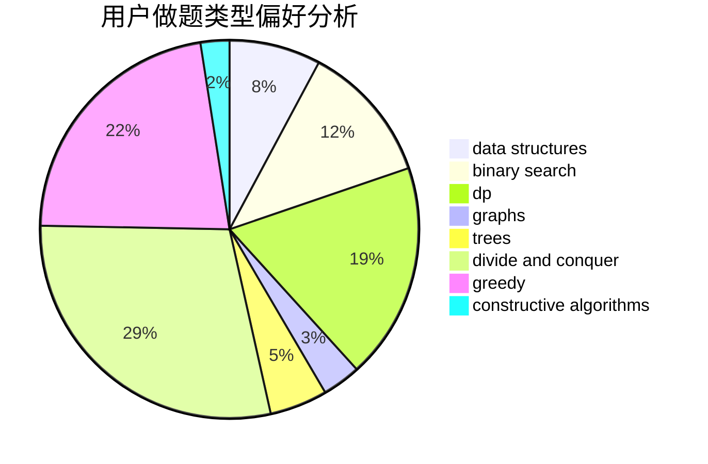

# CitricAcid

<!-- tabs:start -->

#### **用户提交结果分析**

#### **用户做题类型偏好分析**

#### **用户错题知识点分析**

<!-- tabs:end -->
# 推荐题目
[543E](https://codeforces.com/contest/543/problem/E)		constructive algorithms,
                        data structures		  
[246D](https://codeforces.com/contest/246/problem/D)		brute force,
                        dfs and similar,
                        graphs		  
[1276F](https://codeforces.com/contest/1276/problem/F)		string suffix structures		  
[630J](https://codeforces.com/contest/630/problem/J)		math,
                        number theory		  
[681A](https://codeforces.com/contest/681/problem/A)		implementation		  
[628C](https://codeforces.com/contest/628/problem/C)		greedy,
                        strings		  
[730C](https://codeforces.com/contest/730/problem/C)		binary search,
                        dfs and similar		  
[730B](https://codeforces.com/contest/730/problem/B)		constructive algorithms,
                        interactive		  
[482E](https://codeforces.com/contest/482/problem/E)		data structures,
                        trees		  
[1070K](https://codeforces.com/contest/1070/problem/K)		implementation		  
