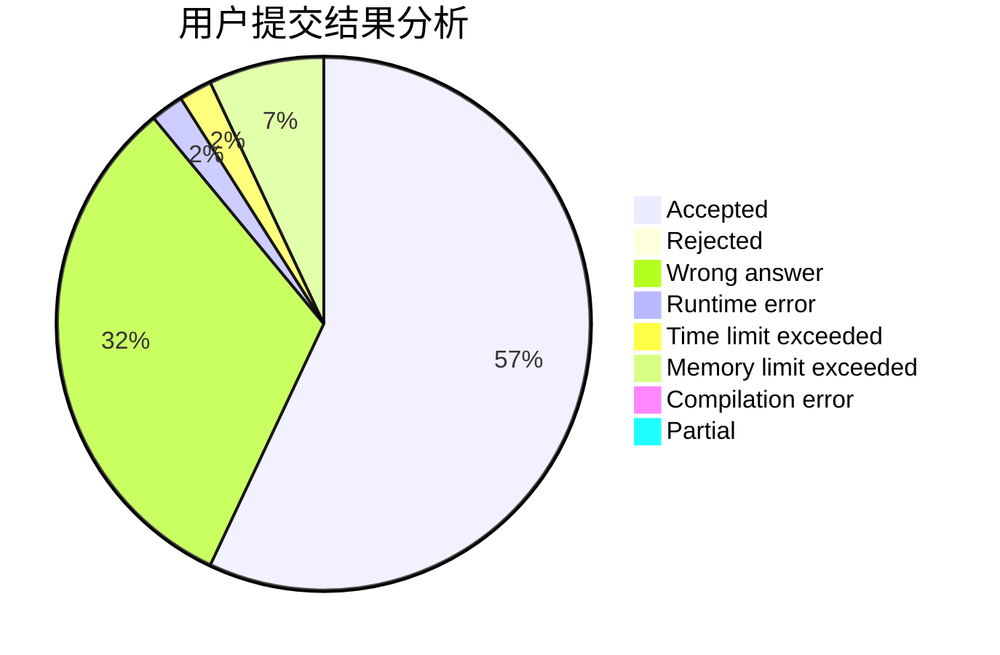
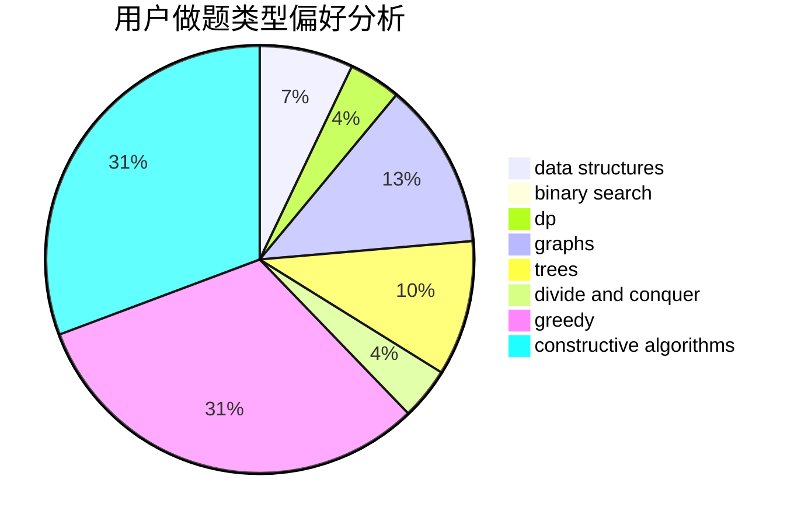
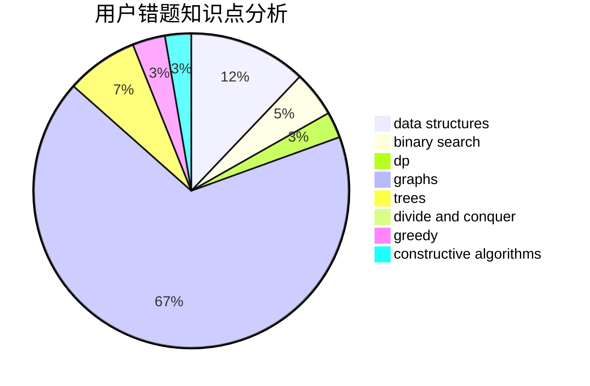

# ClCN

<!-- tabs:start -->

#### **用户提交结果分析**

#### **用户做题类型偏好分析**

#### **用户错题知识点分析**

<!-- tabs:end -->
# 推荐题目
[730J](https://codeforces.com/contest/730/problem/J)		dp		  
[109A](https://codeforces.com/contest/109/problem/A)		brute force,
                        implementation		  
[1772](https://codeforces.com/contest/177/problem/2)		dsu,graphs,sortings,trees		  
[557C](https://codeforces.com/contest/557/problem/C)		brute force,
                        data structures,
                        dp,
                        greedy,
                        math,
                        sortings		  
[1297A](https://codeforces.com/contest/1297/problem/A)		*special problem,
                        implementation		  
[533E](https://codeforces.com/contest/533/problem/E)		constructive algorithms,
                        dp,
                        greedy,
                        hashing,
                        strings,
                        two pointers		  
[367A](https://codeforces.com/contest/367/problem/A)		data structures,
                        implementation		  
[730H](https://codeforces.com/contest/730/problem/H)		constructive algorithms,
                        implementation		  
[309A](https://codeforces.com/contest/309/problem/A)		binary search,
                        math,
                        two pointers		  
[438A](https://codeforces.com/contest/438/problem/A)		dsu,graphs,sortings,trees		  
