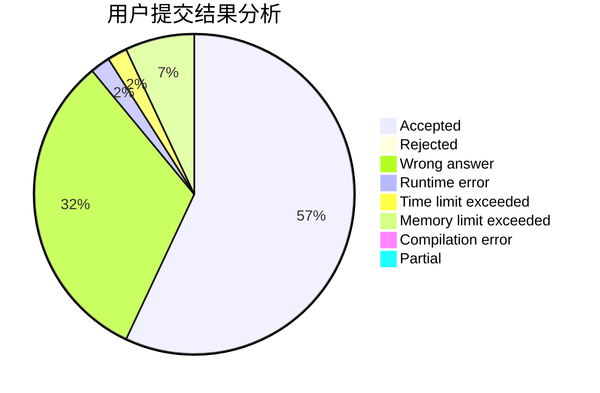
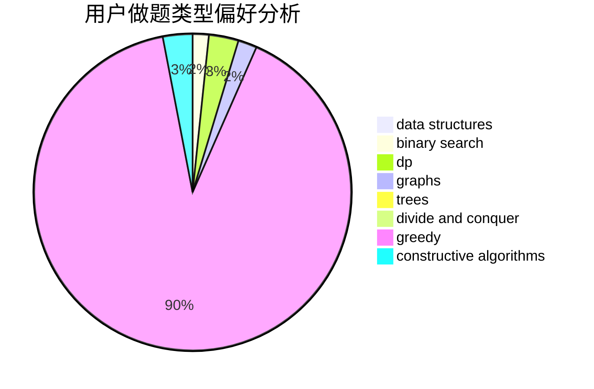
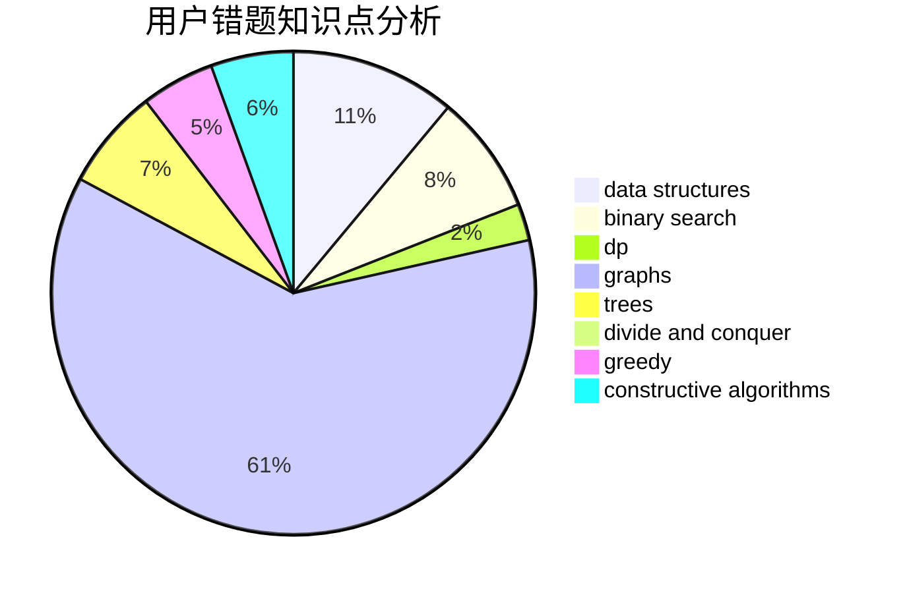

# ClCN

<!-- tabs:start -->

#### **用户提交结果分析**

#### **用户做题类型偏好分析**

#### **用户错题知识点分析**

<!-- tabs:end -->
# 推荐题目
[710F](https://codeforces.com/contest/710/problem/F)		brute force,
                        data structures,
                        hashing,
                        interactive,
                        string suffix structures,
                        strings		  
[1099D](https://codeforces.com/contest/1099/problem/D)		dsu,graphs,sortings,trees		  
[156D](https://codeforces.com/contest/156/problem/D)		combinatorics,
                        graphs		  
[535A](https://codeforces.com/contest/535/problem/A)		brute force,
                        implementation		  
[1290D](https://codeforces.com/contest/1290/problem/D)		constructive algorithms,
                        graphs,
                        interactive		  
[510B](https://codeforces.com/contest/510/problem/B)		dfs and similar		  
[339E](https://codeforces.com/contest/339/problem/E)		constructive algorithms,
                        dfs and similar,
                        greedy		  
[710D](https://codeforces.com/contest/710/problem/D)		math,
                        number theory		  
[292D](https://codeforces.com/contest/292/problem/D)		data structures,
                        dfs and similar,
                        dp,
                        dsu		  
[411A](https://codeforces.com/contest/411/problem/A)		*special problem,
                        implementation		  
