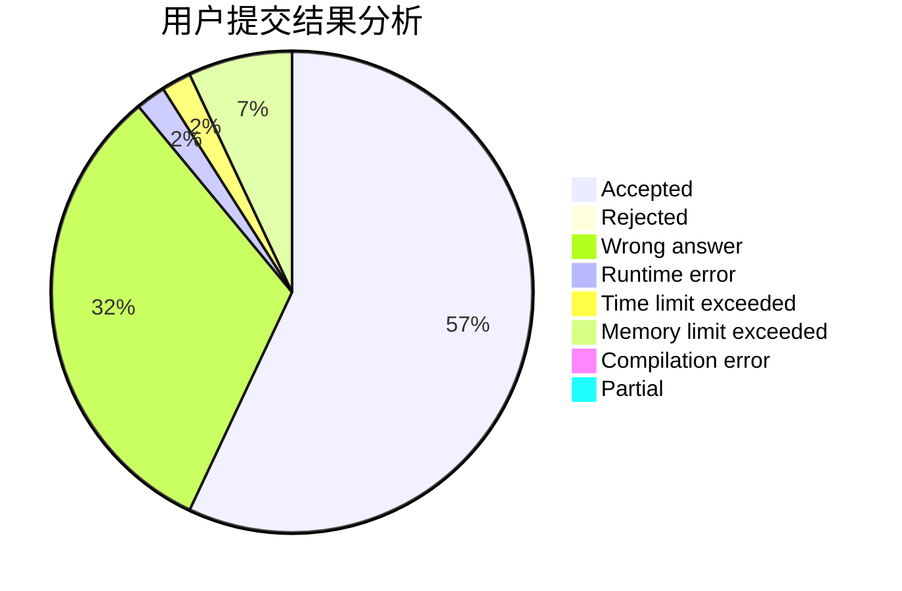
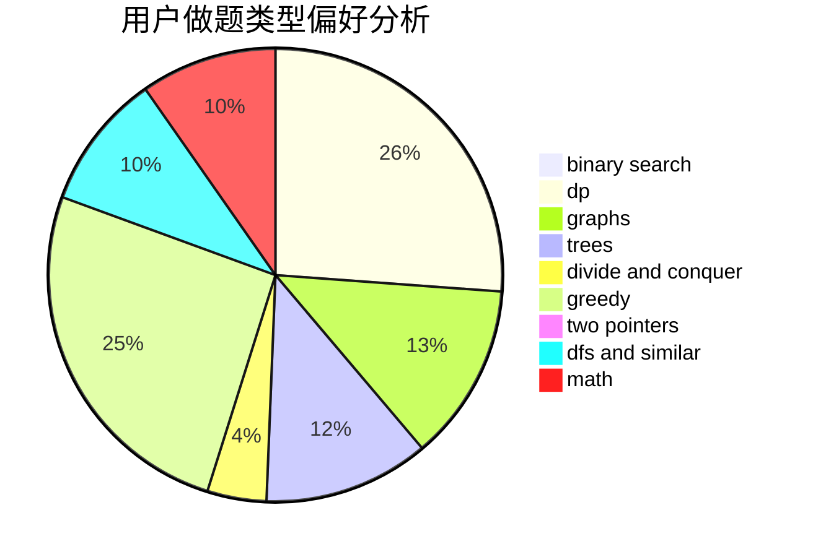

# ClCN

<!-- tabs:start -->

#### **用户提交结果分析**

#### **用户做题类型偏好分析**

<!-- tabs:end -->
# 推荐题目
[730J](https://codeforces.com/contest/730/problem/J)
[109A](https://codeforces.com/contest/109/problem/A)
[1772](https://codeforces.com/contest/177/problem/2)
[557C](https://codeforces.com/contest/557/problem/C)
[1297A](https://codeforces.com/contest/1297/problem/A)
[533E](https://codeforces.com/contest/533/problem/E)
[367A](https://codeforces.com/contest/367/problem/A)
[730H](https://codeforces.com/contest/730/problem/H)
[309A](https://codeforces.com/contest/309/problem/A)
[438A](https://codeforces.com/contest/438/problem/A)
