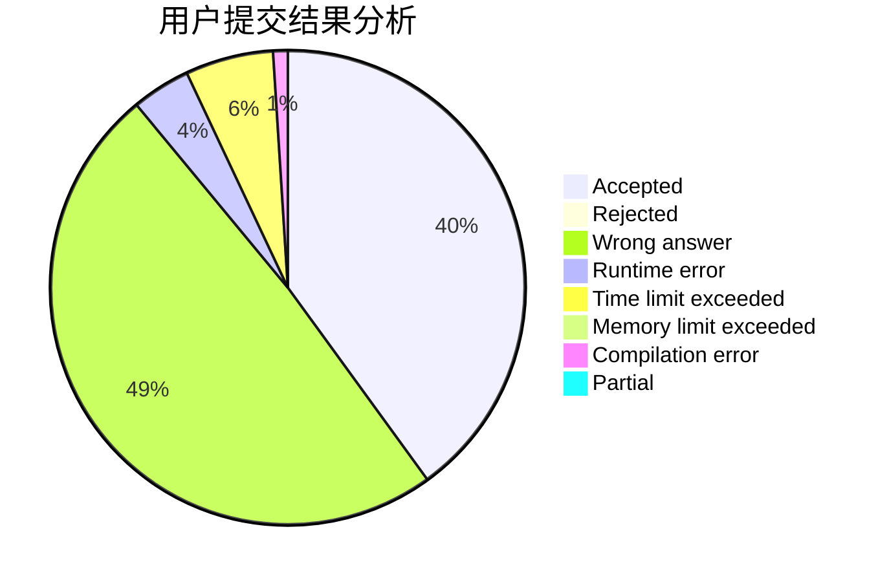
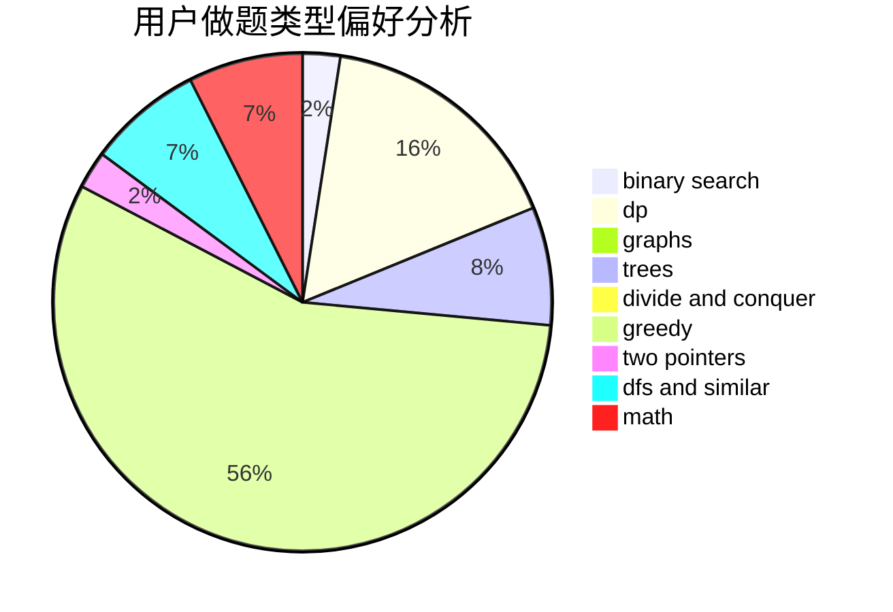

# Clo91eaf

<!-- tabs:start -->

#### **用户提交结果分析**

#### **用户做题类型偏好分析**

<!-- tabs:end -->
# 推荐题目
[1458A](https://codeforces.com/contest/1458/problem/A)
[533F](https://codeforces.com/contest/533/problem/F)
[731C](https://codeforces.com/contest/731/problem/C)
[1162E](https://codeforces.com/contest/1162/problem/E)
[1257E](https://codeforces.com/contest/1257/problem/E)
[286D](https://codeforces.com/contest/286/problem/D)
[29A](https://codeforces.com/contest/29/problem/A)
[230B](https://codeforces.com/contest/230/problem/B)
[319B](https://codeforces.com/contest/319/problem/B)
[731B](https://codeforces.com/contest/731/problem/B)
