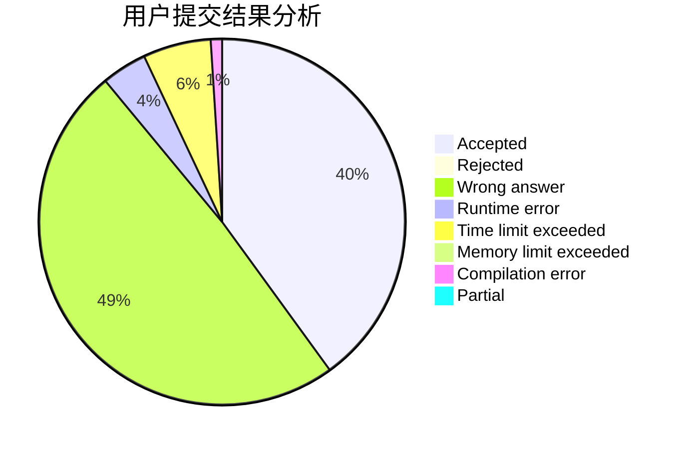
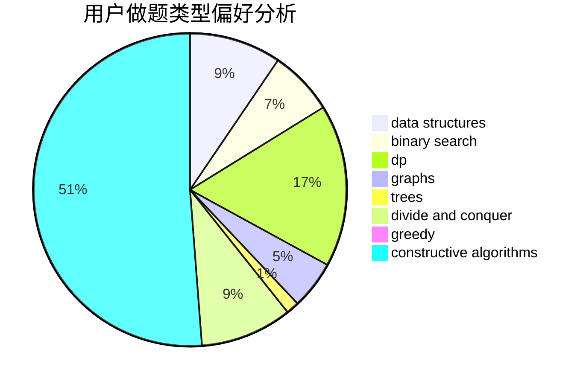
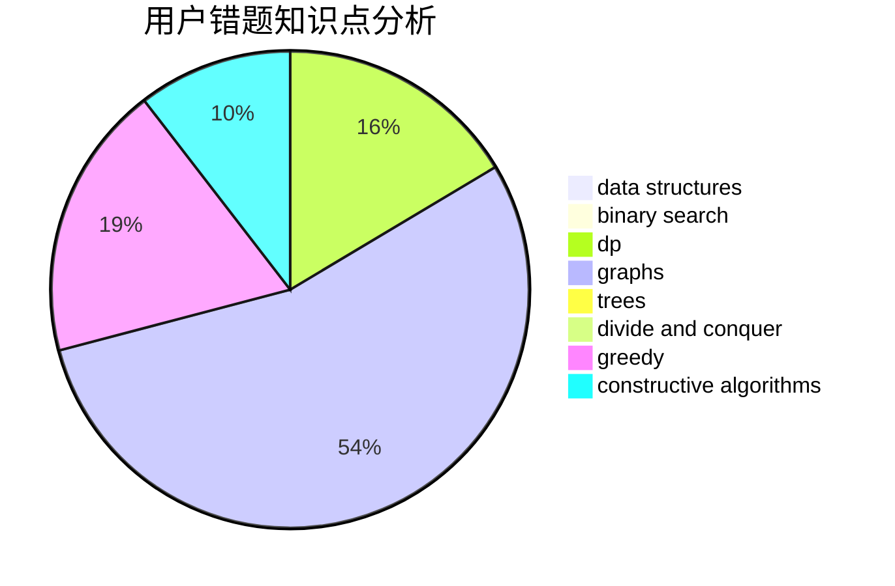

# Clo91eaf

<!-- tabs:start -->

#### **用户提交结果分析**

#### **用户做题类型偏好分析**

#### **用户错题知识点分析**

<!-- tabs:end -->
# 推荐题目
[144D](https://codeforces.com/contest/144/problem/D)		data structures,
                        dfs and similar,
                        graphs,
                        shortest paths		  
[510C](https://codeforces.com/contest/510/problem/C)		dfs and similar,
                        graphs,
                        sortings		  
[711C](https://codeforces.com/contest/711/problem/C)		dp		  
[115A](https://codeforces.com/contest/115/problem/A)		dfs and similar,
                        graphs,
                        trees		  
[1252D](https://codeforces.com/contest/1252/problem/D)		data structures,
                        dp,
                        strings,
                        trees		  
[26D](https://codeforces.com/contest/26/problem/D)		combinatorics,
                        math,
                        probabilities		  
[283A](https://codeforces.com/contest/283/problem/A)		constructive algorithms,
                        data structures,
                        implementation		  
[208D](https://codeforces.com/contest/208/problem/D)		implementation		  
[300D](https://codeforces.com/contest/300/problem/D)		dp,
                        fft		  
[711B](https://codeforces.com/contest/711/problem/B)		constructive algorithms,
                        implementation		  
