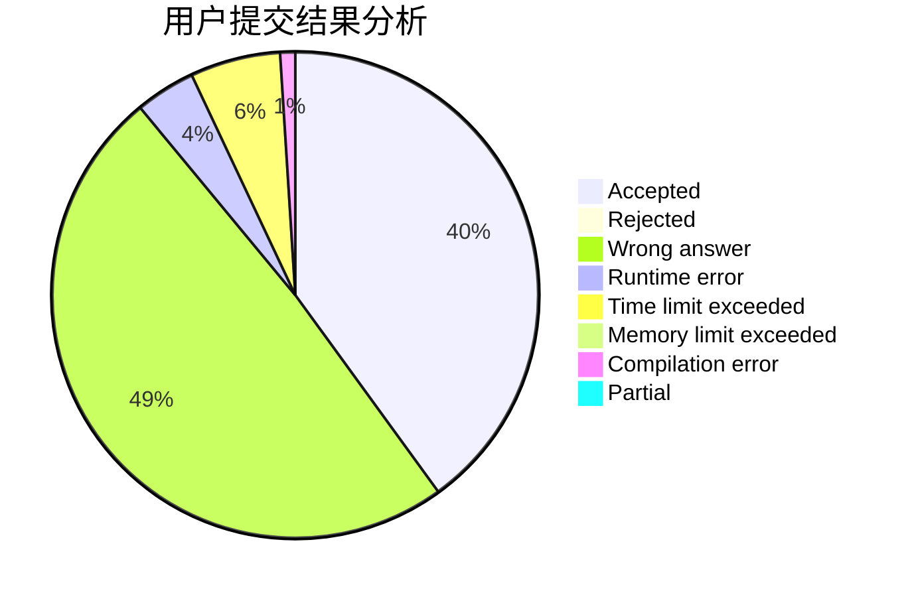
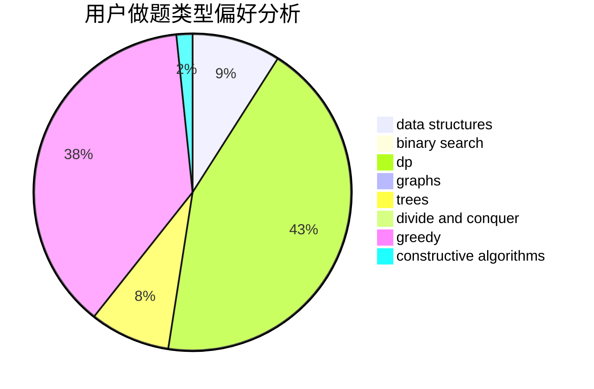
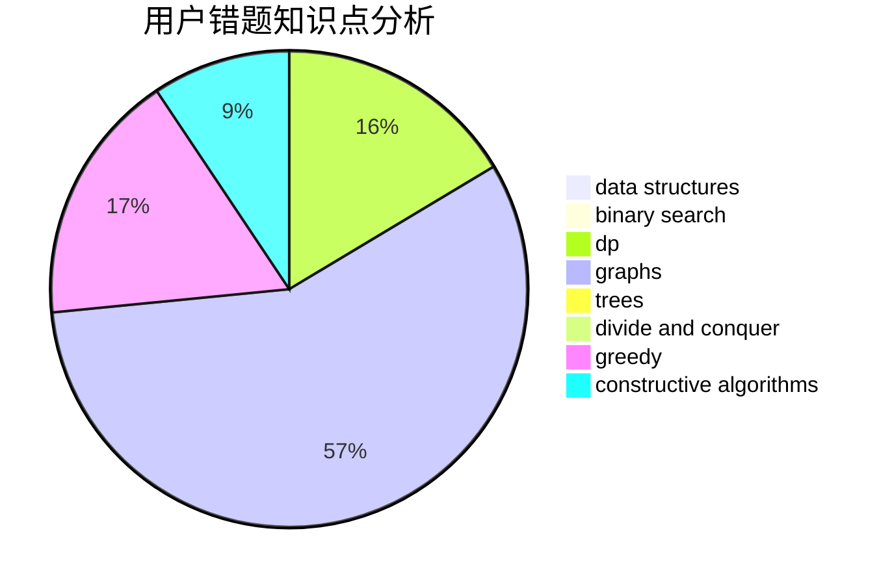

# Clo91eaf

<!-- tabs:start -->

#### **用户提交结果分析**

#### **用户做题类型偏好分析**

#### **用户错题知识点分析**

<!-- tabs:end -->
# 推荐题目
[1458A](https://codeforces.com/contest/1458/problem/A)		math,
                        number theory		  
[533F](https://codeforces.com/contest/533/problem/F)		hashing,
                        string suffix structures,
                        strings		  
[731C](https://codeforces.com/contest/731/problem/C)		dfs and similar,
                        dsu,
                        graphs,
                        greedy		  
[1162E](https://codeforces.com/contest/1162/problem/E)		dsu,graphs,sortings,trees		  
[1257E](https://codeforces.com/contest/1257/problem/E)		data structures,
                        dp,
                        greedy		  
[286D](https://codeforces.com/contest/286/problem/D)		data structures,
                        sortings		  
[29A](https://codeforces.com/contest/29/problem/A)		brute force		  
[230B](https://codeforces.com/contest/230/problem/B)		binary search,
                        implementation,
                        math,
                        number theory		  
[319B](https://codeforces.com/contest/319/problem/B)		data structures,
                        implementation		  
[731B](https://codeforces.com/contest/731/problem/B)		constructive algorithms,
                        greedy		  
