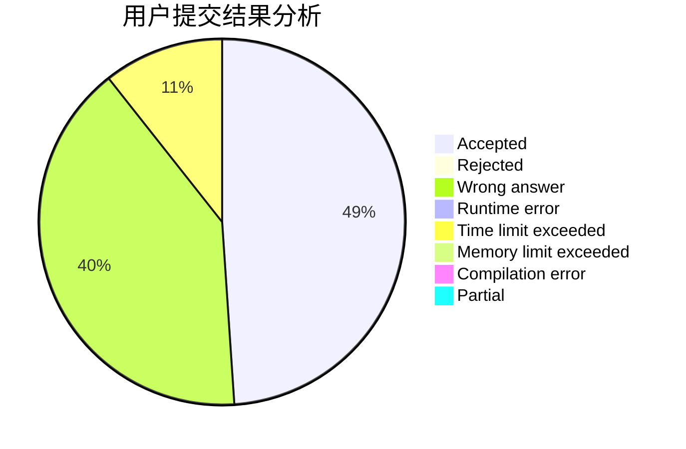
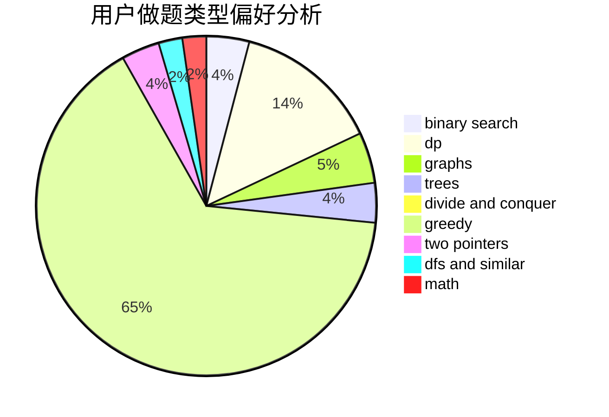

# CloudIO

<!-- tabs:start -->

#### **用户提交结果分析**

#### **用户做题类型偏好分析**

<!-- tabs:end -->
# 推荐题目
[732C](https://codeforces.com/contest/732/problem/C)
[634B](https://codeforces.com/contest/634/problem/B)
[675D](https://codeforces.com/contest/675/problem/D)
[498E](https://codeforces.com/contest/498/problem/E)
[732A](https://codeforces.com/contest/732/problem/A)
[732D](https://codeforces.com/contest/732/problem/D)
[731E](https://codeforces.com/contest/731/problem/E)
[732E](https://codeforces.com/contest/732/problem/E)
[614D](https://codeforces.com/contest/614/problem/D)
[1032E](https://codeforces.com/contest/1032/problem/E)
