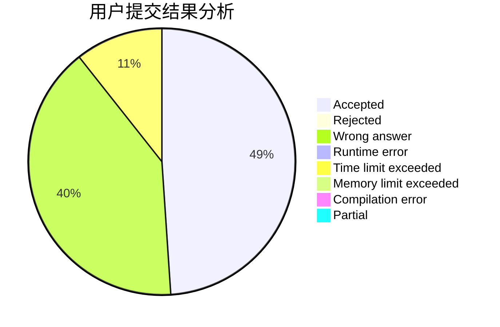
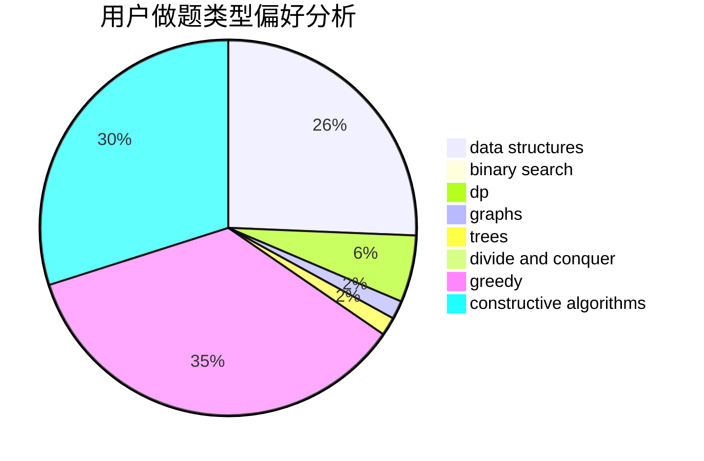
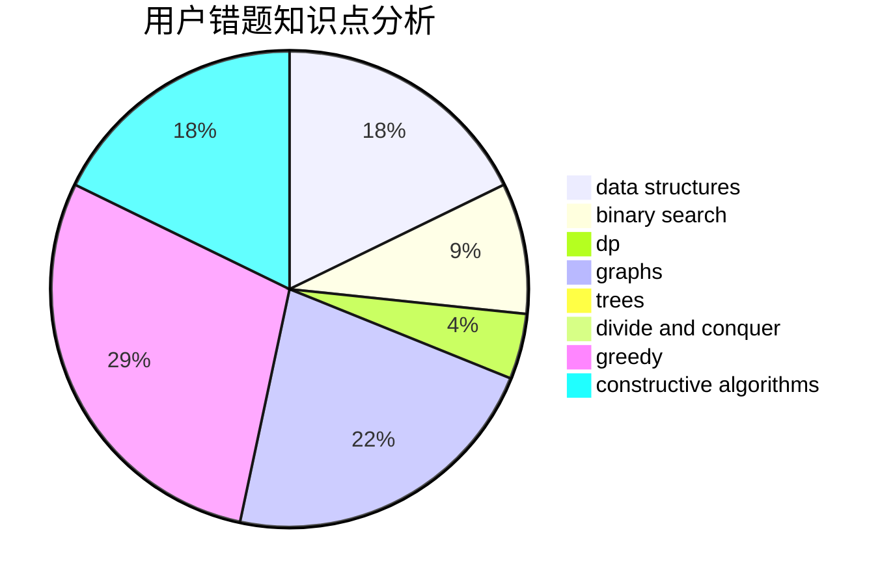

# CloudIO

<!-- tabs:start -->

#### **用户提交结果分析**

#### **用户做题类型偏好分析**

#### **用户错题知识点分析**

<!-- tabs:end -->
# 推荐题目
[732C](https://codeforces.com/contest/732/problem/C)		binary search,
                        constructive algorithms,
                        greedy,
                        implementation,
                        math		  
[634B](https://codeforces.com/contest/634/problem/B)		dsu,graphs,sortings,trees		  
[675D](https://codeforces.com/contest/675/problem/D)		data structures,
                        trees		  
[498E](https://codeforces.com/contest/498/problem/E)		dp,
                        matrices		  
[732A](https://codeforces.com/contest/732/problem/A)		brute force,
                        constructive algorithms,
                        implementation,
                        math		  
[732D](https://codeforces.com/contest/732/problem/D)		binary search,
                        greedy,
                        sortings		  
[731E](https://codeforces.com/contest/731/problem/E)		dp,
                        games		  
[732E](https://codeforces.com/contest/732/problem/E)		greedy,
                        sortings		  
[614D](https://codeforces.com/contest/614/problem/D)		dsu,graphs,sortings,trees		  
[1032E](https://codeforces.com/contest/1032/problem/E)		dp,
                        math		  
