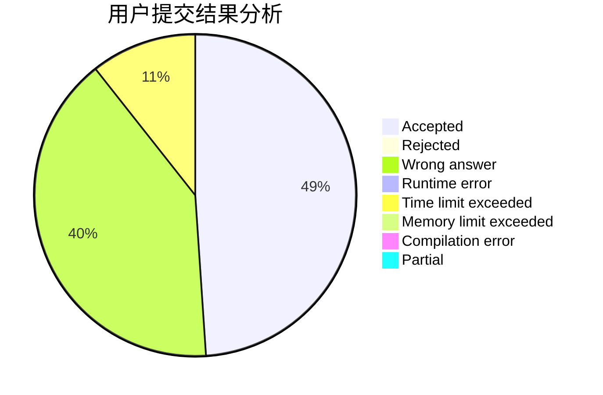
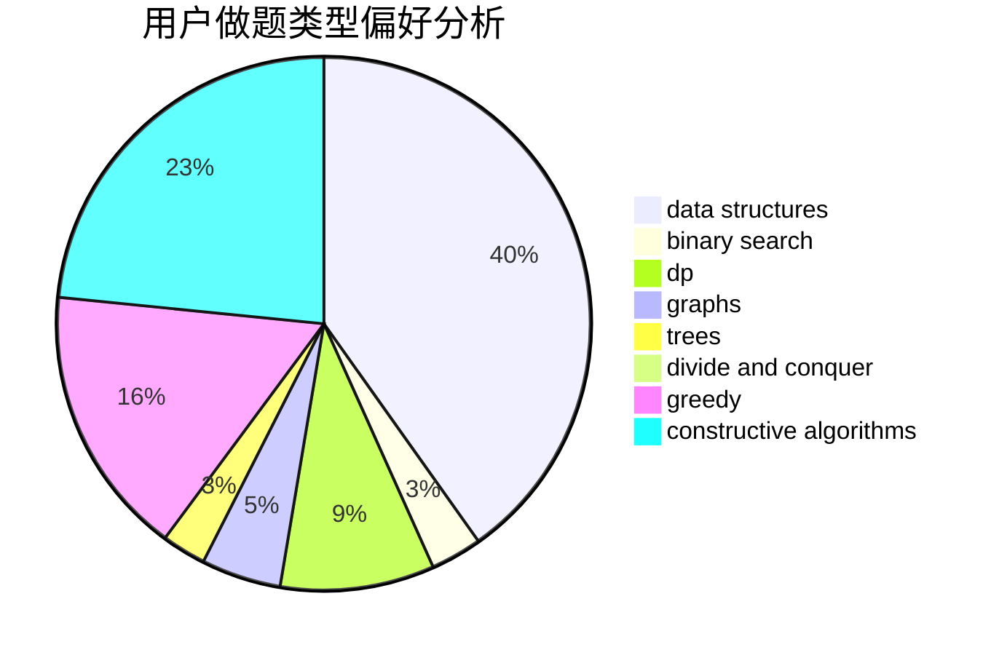
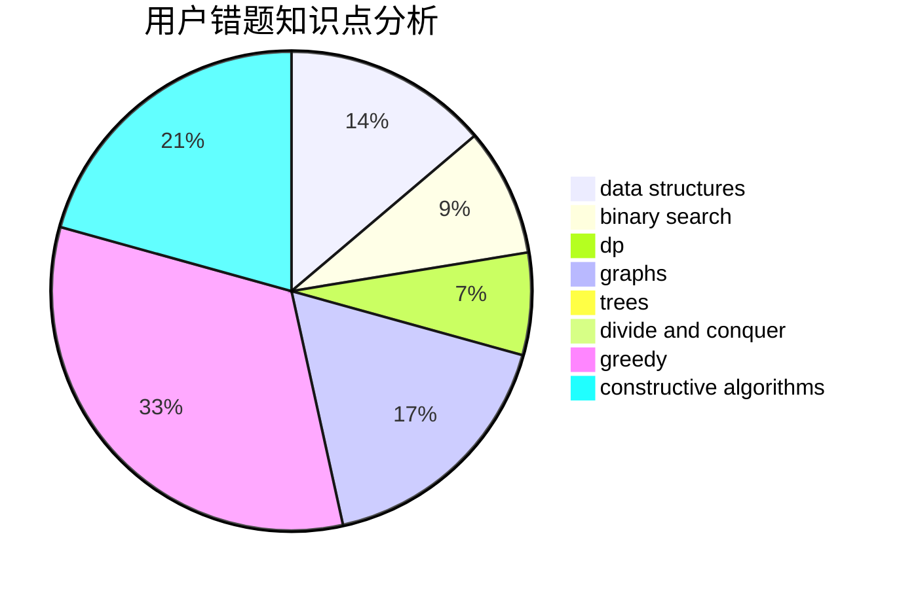

# CloudIO

<!-- tabs:start -->

#### **用户提交结果分析**

#### **用户做题类型偏好分析**

#### **用户错题知识点分析**

<!-- tabs:end -->
# 推荐题目
[713C](https://codeforces.com/contest/713/problem/C)		dp,
                        sortings		  
[616E](https://codeforces.com/contest/616/problem/E)		implementation,
                        math,
                        number theory		  
[651D](https://codeforces.com/contest/651/problem/D)		dsu,graphs,sortings,trees		  
[478E](https://codeforces.com/contest/478/problem/E)		brute force,
                        dfs and similar,
                        meet-in-the-middle,
                        sortings		  
[712E](https://codeforces.com/contest/712/problem/E)		data structures,
                        math,
                        probabilities		  
[713D](https://codeforces.com/contest/713/problem/D)		binary search,
                        data structures		  
[712C](https://codeforces.com/contest/712/problem/C)		greedy,
                        math		  
[713E](https://codeforces.com/contest/713/problem/E)		binary search,
                        dp		  
[597C](https://codeforces.com/contest/597/problem/C)		data structures,
                        dp		  
[1031C](https://codeforces.com/contest/1031/problem/C)		greedy		  
