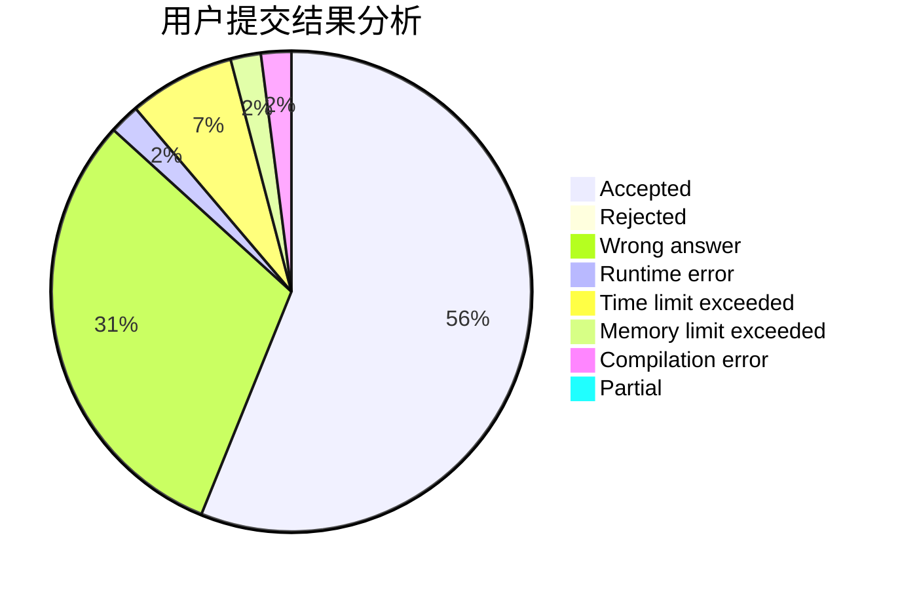
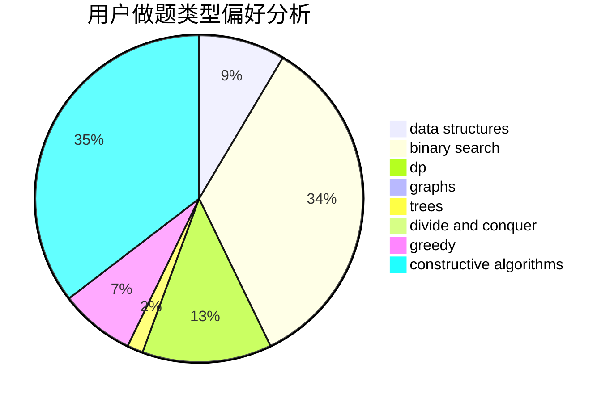
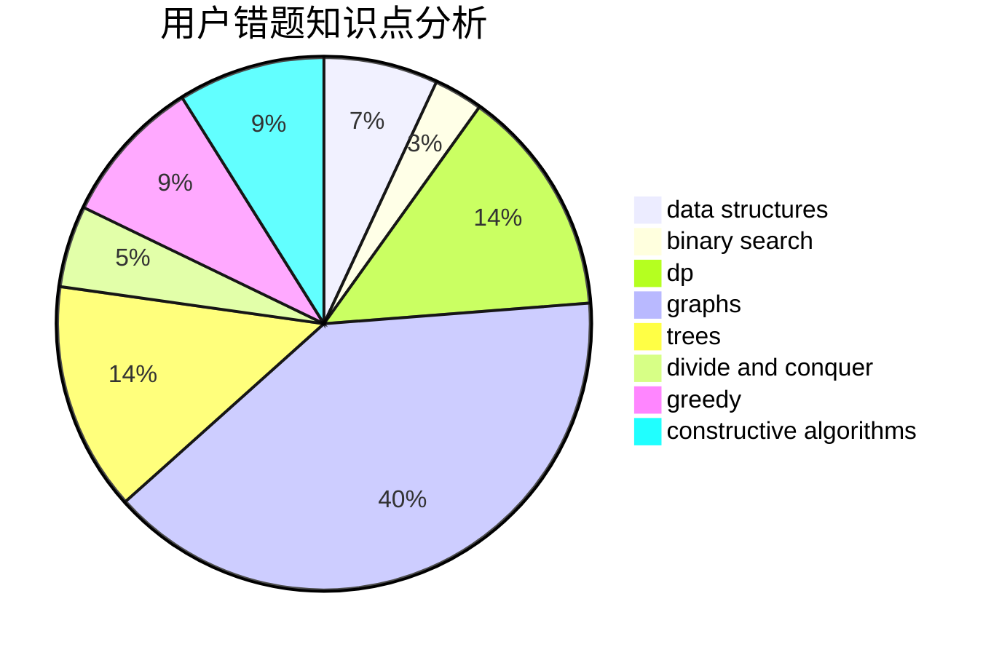

# Clovers

<!-- tabs:start -->

#### **用户提交结果分析**

#### **用户做题类型偏好分析**

#### **用户错题知识点分析**

<!-- tabs:end -->
# 推荐题目
[1139A](https://codeforces.com/contest/1139/problem/A)		implementation,
                        strings		  
[549E](https://codeforces.com/contest/549/problem/E)		geometry,
                        math		  
[437A](https://codeforces.com/contest/437/problem/A)		implementation		  
[1291C](https://codeforces.com/contest/1291/problem/C)		dsu,graphs,sortings,trees		  
[549C](https://codeforces.com/contest/549/problem/C)		games		  
[714E](https://codeforces.com/contest/714/problem/E)		dsu,graphs,sortings,trees		  
[1510D](https://codeforces.com/contest/1510/problem/D)		dp,
                        math,
                        number theory		  
[1141D](https://codeforces.com/contest/1141/problem/D)		greedy,
                        implementation		  
[10D](https://codeforces.com/contest/10/problem/D)		dp		  
[715A](https://codeforces.com/contest/715/problem/A)		constructive algorithms,
                        math		  
