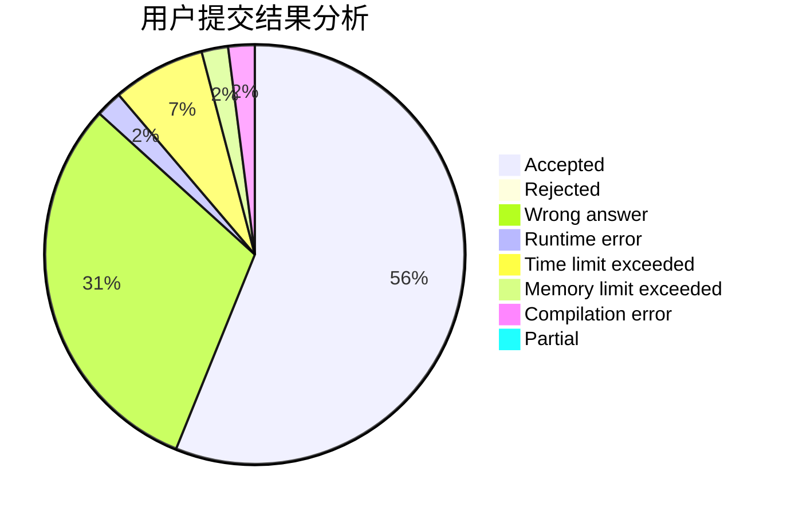
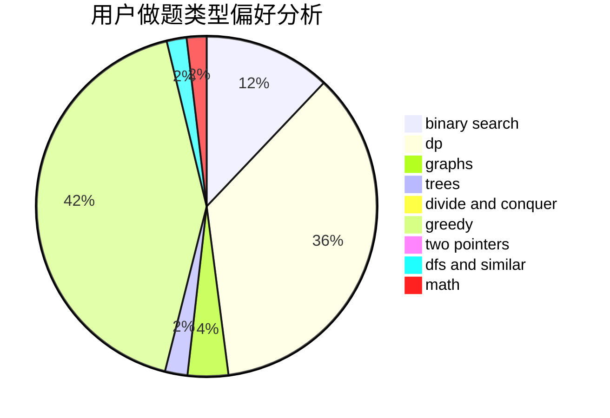

# Clovers

<!-- tabs:start -->

#### **用户提交结果分析**

#### **用户做题类型偏好分析**

<!-- tabs:end -->
# 推荐题目
[1140E](https://codeforces.com/contest/1140/problem/E)
[574C](https://codeforces.com/contest/574/problem/C)
[459C](https://codeforces.com/contest/459/problem/C)
[1298B](https://codeforces.com/contest/1298/problem/B)
[574B](https://codeforces.com/contest/574/problem/B)
[733B](https://codeforces.com/contest/733/problem/B)
[164C](https://codeforces.com/contest/164/problem/C)
[1143D](https://codeforces.com/contest/1143/problem/D)
[1100B](https://codeforces.com/contest/1100/problem/B)
[733C](https://codeforces.com/contest/733/problem/C)
