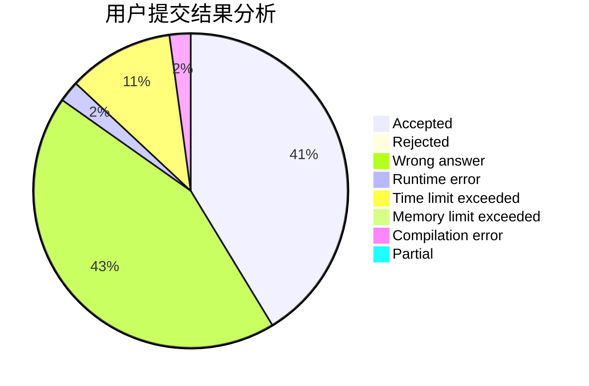
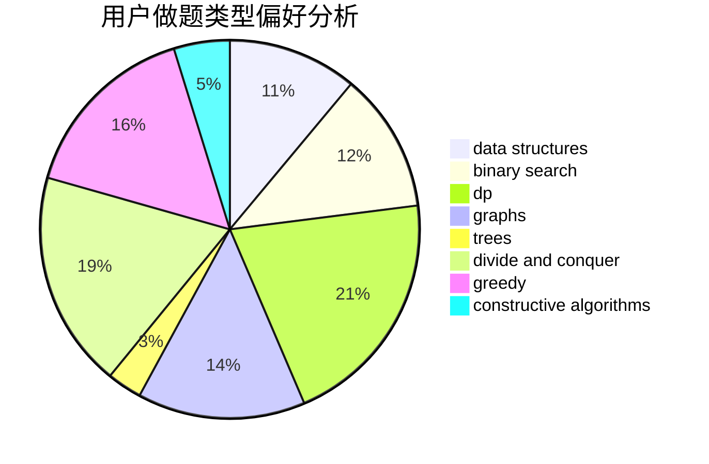
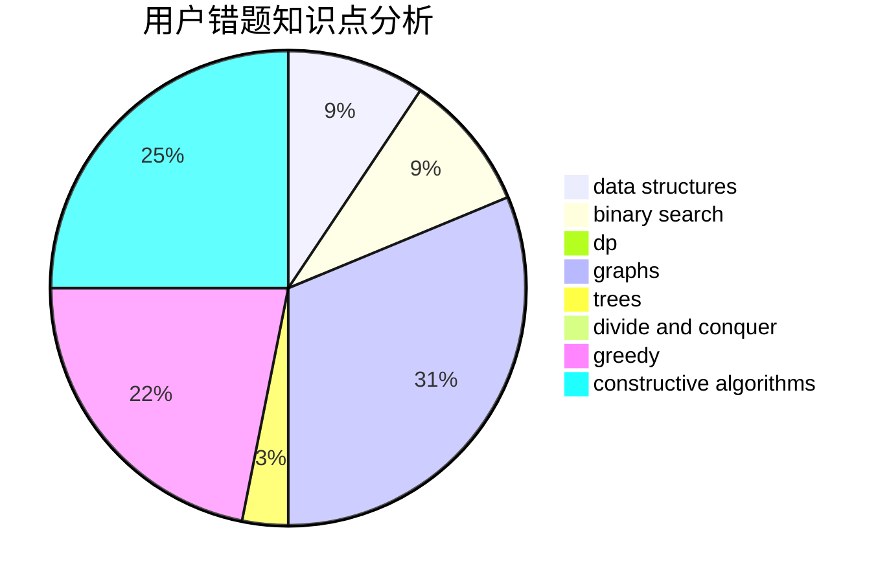

# CodeZima

<!-- tabs:start -->

#### **用户提交结果分析**

#### **用户做题类型偏好分析**

#### **用户错题知识点分析**

<!-- tabs:end -->
# 推荐题目
[1490C](https://codeforces.com/contest/1490/problem/C)		binary search,
                        brute force,
                        brute force,
                        math		  
[1465F](https://codeforces.com/contest/1465/problem/F)		dsu,graphs,sortings,trees		  
[25D](https://codeforces.com/contest/25/problem/D)		dsu,
                        graphs,
                        trees		  
[295A](https://codeforces.com/contest/295/problem/A)		data structures,
                        implementation		  
[733D](https://codeforces.com/contest/733/problem/D)		data structures,
                        hashing		  
[734A](https://codeforces.com/contest/734/problem/A)		implementation,
                        strings		  
[343A](https://codeforces.com/contest/343/problem/A)		math,
                        number theory		  
[299C](https://codeforces.com/contest/299/problem/C)		dsu,graphs,sortings,trees		  
[1227B](https://codeforces.com/contest/1227/problem/B)		constructive algorithms		  
[263A](https://codeforces.com/contest/263/problem/A)		implementation		  
