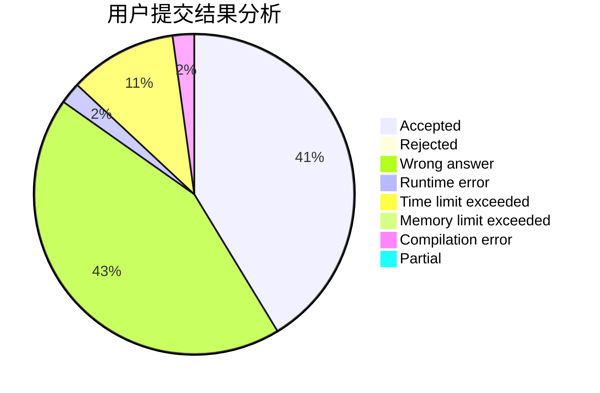
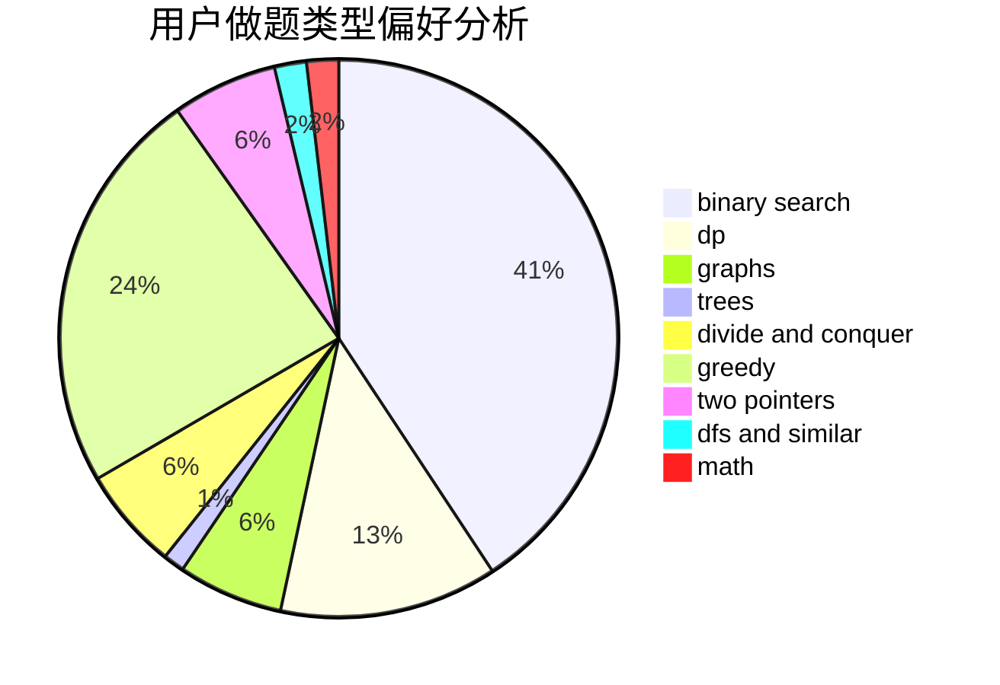

# CodeZima

<!-- tabs:start -->

#### **用户提交结果分析**

#### **用户做题类型偏好分析**

<!-- tabs:end -->
# 推荐题目
[1490C](https://codeforces.com/contest/1490/problem/C)
[1465F](https://codeforces.com/contest/1465/problem/F)
[25D](https://codeforces.com/contest/25/problem/D)
[295A](https://codeforces.com/contest/295/problem/A)
[733D](https://codeforces.com/contest/733/problem/D)
[734A](https://codeforces.com/contest/734/problem/A)
[343A](https://codeforces.com/contest/343/problem/A)
[299C](https://codeforces.com/contest/299/problem/C)
[1227B](https://codeforces.com/contest/1227/problem/B)
[263A](https://codeforces.com/contest/263/problem/A)
