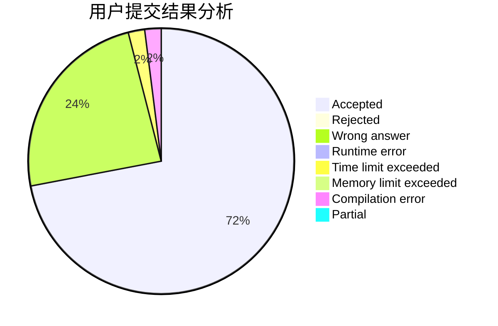
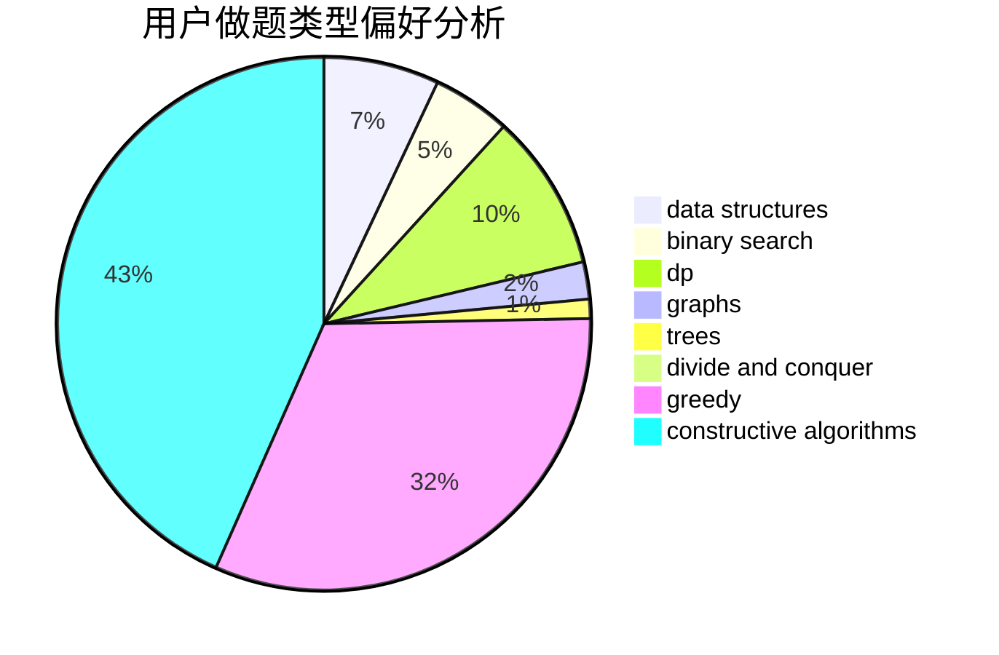
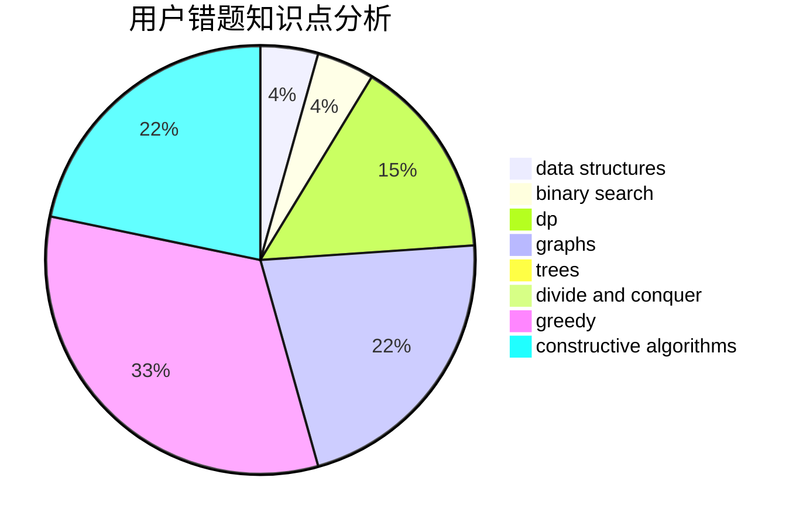

# Coding_Sylvie

<!-- tabs:start -->

#### **用户提交结果分析**

#### **用户做题类型偏好分析**

#### **用户错题知识点分析**

<!-- tabs:end -->
# 推荐题目
[705B](https://codeforces.com/contest/705/problem/B)		games,
                        math		  
[55D](https://codeforces.com/contest/55/problem/D)		dp,
                        number theory		  
[717E](https://codeforces.com/contest/717/problem/E)		dfs and similar		  
[1144G](https://codeforces.com/contest/1144/problem/G)		dp,
                        greedy		  
[717A](https://codeforces.com/contest/717/problem/A)		math,
                        number theory		  
[717I](https://codeforces.com/contest/717/problem/I)		geometry		  
[712E](https://codeforces.com/contest/712/problem/E)		data structures,
                        math,
                        probabilities		  
[165C](https://codeforces.com/contest/165/problem/C)		binary search,
                        brute force,
                        dp,
                        math,
                        strings,
                        two pointers		  
[367B](https://codeforces.com/contest/367/problem/B)		binary search,
                        data structures		  
[1338A](https://codeforces.com/contest/1338/problem/A)		greedy,
                        math		  
