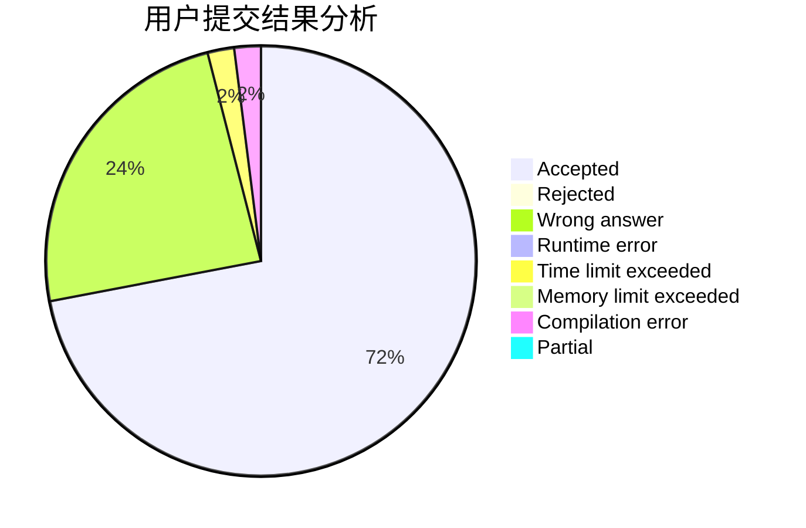
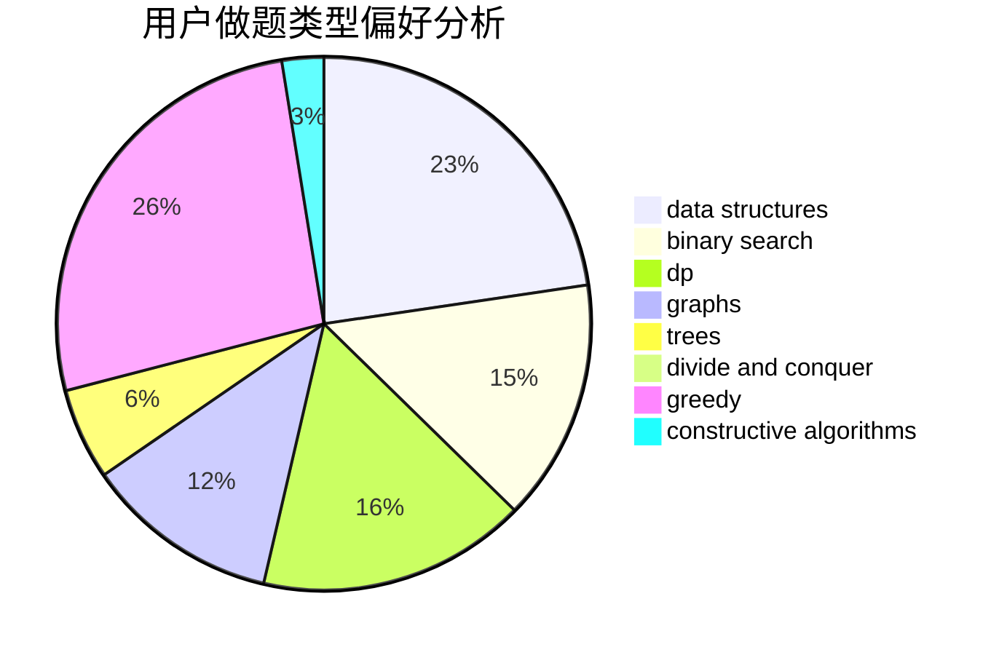
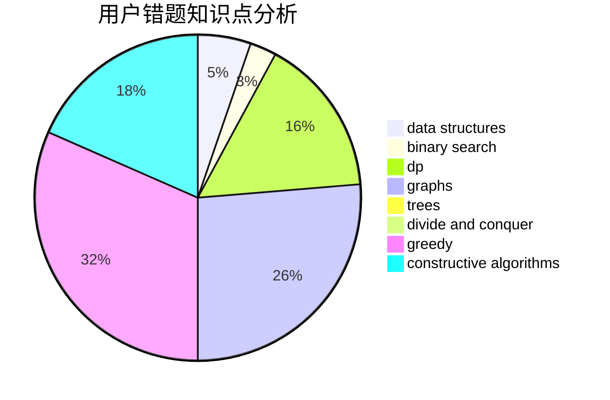

# Coding_Sylvie

<!-- tabs:start -->

#### **用户提交结果分析**

#### **用户做题类型偏好分析**

#### **用户错题知识点分析**

<!-- tabs:end -->
# 推荐题目
[724C](https://codeforces.com/contest/724/problem/C)		greedy,
                        hashing,
                        implementation,
                        math,
                        number theory,
                        sortings		  
[584B](https://codeforces.com/contest/584/problem/B)		combinatorics		  
[735A](https://codeforces.com/contest/735/problem/A)		implementation,
                        strings		  
[1147A](https://codeforces.com/contest/1147/problem/A)		graphs		  
[734D](https://codeforces.com/contest/734/problem/D)		implementation		  
[735C](https://codeforces.com/contest/735/problem/C)		combinatorics,
                        constructive algorithms,
                        greedy,
                        math		  
[732A](https://codeforces.com/contest/732/problem/A)		brute force,
                        constructive algorithms,
                        implementation,
                        math		  
[18E](https://codeforces.com/contest/18/problem/E)		dp		  
[398A](https://codeforces.com/contest/398/problem/A)		constructive algorithms,
                        implementation		  
[1345B](https://codeforces.com/contest/1345/problem/B)		binary search,
                        brute force,
                        dp,
                        math		  
