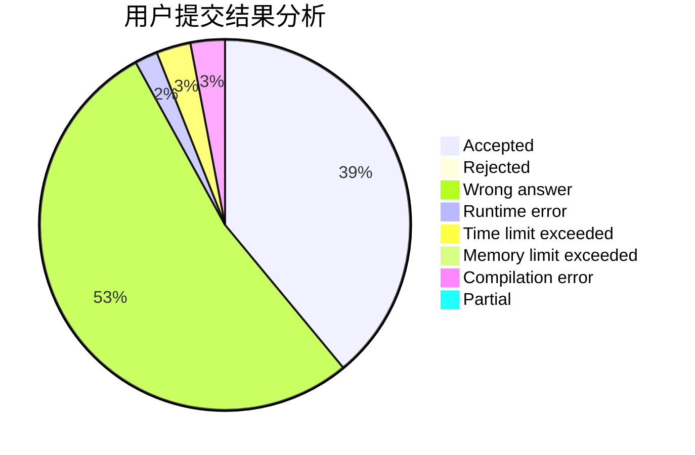
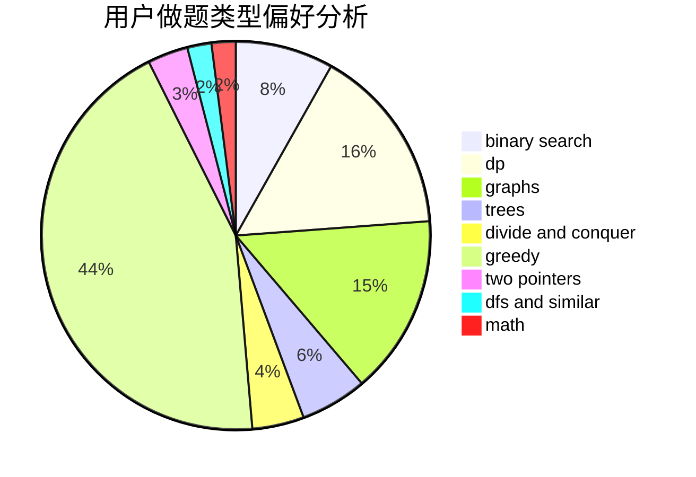

# CodyTheWolf

<!-- tabs:start -->

#### **用户提交结果分析**

#### **用户做题类型偏好分析**

<!-- tabs:end -->
# 推荐题目
[1498E](https://codeforces.com/contest/1498/problem/E)
[1175E](https://codeforces.com/contest/1175/problem/E)
[736B](https://codeforces.com/contest/736/problem/B)
[357B](https://codeforces.com/contest/357/problem/B)
[1238C](https://codeforces.com/contest/1238/problem/C)
[736D](https://codeforces.com/contest/736/problem/D)
[5132](https://codeforces.com/contest/513/problem/2)
[335A](https://codeforces.com/contest/335/problem/A)
[1066F](https://codeforces.com/contest/1066/problem/F)
[12371](https://codeforces.com/contest/1237/problem/1)
