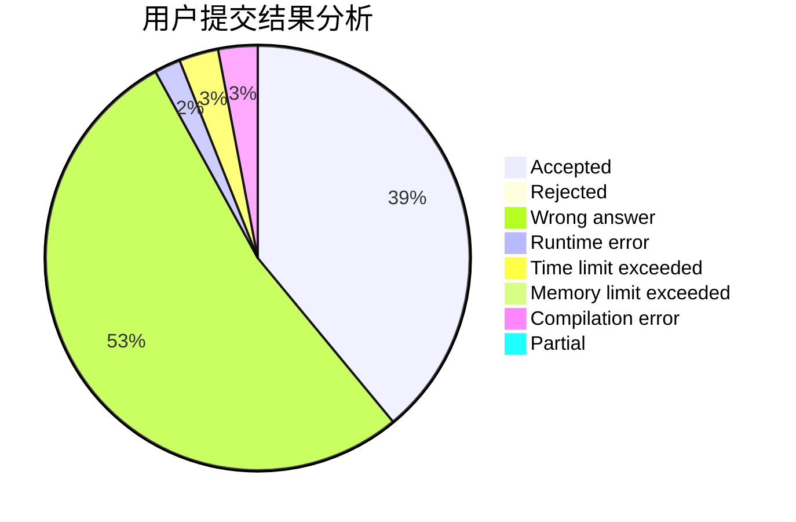
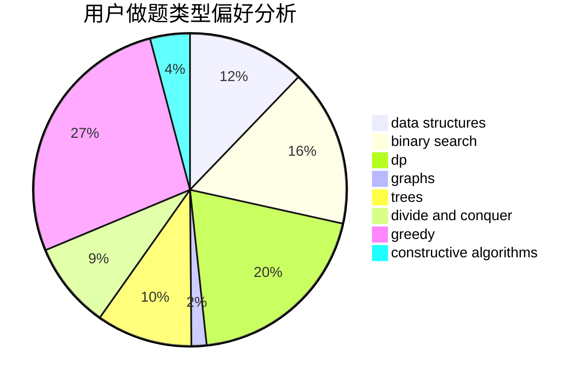
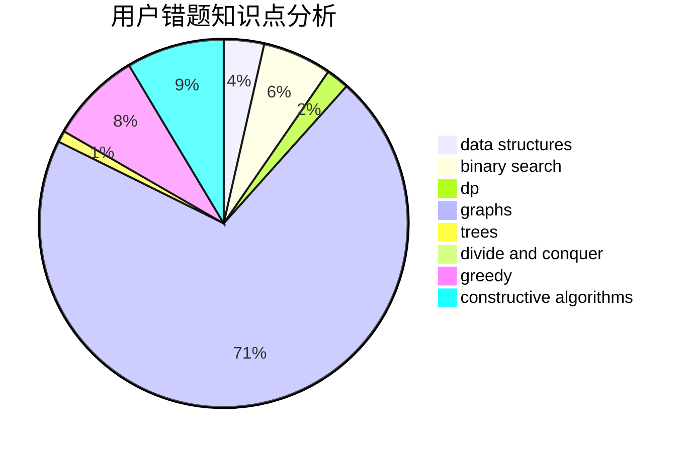

# CodyTheWolf

<!-- tabs:start -->

#### **用户提交结果分析**

#### **用户做题类型偏好分析**

#### **用户错题知识点分析**

<!-- tabs:end -->
# 推荐题目
[1498E](https://codeforces.com/contest/1498/problem/E)		brute force,
                        graphs,
                        greedy,
                        interactive,
                        sortings		  
[1175E](https://codeforces.com/contest/1175/problem/E)		data structures,
                        dfs and similar,
                        divide and conquer,
                        dp,
                        greedy,
                        implementation,
                        trees		  
[736B](https://codeforces.com/contest/736/problem/B)		dsu,graphs,sortings,trees		  
[357B](https://codeforces.com/contest/357/problem/B)		constructive algorithms,
                        implementation		  
[1238C](https://codeforces.com/contest/1238/problem/C)		dp,
                        greedy,
                        math		  
[736D](https://codeforces.com/contest/736/problem/D)		math,
                        matrices		  
[5132](https://codeforces.com/contest/513/problem/2)		dsu,graphs,sortings,trees		  
[335A](https://codeforces.com/contest/335/problem/A)		binary search,
                        constructive algorithms,
                        greedy		  
[1066F](https://codeforces.com/contest/1066/problem/F)		dp		  
[12371](https://codeforces.com/contest/1237/problem/1)		dsu,graphs,sortings,trees		  
