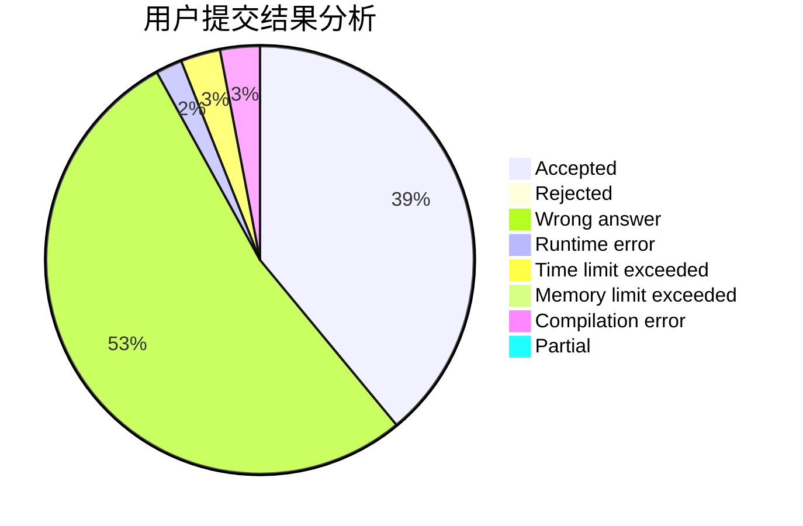
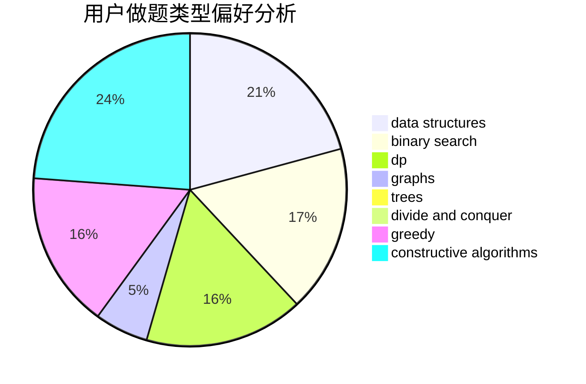
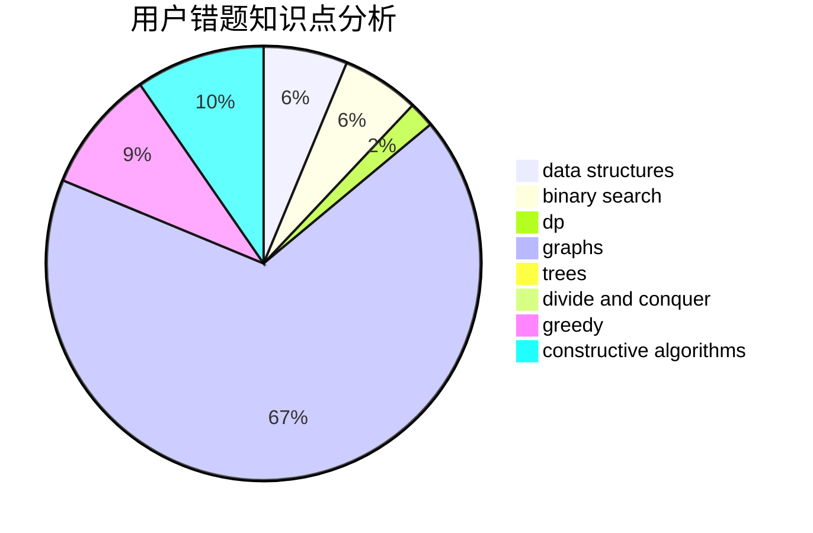

# CodyTheWolf

<!-- tabs:start -->

#### **用户提交结果分析**

#### **用户做题类型偏好分析**

#### **用户错题知识点分析**

<!-- tabs:end -->
# 推荐题目
[148E](https://codeforces.com/contest/148/problem/E)		dp		  
[1173B](https://codeforces.com/contest/1173/problem/B)		constructive algorithms,
                        greedy		  
[719A](https://codeforces.com/contest/719/problem/A)		implementation		  
[329E](https://codeforces.com/contest/329/problem/E)		math		  
[122B](https://codeforces.com/contest/122/problem/B)		brute force,
                        implementation		  
[719C](https://codeforces.com/contest/719/problem/C)		dsu,graphs,sortings,trees		  
[492E](https://codeforces.com/contest/492/problem/E)		math		  
[311D](https://codeforces.com/contest/311/problem/D)		data structures,
                        math		  
[1066C](https://codeforces.com/contest/1066/problem/C)		implementation		  
[1228A](https://codeforces.com/contest/1228/problem/A)		brute force,
                        implementation		  
