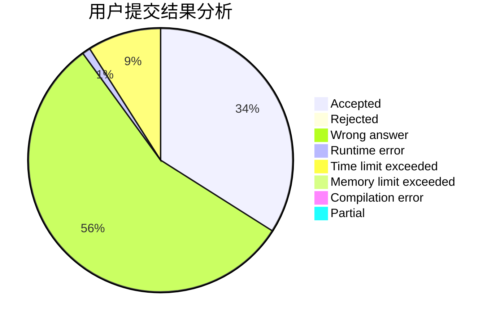
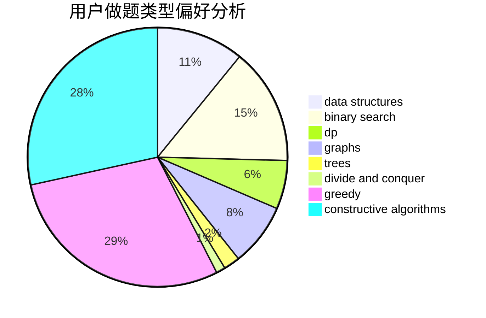

# CofDoria

<!-- tabs:start -->

#### **用户提交结果分析**

#### **用户做题类型偏好分析**

#### **用户错题知识点分析**

<!-- tabs:end -->
# 推荐题目
[1028H](https://codeforces.com/contest/1028/problem/H)		math		  
[712E](https://codeforces.com/contest/712/problem/E)		data structures,
                        math,
                        probabilities		  
[1469D](https://codeforces.com/contest/1469/problem/D)		brute force,
                        constructive algorithms,
                        math,
                        number theory		  
[508A](https://codeforces.com/contest/508/problem/A)		brute force		  
[1360G](https://codeforces.com/contest/1360/problem/G)		constructive algorithms,
                        greedy,
                        math		  
[1157C1](https://codeforces.com/contest/1157C/problem/1)		greedy		  
[1180D](https://codeforces.com/contest/1180/problem/D)		dsu,graphs,sortings,trees		  
[1290E](https://codeforces.com/contest/1290/problem/E)		data structures		  
[1164G](https://codeforces.com/contest/1164/problem/G)		dsu,graphs,sortings,trees		  
[720C](https://codeforces.com/contest/720/problem/C)		constructive algorithms		  
