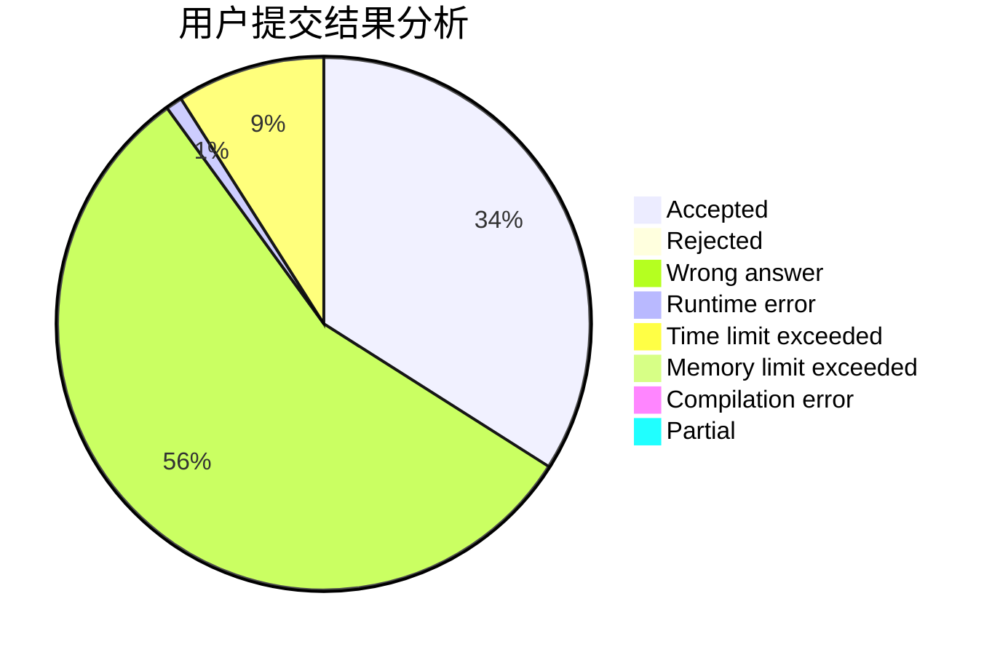
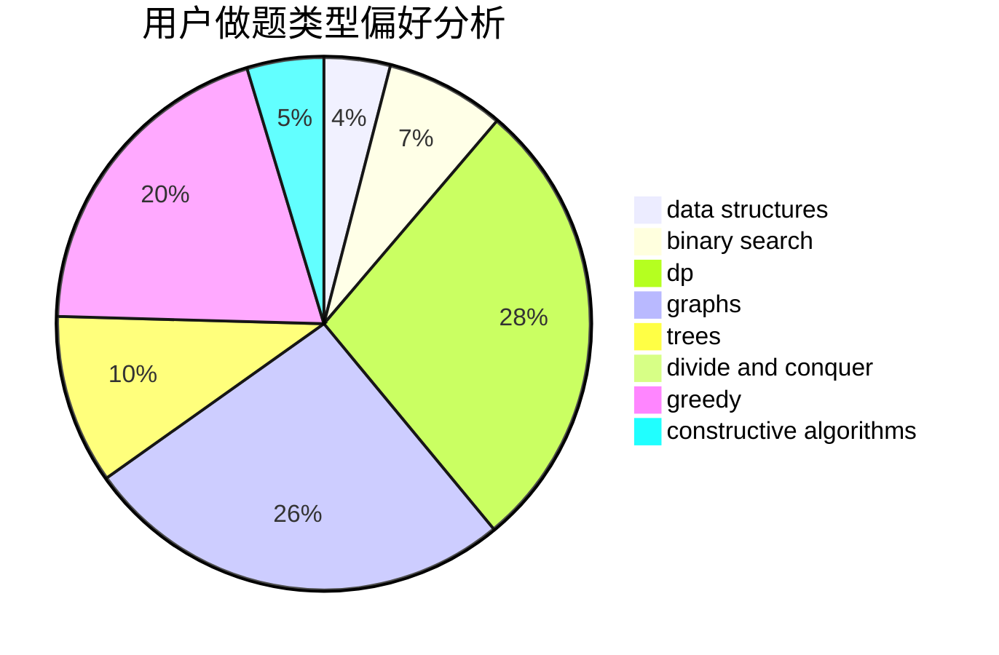

# CofDoria

<!-- tabs:start -->

#### **用户提交结果分析**

#### **用户做题类型偏好分析**

#### **用户错题知识点分析**

<!-- tabs:end -->
# 推荐题目
[1029C](https://codeforces.com/contest/1029/problem/C)		greedy,
                        math,
                        sortings		  
[732A](https://codeforces.com/contest/732/problem/A)		brute force,
                        constructive algorithms,
                        implementation,
                        math		  
[1477E](https://codeforces.com/contest/1477/problem/E)		data structures,
                        greedy		  
[528A](https://codeforces.com/contest/528/problem/A)		dsu,graphs,sortings,trees		  
[1368F](https://codeforces.com/contest/1368/problem/F)		games,
                        implementation,
                        interactive,
                        math		  
[1159C](https://codeforces.com/contest/1159/problem/C)		dsu,graphs,sortings,trees		  
[1183E](https://codeforces.com/contest/1183/problem/E)		dp,
                        graphs,
                        implementation,
                        shortest paths		  
[1297B](https://codeforces.com/contest/1297/problem/B)		*special problem,
                        implementation,
                        sortings		  
[1165D](https://codeforces.com/contest/1165/problem/D)		math,
                        number theory		  
[737C](https://codeforces.com/contest/737/problem/C)		dsu,graphs,sortings,trees		  
