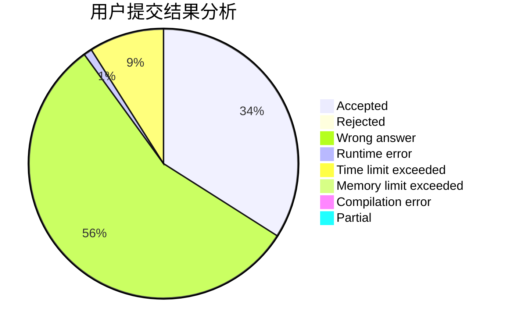
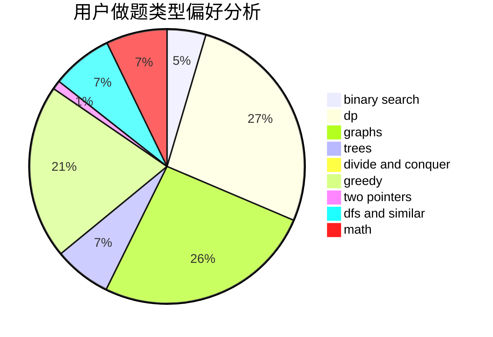

# CofDoria

<!-- tabs:start -->

#### **用户提交结果分析**

#### **用户做题类型偏好分析**

<!-- tabs:end -->
# 推荐题目
[1029C](https://codeforces.com/contest/1029/problem/C)
[732A](https://codeforces.com/contest/732/problem/A)
[1477E](https://codeforces.com/contest/1477/problem/E)
[528A](https://codeforces.com/contest/528/problem/A)
[1368F](https://codeforces.com/contest/1368/problem/F)
[1159C](https://codeforces.com/contest/1159/problem/C)
[1183E](https://codeforces.com/contest/1183/problem/E)
[1297B](https://codeforces.com/contest/1297/problem/B)
[1165D](https://codeforces.com/contest/1165/problem/D)
[737C](https://codeforces.com/contest/737/problem/C)
