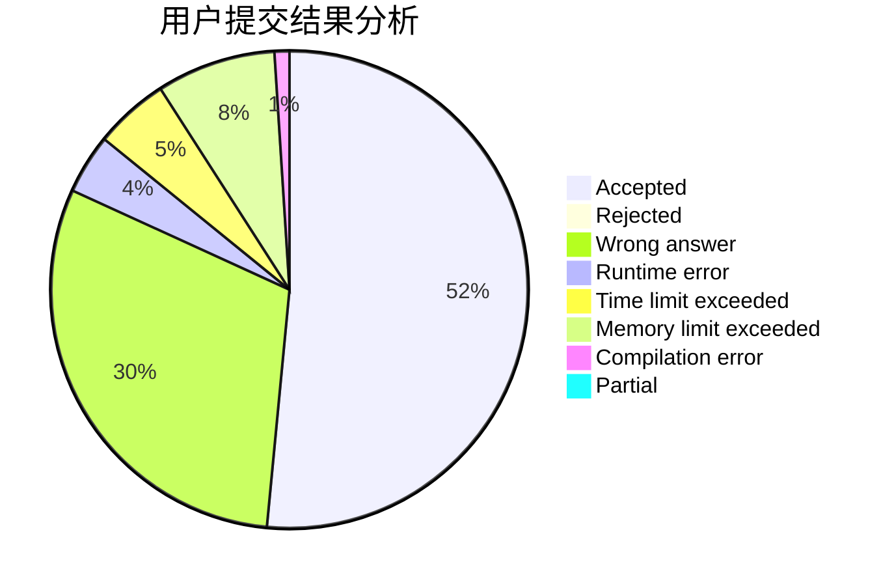
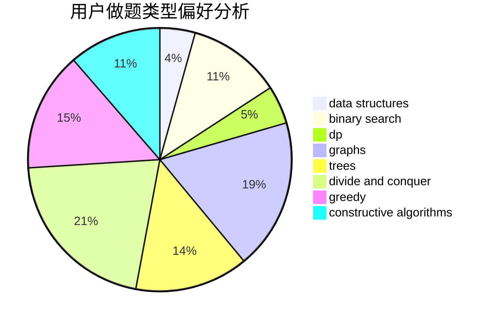
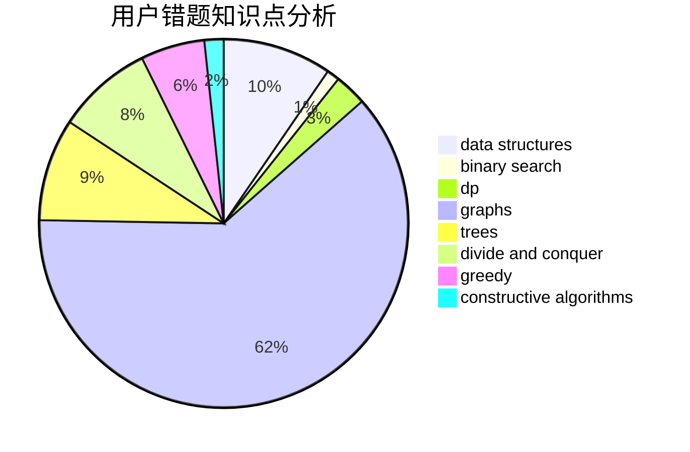

# Comet_Honeymoon

<!-- tabs:start -->

#### **用户提交结果分析**

#### **用户做题类型偏好分析**

#### **用户错题知识点分析**

<!-- tabs:end -->
# 推荐题目
[1486D](https://codeforces.com/contest/1486/problem/D)		binary search,
                        data structures,
                        dp		  
[12821](https://codeforces.com/contest/1282/problem/1)		dsu,graphs,sortings,trees		  
[616A](https://codeforces.com/contest/616/problem/A)		implementation,
                        strings		  
[730J](https://codeforces.com/contest/730/problem/J)		dp		  
[1000F](https://codeforces.com/contest/1000/problem/F)		data structures,
                        divide and conquer		  
[736B](https://codeforces.com/contest/736/problem/B)		dsu,graphs,sortings,trees		  
[739D](https://codeforces.com/contest/739/problem/D)		graph matchings		  
[738D](https://codeforces.com/contest/738/problem/D)		dsu,graphs,sortings,trees		  
[1159F](https://codeforces.com/contest/1159/problem/F)		dsu,graphs,sortings,trees		  
[740A](https://codeforces.com/contest/740/problem/A)		brute force,
                        implementation		  
