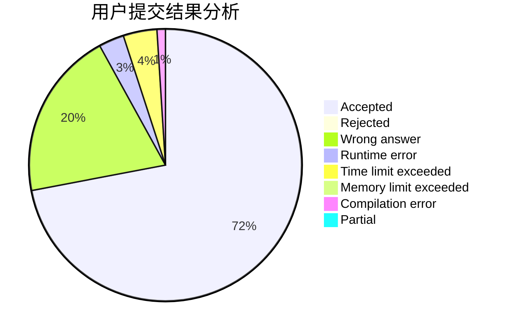
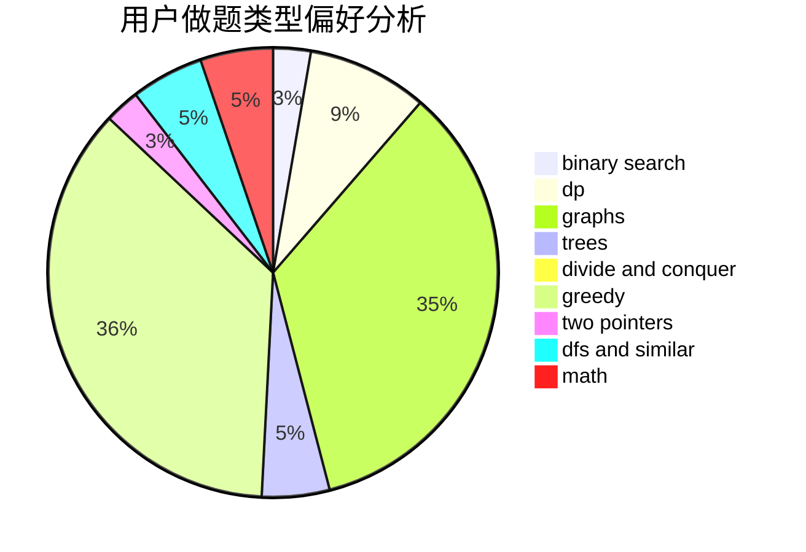

# 00001

<!-- tabs:start -->

#### **用户提交结果分析**

#### **用户做题类型偏好分析**

<!-- tabs:end -->
# 推荐题目
[1025G](https://codeforces.com/contest/1025/problem/G)
[1020A](https://codeforces.com/contest/1020/problem/A)
[101D](https://codeforces.com/contest/101/problem/D)
[1023C](https://codeforces.com/contest/1023/problem/C)
[1023A](https://codeforces.com/contest/1023/problem/A)
[101B](https://codeforces.com/contest/101/problem/B)
[1023G](https://codeforces.com/contest/1023/problem/G)
[1025E](https://codeforces.com/contest/1025/problem/E)
[1025F](https://codeforces.com/contest/1025/problem/F)
[1025C](https://codeforces.com/contest/1025/problem/C)
