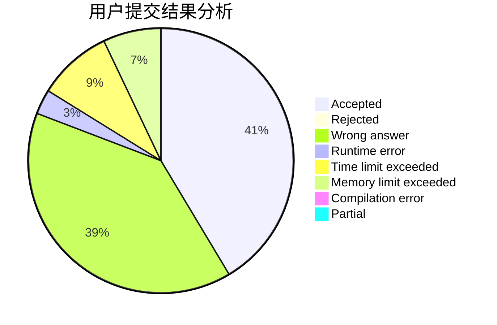
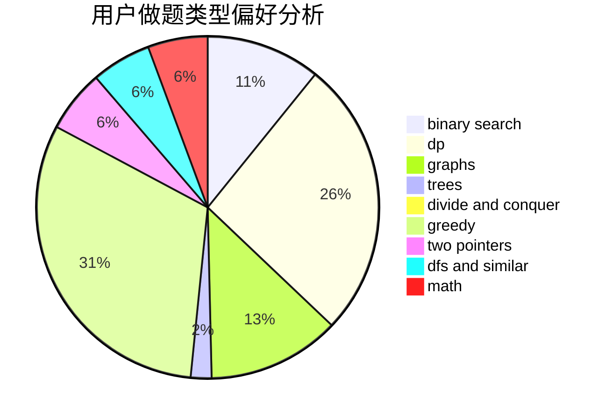

# 1910903

<!-- tabs:start -->

#### **用户提交结果分析**

#### **用户做题类型偏好分析**

<!-- tabs:end -->
# 推荐题目
[1086C](https://codeforces.com/contest/1086/problem/C)
[1197B](https://codeforces.com/contest/1197/problem/B)
[1196A](https://codeforces.com/contest/1196/problem/A)
[1198F](https://codeforces.com/contest/1198/problem/F)
[11962](https://codeforces.com/contest/1196/problem/2)
[119D](https://codeforces.com/contest/119/problem/D)
[1091A](https://codeforces.com/contest/1091/problem/A)
[1103B](https://codeforces.com/contest/1103/problem/B)
[1196C](https://codeforces.com/contest/1196/problem/C)
[1199C](https://codeforces.com/contest/1199/problem/C)
