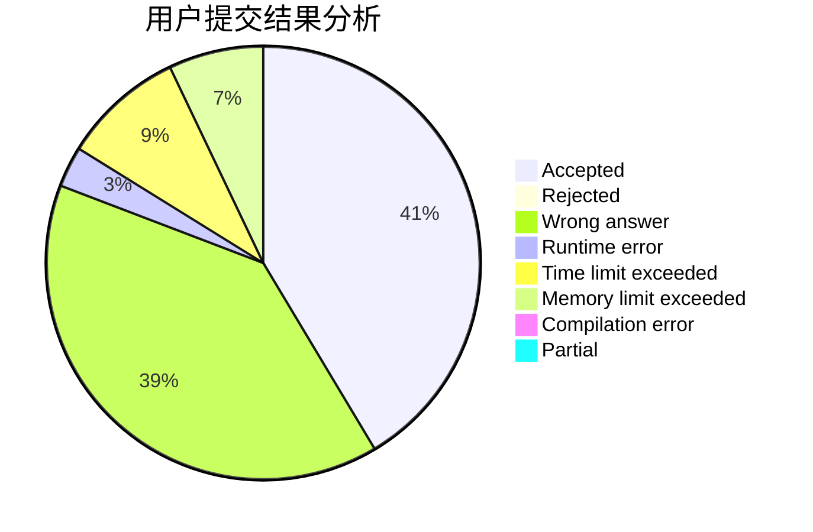
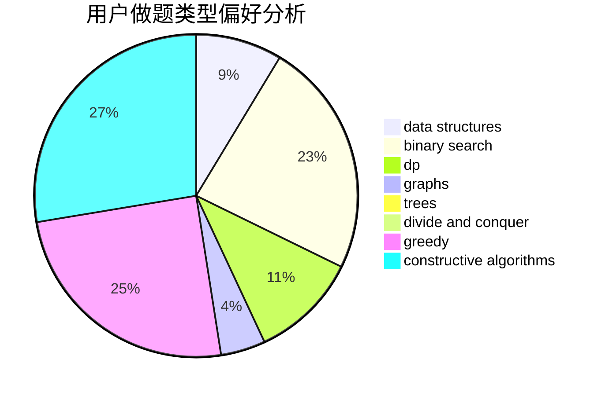

# 1910903

<!-- tabs:start -->

#### **用户提交结果分析**

#### **用户做题类型偏好分析**

#### **用户错题知识点分析**

<!-- tabs:end -->
# 推荐题目
[1085G](https://codeforces.com/contest/1085/problem/G)		combinatorics,
                        data structures,
                        dp		  
[1191C](https://codeforces.com/contest/1191/problem/C)		dsu,graphs,sortings,trees		  
[1190C](https://codeforces.com/contest/1190/problem/C)		brute force,
                        games,
                        greedy		  
[1194D](https://codeforces.com/contest/1194/problem/D)		games,
                        math		  
[1190B](https://codeforces.com/contest/1190/problem/B)		games		  
[1195E](https://codeforces.com/contest/1195/problem/E)		data structures,
                        two pointers		  
[1090D](https://codeforces.com/contest/1090/problem/D)		constructive algorithms		  
[1102E](https://codeforces.com/contest/1102/problem/E)		combinatorics,
                        sortings		  
[1190E](https://codeforces.com/contest/1190/problem/E)		binary search,
                        greedy		  
[1195A](https://codeforces.com/contest/1195/problem/A)		greedy,
                        math		  
