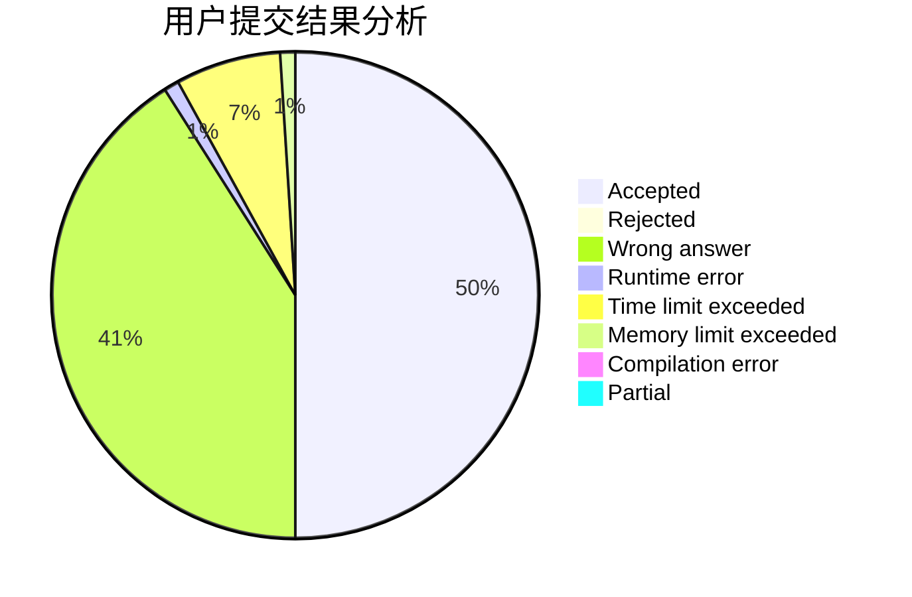
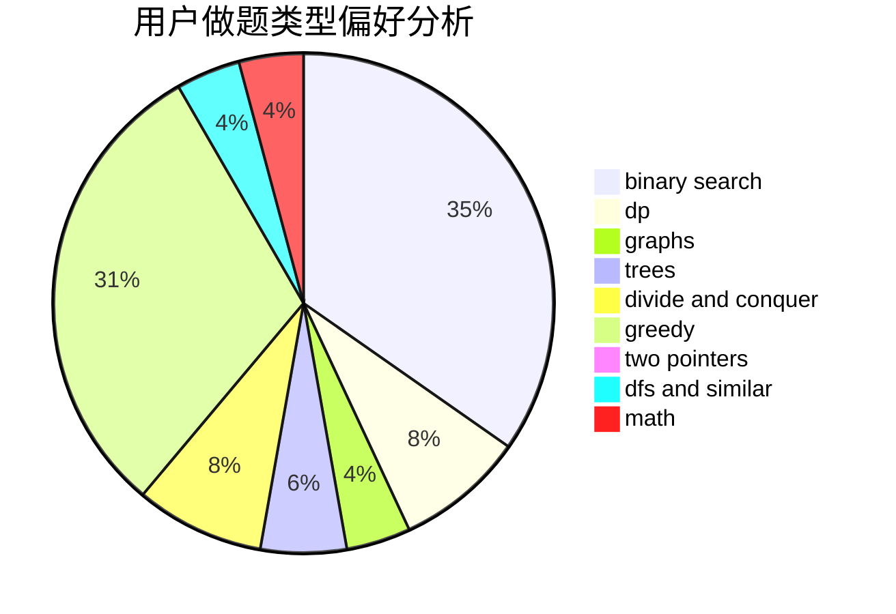

# ConanYu

<!-- tabs:start -->

#### **用户提交结果分析**

#### **用户做题类型偏好分析**

<!-- tabs:end -->
# 推荐题目
[634B](https://codeforces.com/contest/634/problem/B)
[13577](https://codeforces.com/contest/1357/problem/7)
[263A](https://codeforces.com/contest/263/problem/A)
[741A](https://codeforces.com/contest/741/problem/A)
[1140E](https://codeforces.com/contest/1140/problem/E)
[1323B](https://codeforces.com/contest/1323/problem/B)
[1490C](https://codeforces.com/contest/1490/problem/C)
[1497B](https://codeforces.com/contest/1497/problem/B)
[1491C](https://codeforces.com/contest/1491/problem/C)
[1484C](https://codeforces.com/contest/1484/problem/C)
