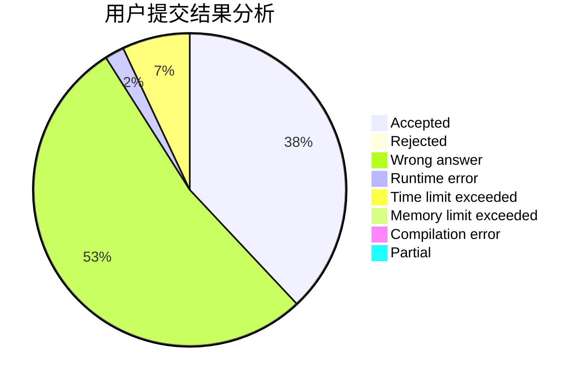
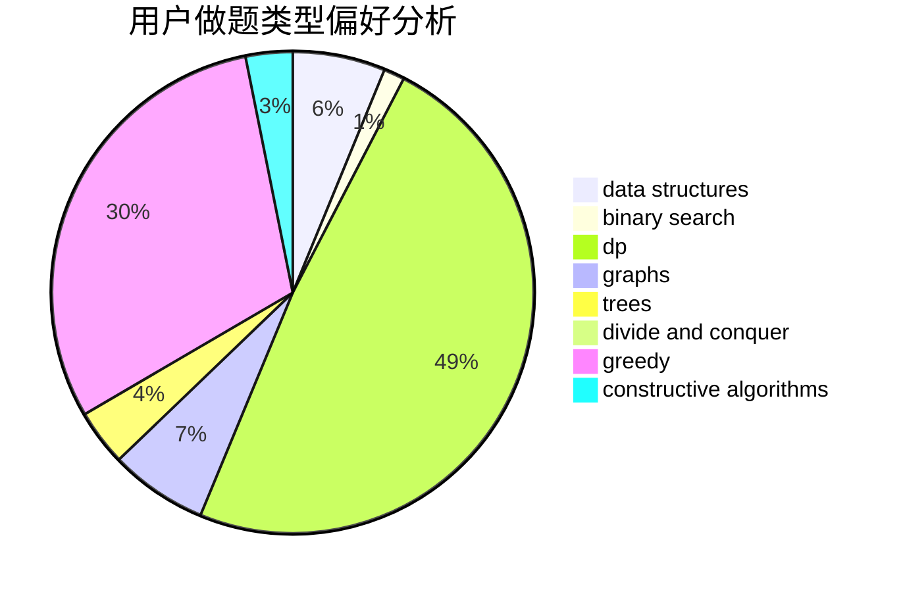
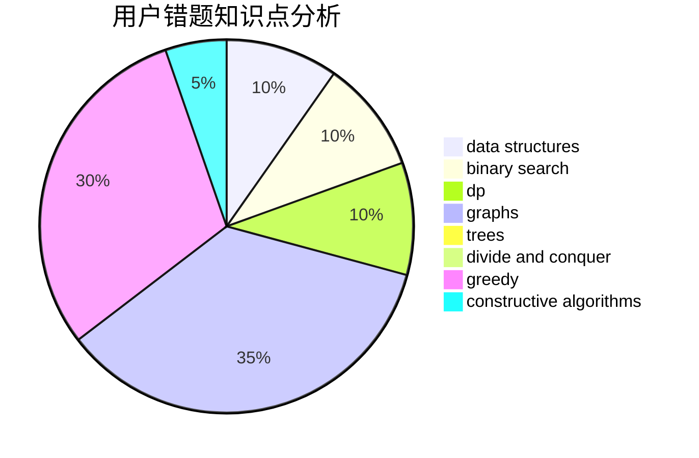

# Conata

<!-- tabs:start -->

#### **用户提交结果分析**

#### **用户做题类型偏好分析**

#### **用户错题知识点分析**

<!-- tabs:end -->
# 推荐题目
[1482H](https://codeforces.com/contest/1482/problem/H)		data structures,
                        string suffix structures,
                        trees		  
[1443F](https://codeforces.com/contest/1443/problem/F)		dsu,graphs,sortings,trees		  
[1467B](https://codeforces.com/contest/1467/problem/B)		brute force,
                        implementation		  
[294D](https://codeforces.com/contest/294/problem/D)		brute force,
                        implementation,
                        number theory		  
[611F](https://codeforces.com/contest/611/problem/F)		binary search,
                        implementation		  
[56B](https://codeforces.com/contest/56/problem/B)		implementation		  
[724E](https://codeforces.com/contest/724/problem/E)		dp,
                        flows,
                        greedy		  
[1007A](https://codeforces.com/contest/1007/problem/A)		combinatorics,
                        data structures,
                        math,
                        sortings,
                        two pointers		  
[253A](https://codeforces.com/contest/253/problem/A)		greedy		  
[724G](https://codeforces.com/contest/724/problem/G)		bitmasks,
                        graphs,
                        math,
                        number theory,
                        trees		  
