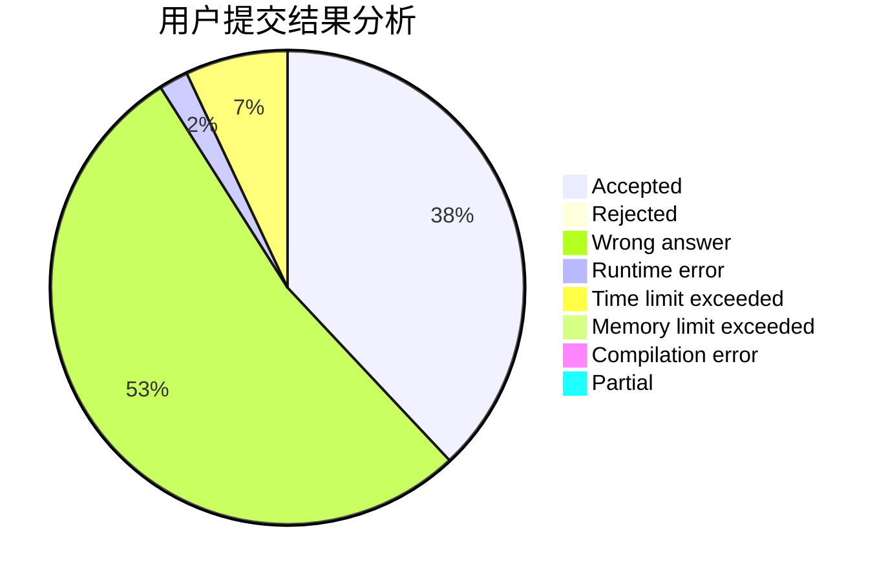
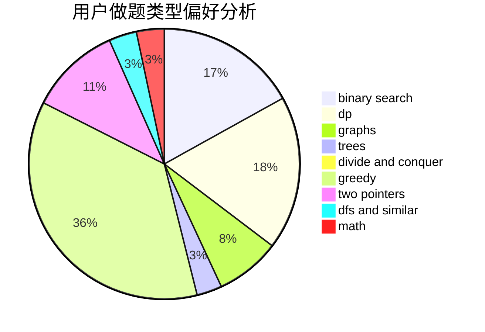

# Conata

<!-- tabs:start -->

#### **用户提交结果分析**

#### **用户做题类型偏好分析**

<!-- tabs:end -->
# 推荐题目
[1490E](https://codeforces.com/contest/1490/problem/E)
[1453D](https://codeforces.com/contest/1453/problem/D)
[1474D](https://codeforces.com/contest/1474/problem/D)
[311A](https://codeforces.com/contest/311/problem/A)
[630J](https://codeforces.com/contest/630/problem/J)
[58E](https://codeforces.com/contest/58/problem/E)
[741E](https://codeforces.com/contest/741/problem/E)
[1007E](https://codeforces.com/contest/1007/problem/E)
[26D](https://codeforces.com/contest/26/problem/D)
[742D](https://codeforces.com/contest/742/problem/D)
