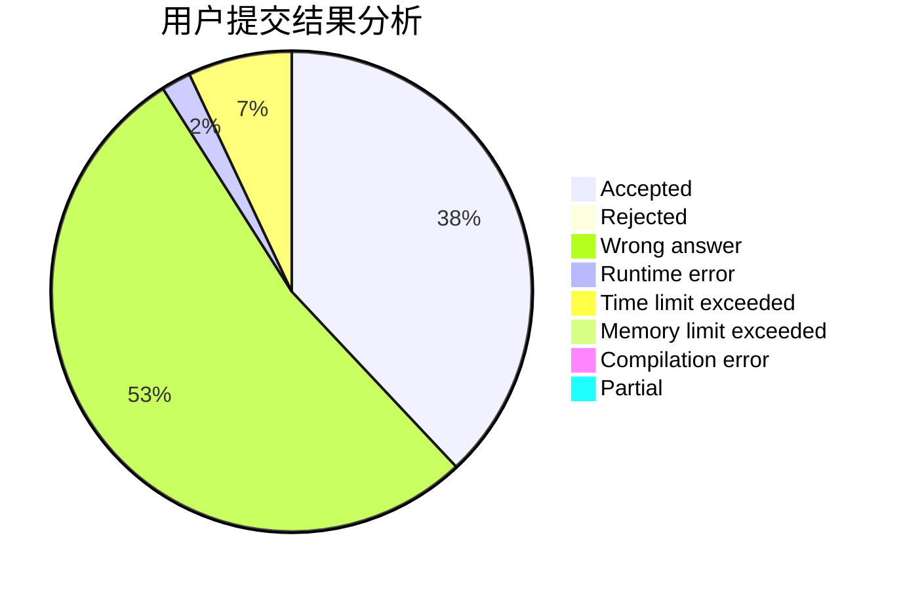
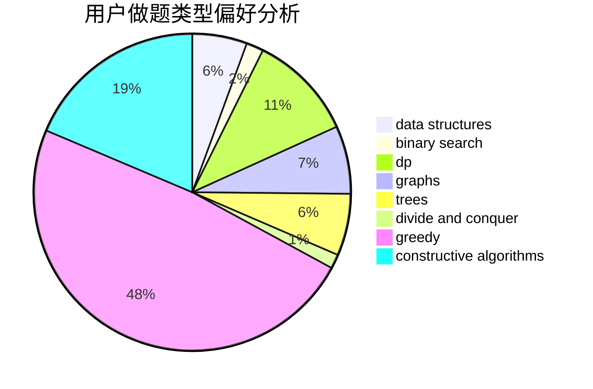
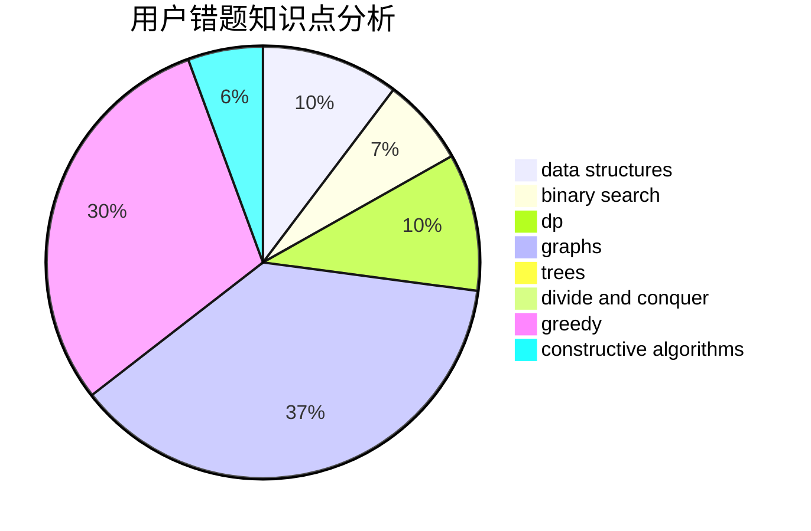

# Conata

<!-- tabs:start -->

#### **用户提交结果分析**

#### **用户做题类型偏好分析**

#### **用户错题知识点分析**

<!-- tabs:end -->
# 推荐题目
[1490E](https://codeforces.com/contest/1490/problem/E)		binary search,
                        data structures,
                        greedy		  
[1453D](https://codeforces.com/contest/1453/problem/D)		brute force,
                        constructive algorithms,
                        greedy,
                        math,
                        probabilities		  
[1474D](https://codeforces.com/contest/1474/problem/D)		data structures,
                        dp,
                        greedy,
                        math		  
[311A](https://codeforces.com/contest/311/problem/A)		constructive algorithms,
                        implementation		  
[630J](https://codeforces.com/contest/630/problem/J)		math,
                        number theory		  
[58E](https://codeforces.com/contest/58/problem/E)		dp		  
[741E](https://codeforces.com/contest/741/problem/E)		data structures,
                        string suffix structures		  
[1007E](https://codeforces.com/contest/1007/problem/E)		dp		  
[26D](https://codeforces.com/contest/26/problem/D)		combinatorics,
                        math,
                        probabilities		  
[742D](https://codeforces.com/contest/742/problem/D)		dsu,graphs,sortings,trees		  
