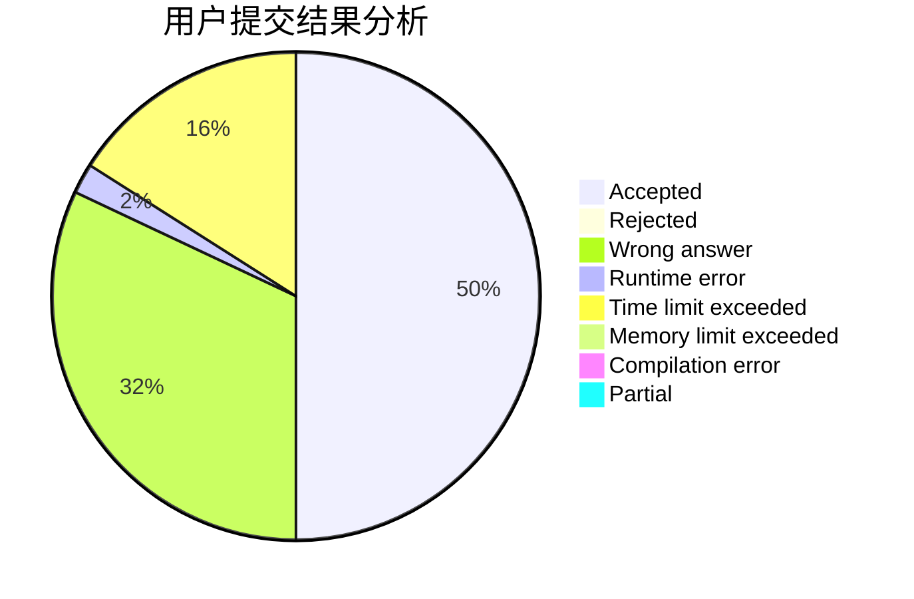
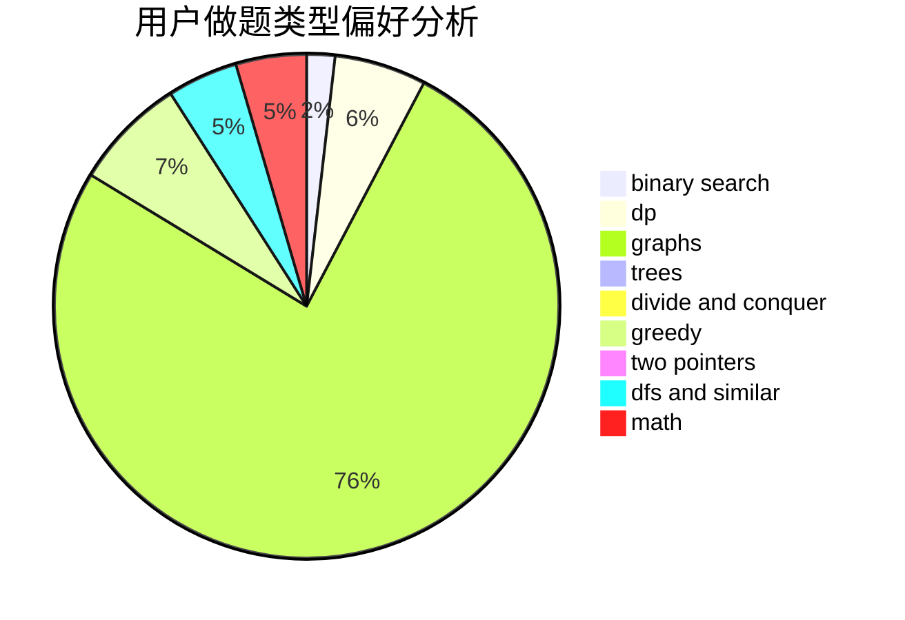

# Confident_Rafflesia

<!-- tabs:start -->

#### **用户提交结果分析**

#### **用户做题类型偏好分析**

<!-- tabs:end -->
# 推荐题目
[1270D](https://codeforces.com/contest/1270/problem/D)
[1101F](https://codeforces.com/contest/1101/problem/F)
[1250N](https://codeforces.com/contest/1250/problem/N)
[295D](https://codeforces.com/contest/295/problem/D)
[742E](https://codeforces.com/contest/742/problem/E)
[535B](https://codeforces.com/contest/535/problem/B)
[691A](https://codeforces.com/contest/691/problem/A)
[171A](https://codeforces.com/contest/171/problem/A)
[1132B](https://codeforces.com/contest/1132/problem/B)
[1485D](https://codeforces.com/contest/1485/problem/D)
