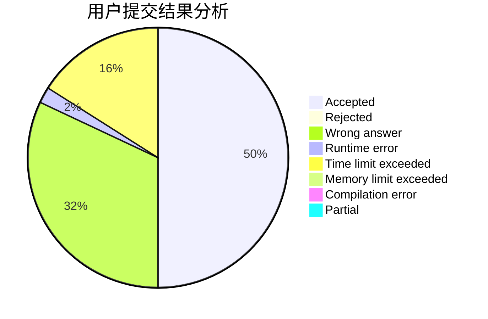
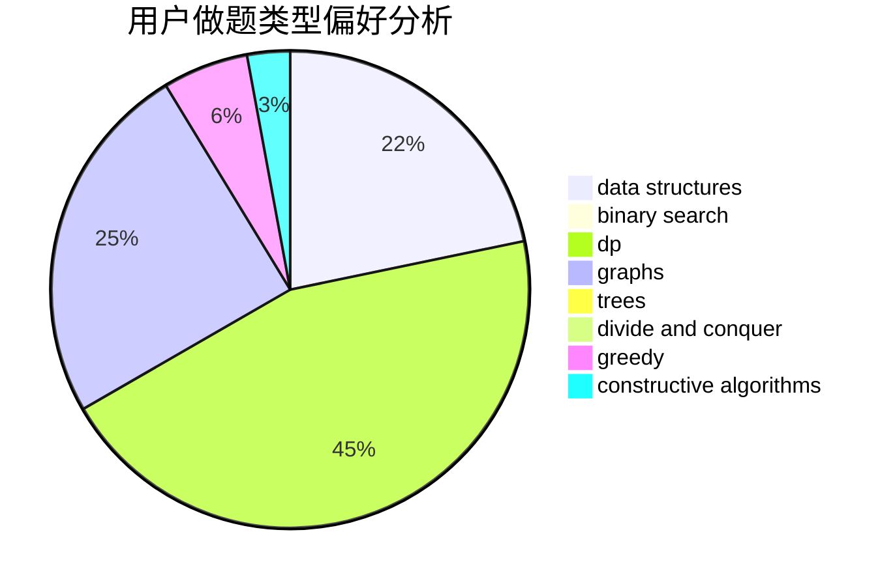
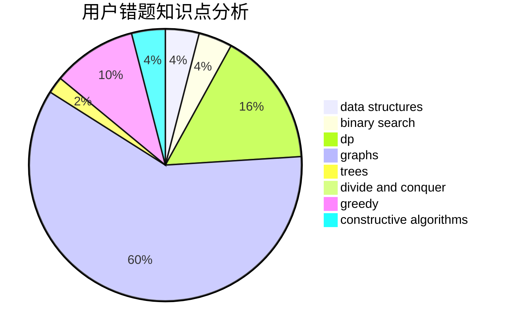

# Confident_Rafflesia

<!-- tabs:start -->

#### **用户提交结果分析**

#### **用户做题类型偏好分析**

#### **用户错题知识点分析**

<!-- tabs:end -->
# 推荐题目
[1264E](https://codeforces.com/contest/1264/problem/E)		constructive algorithms,
                        flows,
                        graph matchings		  
[1101C](https://codeforces.com/contest/1101/problem/C)		sortings		  
[1246F](https://codeforces.com/contest/1246/problem/F)		nan		  
[27E](https://codeforces.com/contest/27/problem/E)		brute force,
                        dp,
                        number theory		  
[725A](https://codeforces.com/contest/725/problem/A)		implementation		  
[512B](https://codeforces.com/contest/512/problem/B)		dsu,graphs,sortings,trees		  
[668D](https://codeforces.com/contest/668/problem/D)		dsu,graphs,sortings,trees		  
[1512A](https://codeforces.com/contest/1512/problem/A)		brute force,
                        implementation		  
[1130B](https://codeforces.com/contest/1130/problem/B)		greedy		  
[1476F](https://codeforces.com/contest/1476/problem/F)		binary search,
                        data structures,
                        dp		  
