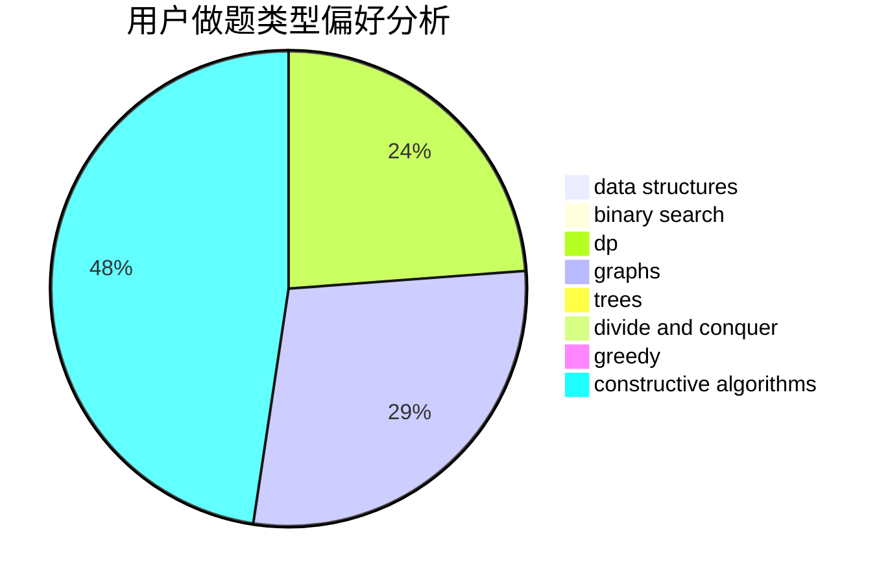
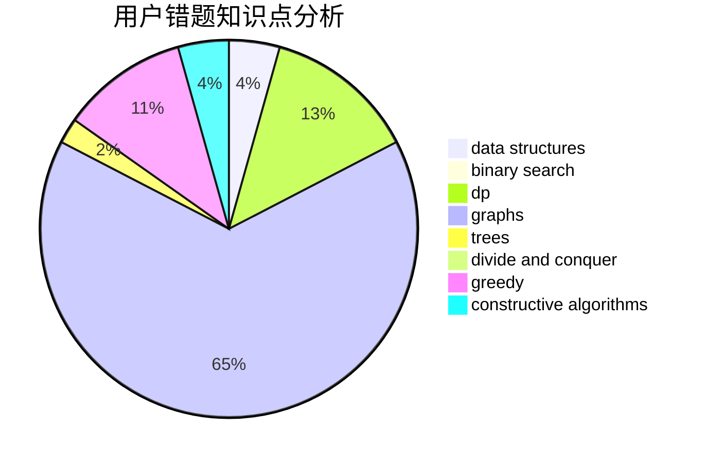

# Confident_Rafflesia

<!-- tabs:start -->

#### **用户提交结果分析**

#### **用户做题类型偏好分析**

#### **用户错题知识点分析**

<!-- tabs:end -->
# 推荐题目
[1270D](https://codeforces.com/contest/1270/problem/D)		constructive algorithms,
                        interactive,
                        math,
                        sortings		  
[1101F](https://codeforces.com/contest/1101/problem/F)		binary search,
                        dp		  
[1250N](https://codeforces.com/contest/1250/problem/N)		dfs and similar,
                        graphs,
                        greedy		  
[295D](https://codeforces.com/contest/295/problem/D)		combinatorics,
                        dp		  
[742E](https://codeforces.com/contest/742/problem/E)		dsu,graphs,sortings,trees		  
[535B](https://codeforces.com/contest/535/problem/B)		bitmasks,
                        brute force,
                        combinatorics,
                        implementation		  
[691A](https://codeforces.com/contest/691/problem/A)		implementation		  
[171A](https://codeforces.com/contest/171/problem/A)		*special problem,
                        constructive algorithms		  
[1132B](https://codeforces.com/contest/1132/problem/B)		greedy,
                        sortings		  
[1485D](https://codeforces.com/contest/1485/problem/D)		constructive algorithms,
                        graphs,
                        math,
                        number theory		  
