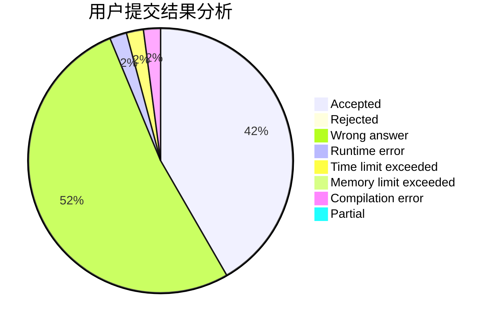
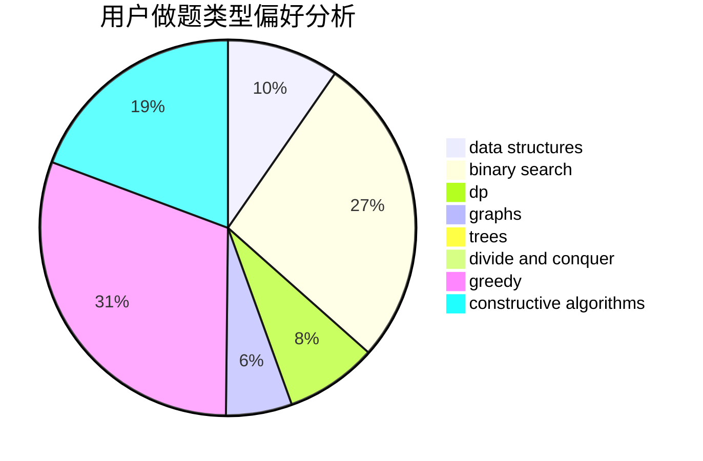

# Conless

<!-- tabs:start -->

#### **用户提交结果分析**

#### **用户做题类型偏好分析**

#### **用户错题知识点分析**

<!-- tabs:end -->
# 推荐题目
[401C](https://codeforces.com/contest/401/problem/C)		constructive algorithms,
                        greedy,
                        implementation		  
[1219C](https://codeforces.com/contest/1219/problem/C)		implementation,
                        strings		  
[524E](https://codeforces.com/contest/524/problem/E)		data structures,
                        sortings		  
[1436F](https://codeforces.com/contest/1436/problem/F)		combinatorics,
                        math,
                        number theory		  
[725E](https://codeforces.com/contest/725/problem/E)		brute force,
                        greedy		  
[1263D](https://codeforces.com/contest/1263/problem/D)		dfs and similar,
                        dsu,
                        graphs		  
[729A](https://codeforces.com/contest/729/problem/A)		implementation,
                        strings		  
[727F](https://codeforces.com/contest/727/problem/F)		binary search,
                        dp,
                        greedy		  
[725D](https://codeforces.com/contest/725/problem/D)		data structures,
                        greedy		  
[727A](https://codeforces.com/contest/727/problem/A)		brute force,
                        dfs and similar,
                        math		  
