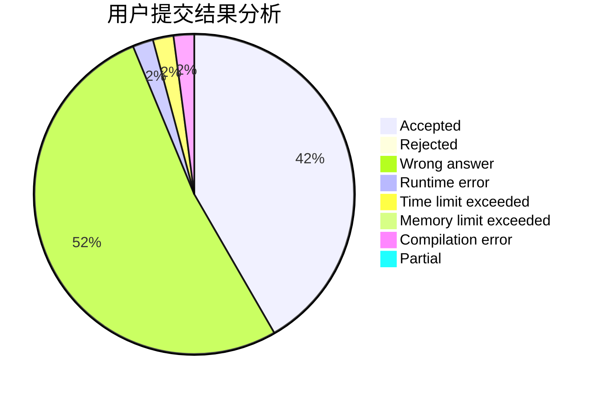
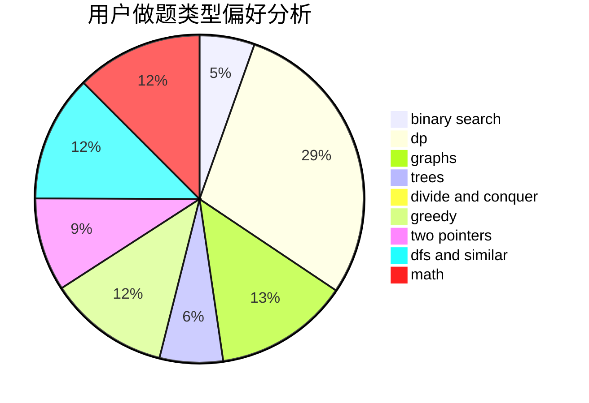

# Conless

<!-- tabs:start -->

#### **用户提交结果分析**

#### **用户做题类型偏好分析**

<!-- tabs:end -->
# 推荐题目
[42C](https://codeforces.com/contest/42/problem/C)
[12272](https://codeforces.com/contest/1227/problem/2)
[549B](https://codeforces.com/contest/549/problem/B)
[1446E](https://codeforces.com/contest/1446/problem/E)
[743E](https://codeforces.com/contest/743/problem/E)
[1269B](https://codeforces.com/contest/1269/problem/B)
[746A](https://codeforces.com/contest/746/problem/A)
[745C](https://codeforces.com/contest/745/problem/C)
[743D](https://codeforces.com/contest/743/problem/D)
[744C](https://codeforces.com/contest/744/problem/C)
