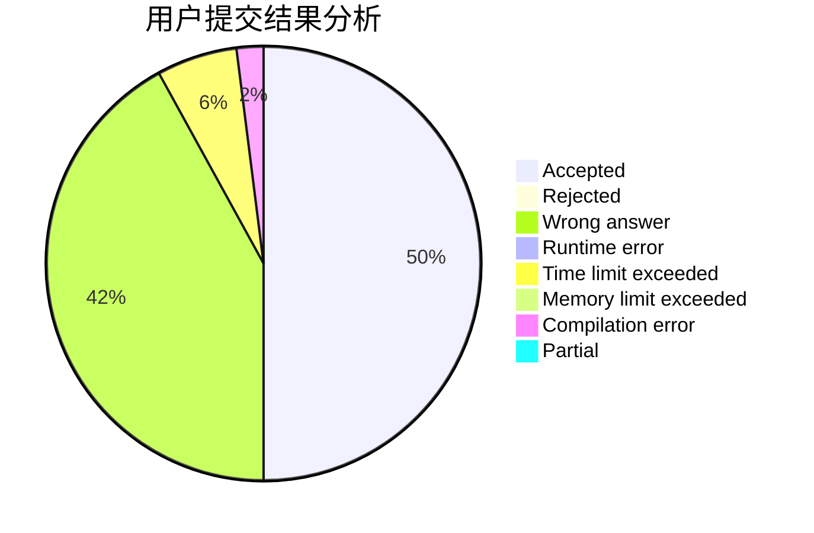
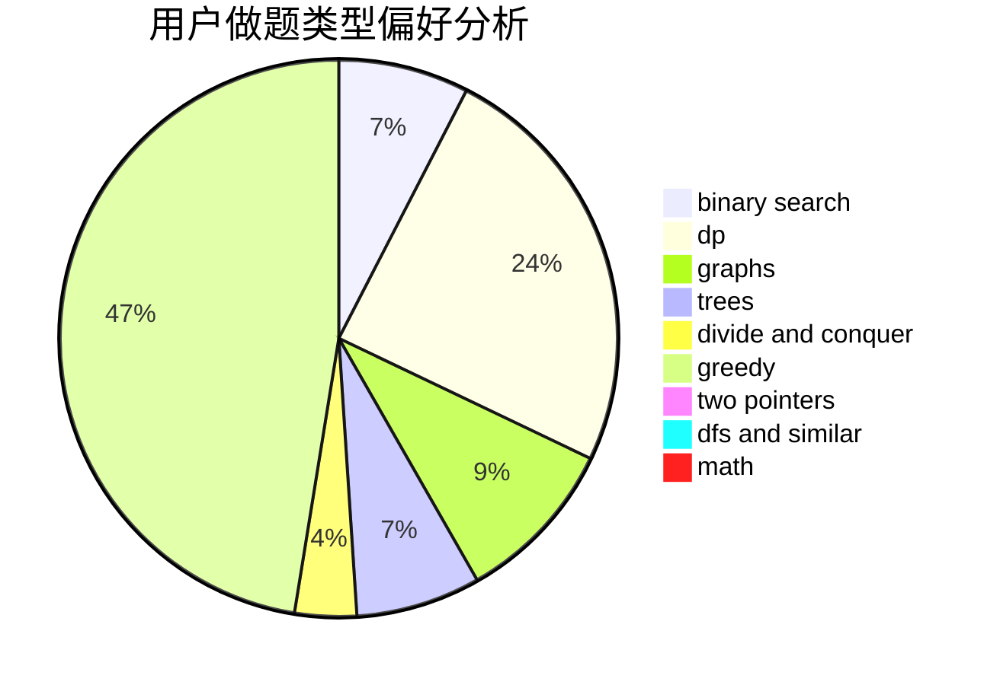

# ConnectorB

<!-- tabs:start -->

#### **用户提交结果分析**

#### **用户做题类型偏好分析**

<!-- tabs:end -->
# 推荐题目
[1484B](https://codeforces.com/contest/1484/problem/B)
[1496E](https://codeforces.com/contest/1496/problem/E)
[1025G](https://codeforces.com/contest/1025/problem/G)
[746D](https://codeforces.com/contest/746/problem/D)
[601B](https://codeforces.com/contest/601/problem/B)
[269D](https://codeforces.com/contest/269/problem/D)
[198B](https://codeforces.com/contest/198/problem/B)
[1239E](https://codeforces.com/contest/1239/problem/E)
[1108B](https://codeforces.com/contest/1108/problem/B)
[1162C](https://codeforces.com/contest/1162/problem/C)
