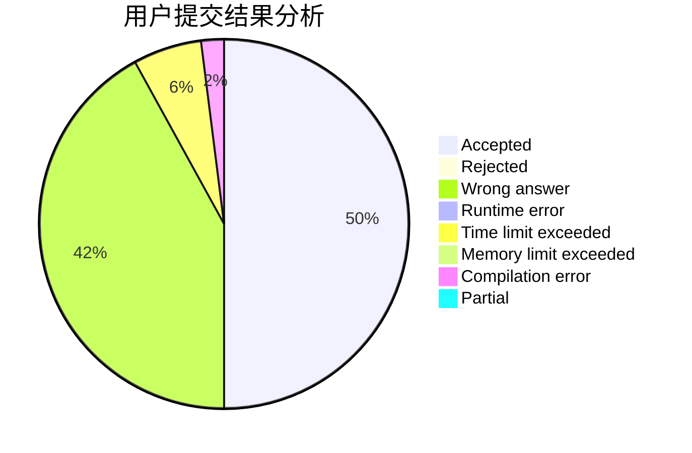
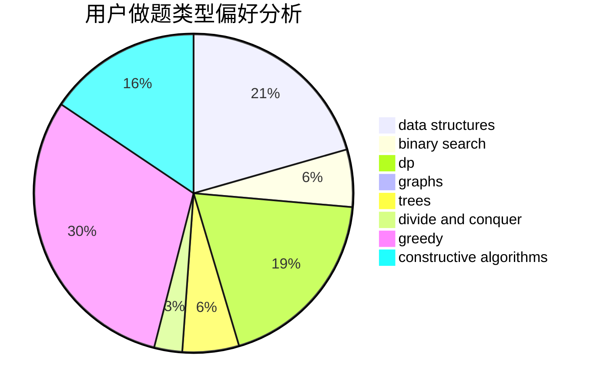
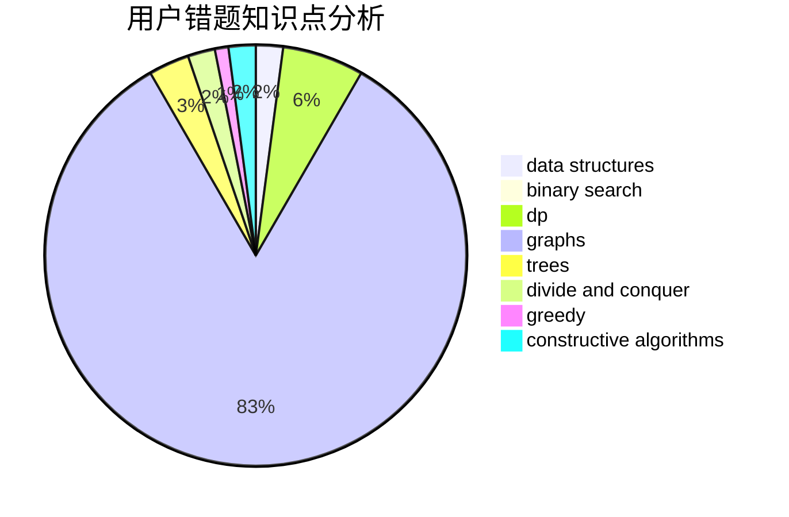

# ConnectorB

<!-- tabs:start -->

#### **用户提交结果分析**

#### **用户做题类型偏好分析**

#### **用户错题知识点分析**

<!-- tabs:end -->
# 推荐题目
[1484B](https://codeforces.com/contest/1484/problem/B)		dsu,graphs,sortings,trees		  
[1496E](https://codeforces.com/contest/1496/problem/E)		dsu,graphs,sortings,trees		  
[1025G](https://codeforces.com/contest/1025/problem/G)		constructive algorithms,
                        math		  
[746D](https://codeforces.com/contest/746/problem/D)		constructive algorithms,
                        greedy,
                        math		  
[601B](https://codeforces.com/contest/601/problem/B)		data structures,
                        math		  
[269D](https://codeforces.com/contest/269/problem/D)		data structures,
                        dp,
                        graphs,
                        sortings		  
[198B](https://codeforces.com/contest/198/problem/B)		shortest paths		  
[1239E](https://codeforces.com/contest/1239/problem/E)		dp,
                        implementation		  
[1108B](https://codeforces.com/contest/1108/problem/B)		brute force,
                        greedy,
                        math,
                        number theory		  
[1162C](https://codeforces.com/contest/1162/problem/C)		dsu,graphs,sortings,trees		  
