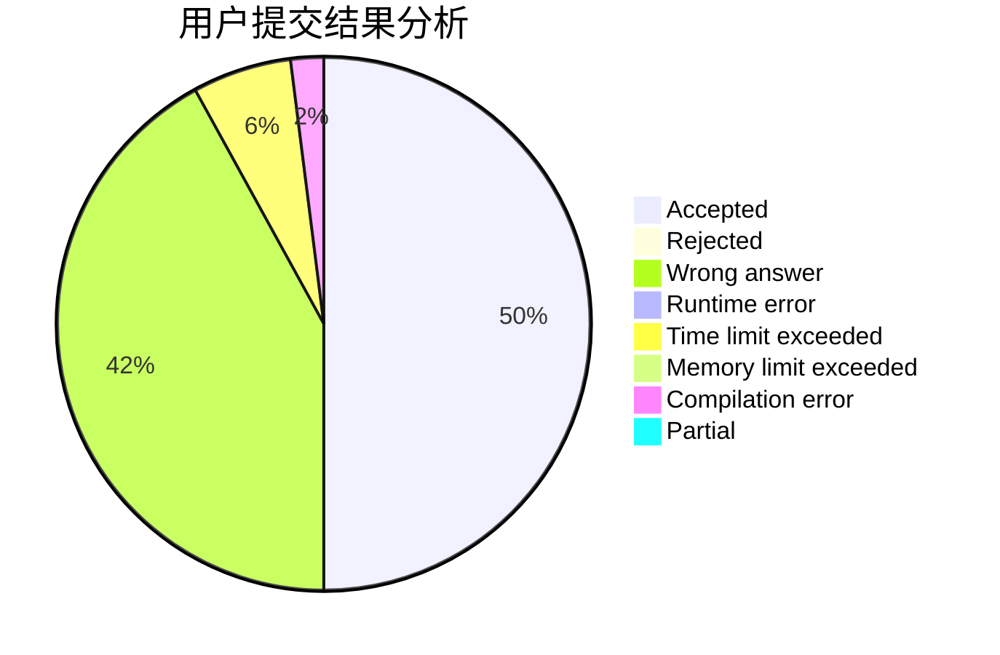
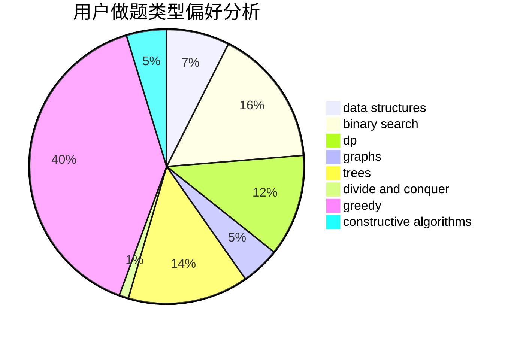
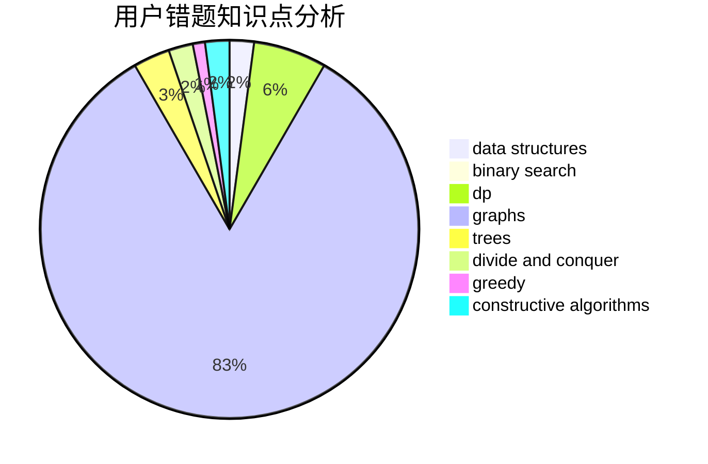

# ConnectorB

<!-- tabs:start -->

#### **用户提交结果分析**

#### **用户做题类型偏好分析**

#### **用户错题知识点分析**

<!-- tabs:end -->
# 推荐题目
[1475E](https://codeforces.com/contest/1475/problem/E)		combinatorics,
                        math,
                        sortings		  
[1488G](https://codeforces.com/contest/1488/problem/G)		*special problem,
                        data structures,
                        greedy,
                        number theory		  
[1025D](https://codeforces.com/contest/1025/problem/D)		brute force,
                        dp,
                        math,
                        number theory,
                        trees		  
[729D](https://codeforces.com/contest/729/problem/D)		constructive algorithms,
                        greedy,
                        math		  
[581A](https://codeforces.com/contest/581/problem/A)		implementation,
                        math		  
[251B](https://codeforces.com/contest/251/problem/B)		implementation,
                        math		  
[171B](https://codeforces.com/contest/171/problem/B)		*special problem,
                        combinatorics		  
[1234A](https://codeforces.com/contest/1234/problem/A)		math		  
[1108A](https://codeforces.com/contest/1108/problem/A)		implementation		  
[1159D](https://codeforces.com/contest/1159/problem/D)		dsu,graphs,sortings,trees		  
