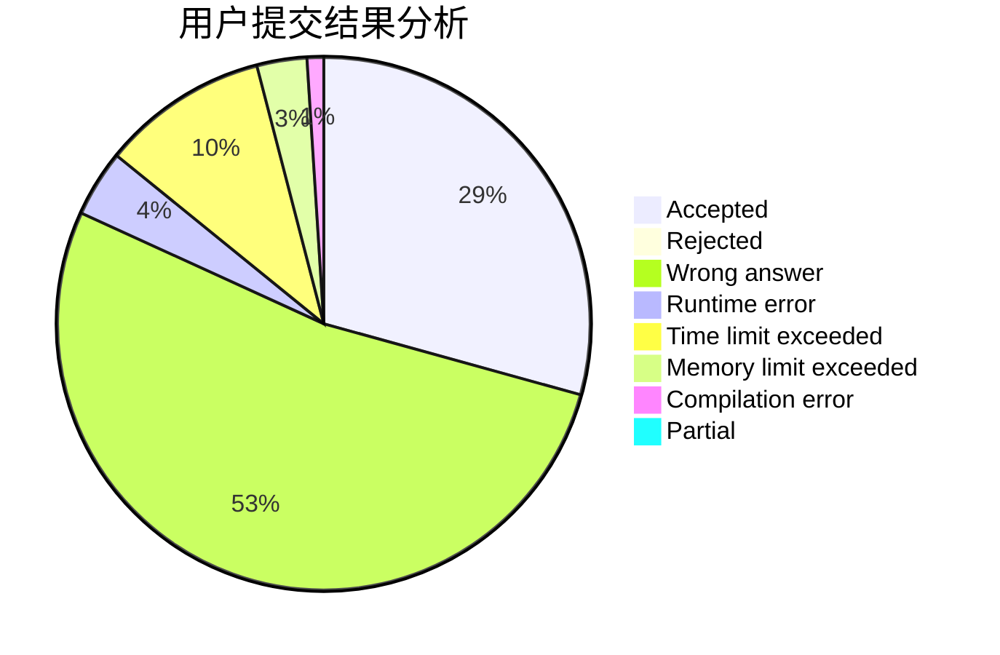
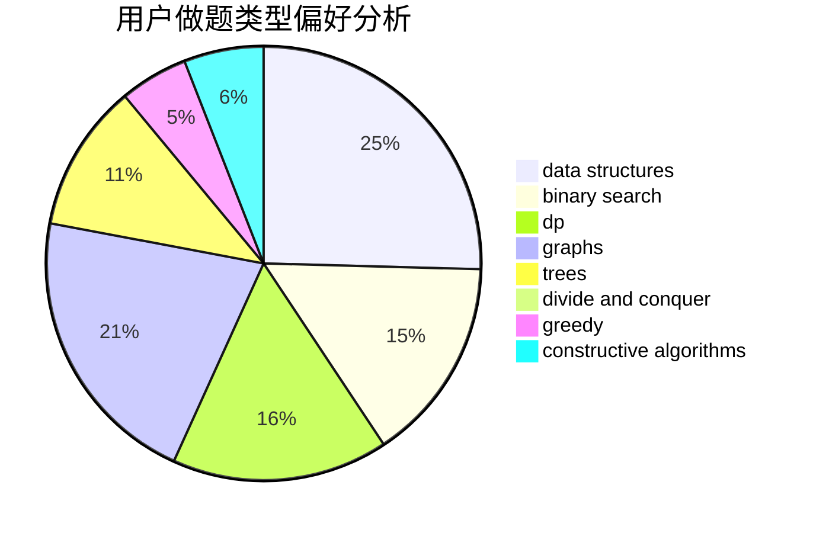
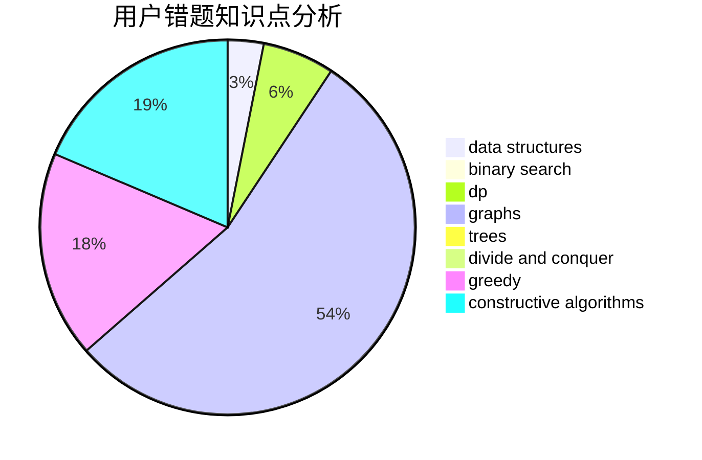

# Consolasy

<!-- tabs:start -->

#### **用户提交结果分析**

#### **用户做题类型偏好分析**

#### **用户错题知识点分析**

<!-- tabs:end -->
# 推荐题目
[746G](https://codeforces.com/contest/746/problem/G)		constructive algorithms,
                        graphs,
                        trees		  
[11892](https://codeforces.com/contest/1189/problem/2)		dsu,graphs,sortings,trees		  
[13681](https://codeforces.com/contest/1368/problem/1)		dsu,graphs,sortings,trees		  
[578B](https://codeforces.com/contest/578/problem/B)		brute force,
                        greedy		  
[102B](https://codeforces.com/contest/102/problem/B)		implementation		  
[1347D](https://codeforces.com/contest/1347/problem/D)		dsu,graphs,sortings,trees		  
[1034E](https://codeforces.com/contest/1034/problem/E)		bitmasks,
                        dp,
                        math		  
[119A](https://codeforces.com/contest/119/problem/A)		implementation		  
[1220F](https://codeforces.com/contest/1220/problem/F)		binary search,
                        data structures		  
[746F](https://codeforces.com/contest/746/problem/F)		data structures,
                        greedy,
                        two pointers		  
