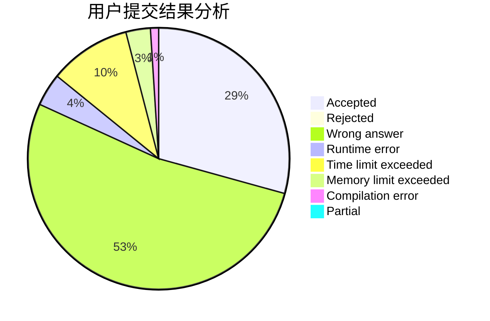
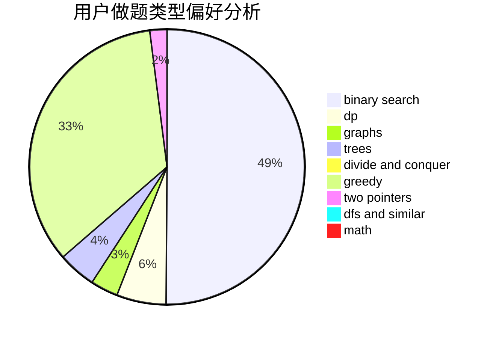

# Consolasy

<!-- tabs:start -->

#### **用户提交结果分析**

#### **用户做题类型偏好分析**

<!-- tabs:end -->
# 推荐题目
[746G](https://codeforces.com/contest/746/problem/G)
[11892](https://codeforces.com/contest/1189/problem/2)
[13681](https://codeforces.com/contest/1368/problem/1)
[578B](https://codeforces.com/contest/578/problem/B)
[102B](https://codeforces.com/contest/102/problem/B)
[1347D](https://codeforces.com/contest/1347/problem/D)
[1034E](https://codeforces.com/contest/1034/problem/E)
[119A](https://codeforces.com/contest/119/problem/A)
[1220F](https://codeforces.com/contest/1220/problem/F)
[746F](https://codeforces.com/contest/746/problem/F)
